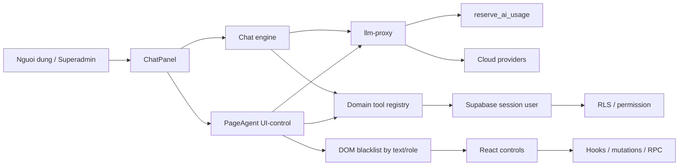
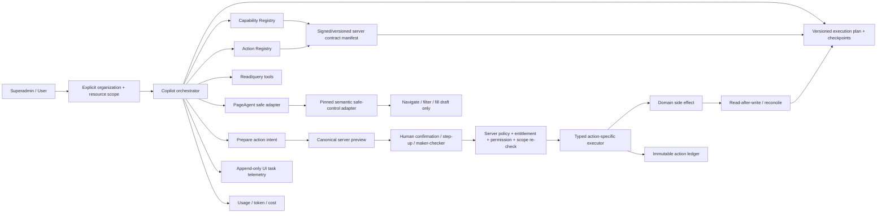

# AI Copilot Superadmin Full-Site Control - Audit And Target Design

**Ngay:** 2026-08-13

**Cap nhat:** 2026-08-14 - doi chieu live evaluation 2026-08-13

**Trang thai:** Danh gia va thiet ke de ra quyet dinh; chua trien khai

**Source snapshot:** audit chi tiet tai `main@931eb9e78cee`; baseline Copilot da doi chieu tai
`main@c925307da634`. Heartbeat so sanh moi `HEAD` voi baseline nay trong `src/copilot`,
`src/app/capabilities`, `src/contexts`, `supabase/functions/llm-proxy` va Copilot E2E; commit chi doi
inventory/tai lieu ngoai cac path do khong lam doi finding va khong buoc cap nhat snapshot.
Committed drift trong scope rong chi gom migration Zalo revoke ACL, tooling restore/credential
governance va refresh generated RPC/repository inventory (contract hien ghi 672 migration); khong
dong finding Copilot nao. Current source gate van bao 146 route va 5 route navigation Copilot;
package van pin PageAgent 1.11.0, chat van `MAX_TOOL_ROUNDS = 6`, UI-control van `maxSteps = 25`.

**Live evaluation supplement:** `docs/ai-copilot/COPILOT-EVALUATION-2026-08-13.md`
(SHA-256 `65450dca3cbe3926f2ec0bddc4eed62498fcd5d0ab3325e35965cc41a9152980`) ghi nhan
browser headless authenticated tren `https://ptcrm.vercel.app`, 40 case va read-only oracle tren org
THAT. Bao cao/harness nay la local untracked artifact, khong ghi deployment source SHA, contract/tool
manifest digest hay snapshot entitlement/permission, va chua duoc audit nay tai chay doc lap. Vi vay
no la bang chung live one-off de cap nhat finding, khong phai CI/release attestation.

**Pham vi danh gia:** Chat nghiep vu, tra cuu tai lieu, domain tools, UI-control/PageAgent,
provider/quota, phan quyen, tenant scope, confirmation, audit, test va van hanh.

## 1. Ket luan dieu hanh

AI Copilot hien tai **chua du manh va chua du an toan de dieu khien toan bo website theo
quyen superadmin**.

He thong da co mot nen tang tot cho chat va tra cuu co kiem quyen: JWT qua proxy, entitlement,
kill switch, quota, tool registry loc quyen hai lan, truy van chay duoi session user va RLS lam
lop chan cuoi. Tuy nhien, kha nang dieu khien giao dien moi chi la pilot tren ba route, trong khi
toan app co 146 route declaration. Quan trong hon, boundary "PageAgent khong co write tool"
khong ngan duoc side effect phat sinh tu control autosave tren DOM.

Verdict theo tung muc dich:

| Muc dich | Verdict |
| --- | --- |
| Chat hoi dap, tra cuu nghiep vu co kiem quyen | **Mot phan - live eval 15 PASS, 7 PARTIAL, 8 FAIL** |
| Doc so lieu qua domain tool/RLS | **Chua dat pilot release gate - co query runtime fail va org chua explicit** |
| Mo trang, loc danh sach tren pilot | **Thu nghiem - co one-off live evidence, chua co E2E tracked/attested** |
| Dien form nhap nhung khong commit | **Chua dat - whitelist control chua ton tai** |
| Ghi du lieu co xac nhan | **Blocker - consent do model tu khai** |
| Duyet, vao so, xoa, doi quyen | **Khong duoc mo** |
| Dieu khien toan site | **Chua dat** |
| Tuyen bo production-ready cho full-site control | **Khong du co so** |

Khuyen nghi la chon kien truc **hybrid contract-first**:

1. PageAgent chi duoc navigation; filter va fill draft qua semantic safe-control adapter duoc pin,
   traversal-complete va verify tren browser.
2. Moi side effect phai di qua typed server action, khong commit bang click DOM.
3. Capability Registry hien huu la nguon so huu page surface; bo sung Action Registry tham chieu
   capability thay vi tao mot danh sach route/action song song.
4. Moi action co organization/resource scope, risk, permission, confirmation, idempotency,
   executor, audit va rollback contract.
5. Superadmin co quyen yeu cau rong, nhung van phai chot organization va tai nguyen cu the;
   quyen toan he khong duoc bien thanh scope ngam dinh toan he.
6. Yeu cau nhieu page/action phai co execution plan server-persisted, checkpoint va resume; history
   cua model/PageAgent khong duoc dung lam workflow state hay bang chung consent.
7. Page/Action Registry phai sinh immutable server manifest; runtime rollout chi co mot authority
   server va khong duoc vuot static ceiling cua manifest.

## 2. Objective, scope va Definition of Done

### 2.1 Objective

Thiet ke mot Copilot co the tiep can toan bo be mat san pham va ho tro superadmin dieu phoi
cong viec, nhung khong trao cho model quyen tu do click/ghi tuong duong mot nguoi dung dac quyen.

### 2.2 Trong pham vi

- Inventory page, route, permission, domain tool va knowledge hien tai.
- Read, navigate, filter, fill draft, write, approve va destructive action.
- Organization/building/resource scope cho superadmin va multi-organization user.
- Confirmation, maker-checker, idempotency, audit, rollback va kill switch.
- Orchestration nhieu page/action, checkpoint, resume, cancel va compensation.
- Provider/model readiness, quota, usage va knowledge freshness.
- Rollout theo domain va role-real verification.

### 2.3 Ngoai pham vi

- Khong sua code, migration, RLS, production config hoac entitlement trong tai lieu nay.
- Khong tu mo them route/action trong pilot hien tai.
- Khong cho product Copilot thao tac migration, secret, production infrastructure hoac terminal.
- Khong coi de xuat kien truc la bang chung finding da duoc khac phuc.
- Khong dung graph stale lam nguon ket luan.

### 2.4 Definition of Done cho chuong trinh nang cap

Full-site control chi duoc coi la dat khi:

1. Moi page renderable duoc map vao Capability Registry hoac co exemption ro ly do. Snapshot audit
   co 146 route declaration, gom 113 non-redirect va 33 redirect; gate implementation phai dem lai
   tu source thay vi hard-code con so nay lau dai.
2. Moi action Copilot co Action Contract va default-deny neu chua khai.
3. PageAgent khong the cham control ngoai semantic safe-control tool sinh tu contract. Voi
   PageAgent 1.11.0, `interactiveWhitelist` chi ep control duoc liet ke thanh interactive, complement
   tao bang `document.querySelectorAll('*')` bo sot open shadow root/same-origin iframe, va public API
   khong cho wrapper resolve lai private selector-map. Vi vay UI-control rollout phai disabled cho
   den khi dung pinned patch/fork/upgrade expose traversal-complete collector + pre-action validator,
   hoac thay index primitives bang semantic tool khong phu thuoc selector-map cua dependency.
4. Moi side effect duoc server re-check actor, organization, resource, permission va intent.
5. Model khong the tu tao bang chung consent bang boolean/text.
6. Moi side effect co authoritative append-only audit trong cung transaction khi co the.
7. E2E headless tren DEMO xanh cho superadmin, manager, staff, wrong-org va revoked-mid-task.
8. Autosave, icon-only action, prompt injection, replay va concurrency co negative test.
9. Model/provider chi duoc enable khi capability va pricing mode da duoc xac minh.
10. Canary co so lieu, rollback da dien tap va khong con blocker trong risk tier dang rollout. Phase
    L3 reversible write la optional cho baseline full-site read/navigation/draft; neu chua co business
    action duoc duyet thi bang chung bat buoc la moi `reversible_write` van disabled, khong phai mot
    positive canary gia dinh.
11. Request nhieu buoc co execution plan versioned, moi write step co consent rieng, resume re-check
    toan bo authority va downstream dung khi external effect chua biet ket qua.
12. Moi readonly action dang expose co query contract hop le voi deployed schema, production-like
    integration test cho positive/empty-state/wrong-org, va zero runtime query failure trong golden eval.
13. Golden eval tracked danh gia functional outcome, tool discoverability, multi-intent, relative date
    va latency; moi run bind exact source SHA, provider/model, contract/tool manifest digest,
    organization, entitlement va permission snapshot. Moi proxy-dependent run con phai bind deployed
    `llm-proxy` version, bundle digest va reviewed source SHA; missing/mismatched frontend hoac Edge
    attestation khong duoc tinh la release pass.
14. C36 rate-limit va C38 multimodal co tracked deployment E2E: controlled burst chung minh 429
    server-side truoc upstream, con upload fixture DEMO di qua file control -> proxy -> vision model;
    chi thay control hoac dung one-off result khong duoc tinh la pass.

Ma tran coverage DoD -> implementation/evidence:

| DoD | Task | Gate/evidence bat buoc |
| --- | --- | --- |
| 1. Tat ca page/route accounted | 3, 13 | `gate:copilot-pages`, rollout matrix counts |
| 2. Tat ca action contracted/default-deny | 4 | `gate:copilot-actions`, exact inventory |
| 3. PageAgent chi cham safe control | 5, 14 | dependency adapter proof + traversal/browser zero-mutation |
| 4. Server re-check actor/org/resource/permission | 2, 8, 11, 12 | wrong-org/revoke DB + E2E negatives |
| 5. Consent khong do model tu tao | 8, 12 | first-turn/payload-change/replay negatives |
| 6. Authoritative append-only audit | 6, 7 | privilege/trigger + effect-ledger parity |
| 7-8. Role-real va adversarial E2E | 5, 12-14, 16-18; 15 neu duoc chon | tracked headless matrix tren DEMO |
| 9. Provider/pricing/data readiness | 9 | `gate:copilot-providers`, proxy denial |
| 10. Canary/rollback khong blocker | 11, 16-18; 15 neu duoc chon | immutable rollout events, disabled-L3 negative hoac drill evidence |
| 11. Durable multi-step orchestration | 12, 18 | `gate:copilot-execution-plans`, resume/unknown-effect proof |
| 12. Read query correctness | 1, 2, 13, 18 | production-like query integration + zero runtime query failure |
| 13. Reproducible behavioral quality | 4, 12, 13, 18 | tracked golden eval + source/model/manifest/authz attestation |
| 14. Proxy/multimodal deployment regression | 9, 18 | Edge version/digest readback + rate-limit/multimodal live E2E |

## 3. Evidence basis va gioi han

### 3.1 Thu tu nguon su that

1. Route/guard va caller hien hanh trong `src/`.
2. Migration, live catalog va ACL production chi doc.
3. Contract manifests, generated inventories va SQL harness cua repo.
4. Gate/test output tai source snapshot.
5. Tai lieu he thong va tai lieu ke hoach hien huu.

### 3.2 Gioi han graph

`npm run gate:graph-freshness -- --nhiem-vu architecture` tai `main@32370bda942d` bao:

- UA graph stale 223 commit;
- 602 file da doi, 203 file moi;
- thieu 43 migration;
- thieu `services/openclaw-media-gateway`.

Do do tai lieu nay **khong doc hoac dung UA graph de ket luan**. Gate bao GitNexus van fresh voi
6 commit/2 file moi chua index, nhung phien audit khong co GitNexus query tool callable. Contract
manifest, source va live catalog van co do uu tien cao hon graph theo Project Contract.

### 3.3 Khoang trong runtime/browser

- Evaluation supplement da chay browser headless authenticated tren deployment that. C01-C30 dat
  15 `PASS`, 7 `PARTIAL`, 8 `FAIL`; C31-C40 co 5 live pass, 4 static-only va 1 deployment fail.
- C36 la bang chung live tich cuc cho 429/rate gate va C38 la deployment fail multimodal, nhung ca hai
  van la one-off: chua co tracked burst test hay upload -> proxy -> vision-model smoke de lam release gate.
- Bang chung nay dong khoang trong "chua tung quan sat browser authenticated" o muc one-off, nhung
  khong dong release-evidence gap: harness da don, khong git-track, khong co golden dataset/CI suite,
  khong ghi exact deployment source SHA, contract/tool manifest digest, entitlement hay permission
  snapshot, va chua co independent rerun.
- Production khong hien upload anh/UI-control trong fixture da test, trong khi source co
  `data-testid="copilot-file"` va UI-control con phu thuoc entitlement + `ai_copilot.ui_control`.
  Khong co build/authz attestation nen chi ket luan deployment/fixture mismatch chua duoc giai thich;
  chua du bang chung de gan nhan source regression.
- Production 30 ngay co 29 chat request `ok`, 7 `upstream_error`, va 0 request
  `ui_control`. Vi vay khong co bang chung van hanh UI-control thuc te.

### 3.4 Snapshot production chi doc

Snapshot luc `2026-08-13T10:45:35.678983+00:00`:

| Chi so | Gia tri |
| --- | ---: |
| Global chat enabled | `true` |
| Global UI-control enabled | `true` |
| Entitlement | 4 user chat, 1 user UI-control |
| Provider enabled | 4 |
| Cloud model enabled | 70 |
| Model co input hoac output price bang 0/thieu | 69 |
| `ai_write_audit` table privilege cho authenticated | INSERT/UPDATE/DELETE |
| Non-internal trigger tren `ai_write_audit` | 0 |

Luu y: `DELETE` table privilege khong tu dong vuot RLS khi khong co DELETE policy. Blocker
immutability da duoc chung minh rieng boi UPDATE-own policy cho phep sua noi dung dong audit,
khong can dua vao gia dinh delete thanh cong.

Evaluation supplement cung cho thay cac RPC read-only tren org THAT nhan explicit organization va
building scope; count truoc/sau giu nguyen 520 customer, 1.121 invoice, 333 contract va 18 building.
Day la bang chung tich cuc ve read-only isolation cua cac RPC da test. Khong co reusable digest oracle
nen khong tuyen bo digest parity; no cung khong chung minh cac query Copilot truc tiep deu dung scope.

## 4. Ma tran muc do san sang

| Boundary | Trang thai | Bang chung | Ket luan |
| --- | --- | --- | --- |
| JWT va cloud proxy | Dat | `llm-proxy` xac thuc bearer, provider/model allowlist | Nen tang tot |
| Kill switch, entitlement, rate, quota | Dat mot phan | `reserve_ai_usage` re-check server-side | USD cap sai neu pricing sai |
| Permission tool | Dat mot phan | Loc khi build va execute; session user + RLS | Chua co final object/scope contract cho moi tool |
| Organization scope | Chua dat | `OrganizationContext` mac dinh `organizations[0]`; `ToolCtx` chua co org | Blocker cho multi-org/superadmin |
| Knowledge allowlist | Dat mot phan | 25/29 docs, 7 permission-gated | Chi 5 review con hieu luc; 20 debt |
| Capability inventory | Dat mot phan | 27 capability, 146 route declaration | Chua dai dien toan site |
| Route navigation Copilot | Chua dat | Tool co 5 route, PageAgent guard co 3 | Hai whitelist lech nhau |
| UI safe boundary | Blocker | Blacklist text/aria, khong co component gan marker | Autosave co the ghi |
| DOM action audit | Chua dat | Usage log chi request/model/token/cost/status | Khong truy vet click/input/navigation |
| Typed action catalog | Chua dat | Registry hien tai chi mo ta page surface | Khong co risk/consent/executor/rollback |
| Write confirmation | Blocker | `xac_nhan` do model truyen | Khong phai bang chung user consent |
| Write audit integrity | Blocker | User update own audit; khong co immutable trigger | Khong phai authoritative ledger |
| Idempotency | Dat mot phan | Unique key cho mot write tool | Client-derived, chi mot action |
| Financial safety | Dat mot phan | Tao `UNAPPROVED/PENDING`, account null | Van co side effect va consent yeu |
| Provider governance | Chua dat | 69/70 cloud model co price zero/thieu | USD cap khong dang tin |
| Local provider governance | Chua dat | Ollama browser -> localhost | Bypass reserve/finalize/log/revocation |
| Data egress governance | Blocker | DOM co mask nhung tool output/history vao model request | Chua bind data class voi provider |
| Multi-step orchestration | Blocker | Chat toi da 6 tool round; PageAgent reset task/history moi `execute()` | Khong co durable plan/checkpoint/resume/compensation |
| Read query correctness | Blocker cho readonly pilot | 5/30 live case fail vi relation PostgREST khong ton tai | Query source khong khop generated schema |
| Tool routing/answer quality | Chua dat | Live eval bo/sai tool, bo multi-intent, mat relative date | Chua co golden functional gate |
| Copilot behavioral tests | Dat one-off, chua reproducible | Live browser matrix co; harness khong tracked/attested | Khong the dung lam CI/release proof |
| Deployment/source attestation | Chua dat | Upload/UI-control mismatch; khong co frontend SHA, Edge version/digest hay authz snapshot | Khong phan biet web/proxy drift voi fixture drift |
| Multimodal deployment path | Chua dat | C38 khong chay duoc vi thieu upload control tren fixture | Chua co upload -> proxy -> vision-model smoke |
| Proxy rate-limit regression | Dat one-off, chua reproducible | C36 burst live tra 429 dung mot lan | Chua co tracked policy-derived burst E2E |
| Full-site rollout | Chua dat | UI allowlist 3 route | Khong du coverage va safety gate |

### 4.1 Verdict theo quyen superadmin va nhom nghiep vu

`Superadmin` hien tai lam rong tap du lieu ma actor co the doc/ghi qua policy hien co; no khong tao
them execution semantics cho Copilot. Vi vay verdict phai tach theo cap kha nang:

| Nhom nghiep vu | Hien tai Copilot lam duoc | Boundary con thieu | Muc rollout toi da truoc nang cap |
| --- | --- | --- | --- |
| Dashboard/bao cao | Hoi dap va 4 typed query tool hien huu | Chua phu tat ca report, data egress/provider class | Read shadow/canary tung report |
| Toa nha/phong/khach/hop dong | Mo 5 route cong bo, query mot so so lieu | Route guard chi 3; final org/resource binding; E2E | Read/navigation sau contract |
| Hoa don/cong no/so quy | Read tool va finance draft client-side | Consent, ledger, pricing, maker-checker proof | Read; draft server-action sau Tasks 7-12 |
| Cau hinh/phan quyen/user | Co the huong dan tu docs | Authz/session/control nhay cam, khong co action contract | Guidance/read; final action khong autonomous |
| Van hanh noi bo/nhan su | Mot so doc/query co permission | Coverage/action inventory va separation of duties | Read theo permission |
| Zalo/network/infrastructure | Chat/doc mot phan | Credential, external effect, infrastructure boundary | Chat/read; infrastructure forbidden |
| Public/auth/self-service | Route co trong app inventory | Khong co permission representative, credential/session risk | `none` tru explicit public-read |

Do do "tiep can toan bo website" trong target design nghia la **100% page/action duoc accounted va
co policy**, khong nghia la model duoc thao tac moi control. Ket qua cuoi cung cho superadmin la:

- L0-L2: read, navigate, filter, fill draft co the tu dong khi contract va evidence xanh;
- L3-L4: chi typed server action, preview/consent tung effect, audit/readback bat buoc;
- L5: chi lap evidence/approval request, nguoi duyet doc lap thuc hien final effect;
- L6: migration, secret, terminal, deploy va production infrastructure luon ngoai product Copilot.

## 5. Diem manh can giu

Khong nen viet lai toan bo Copilot. Nhung lop sau dang dung huong va nen duoc tai su dung:

- `llm-proxy` giu cloud key server-side, xac thuc JWT va tu choi provider/model ngoai allowlist.
- `reserve_ai_usage` gom kill switch, entitlement, permission, rate va quota trong server transaction.
- RPC noi bo reserve/finalize/perms khong cap execute cho `authenticated`.
- Tool registry loc quyen truoc khi dua cho model va re-check luc execute.
- Tool truy van bang Supabase session user, de RLS lam lop phong thu cuoi.
- Live evaluation xac nhan JWT/entitlement/permission/provider/rate gates tu choi dung cac fixture
  khong du authority; burst 21 request tao 20 HTTP 200 va 1 HTTP 429 `rate_limited`.
- Read-only oracle tren org THAT dung explicit org/building scope va khong lam doi cac count business
  chinh; day la nen tang tot de mo rong typed read contract.
- UI-control vo hieu `execute_javascript`, mask PII va tu choi local provider.
- Write tool tai chinh chi tao draft cho duyet, khong vao so va khong gan cashbook.
- Capability Registry da co ownership route/nav/permission/docs/risk o muc page surface.
- PageAgent 1.11.0 co san `interactiveBlacklist`, `interactiveWhitelist`, `onBeforeStep`,
  `onAfterStep` va history event. Tuy nhien, whitelist la additive chu khong exclusive, traversal
  vao open shadow/same-origin iframe rong hon collector DOM thong thuong, va selector-map private;
  phai pin dependency adapter/semantic tools thay vi xem complement light-DOM la authority.

## 6. Findings theo muc do uu tien

### B1 - Blocker: UI-control co the ghi gian tiep qua control autosave

`src/copilot/safetyGuard.ts` chi blacklist `button`, `a`, role button/menuitem,
`type=submit`, text nguy hiem va `data-ai-risk`. Khong co component production nao gan
`data-ai-risk` hoac `data-ai-safe`.

Tren `/invoices`, route dang nam trong `PILOT_ROUTE_ALLOWLIST`,
`PaymentsSummaryDialog` goi `updateMethod.mutate` ngay khi chon mot
`DropdownMenuItem`. Khong can nut Luu/Submit.

**He qua:** khong cap write tool cho PageAgent khong dong nghia voi read-only. Blacklist theo
text khong the chung minh absence of side effect.

**Control bat buoc:** khong dung complement collector o app nhu boundary authority. PageAgent 1.11.0
traverse open shadow root va same-origin iframe, nhung `document.querySelectorAll('*')`/`root.querySelectorAll('*')`
khong bao phu hai surface nay; `selectorMap` va `flatTree` lai private nen app khong the resolve lai
index mot cach supported ngay truoc click/input/select.

Task dependency-adapter phai chon va pin mot trong hai duong co the verify:

- patch/fork/upgrade PageController de expose traversal-complete safe-control policy va mot
  `resolveElementForAction(index)`/pre-action hook public; hoac
- disable toan bo index-bearing primitives va thay bang semantic safe-control tools nhan stable
  `controlId`, resolve DOM fresh tren tat ca document/open-shadow/same-origin-iframe roots, validate
  route/page/contract revision/kind ngay truoc interaction, roi dispatch mot lan.

Cross-origin iframe khong duoc interactive trong product Copilot. `execute_javascript` absent;
indexed scroll absent neu khong co cung pre-action validator. UI-control/entitlement giu disabled
neu spike khong chung minh duoc boundary nay. Test phai dung runtime/browser that voi light DOM,
portal, open shadow root, same-origin iframe, stale/replaced node va network-write assertion; helper
unit hoac whitelist don le khong phai bang chung default-deny. Moi commit du lieu di typed server action.

### B2 - Blocker: Chua co authoritative action audit

`ai_usage_logs` ghi request, provider, model, token, cost, latency va status; no khong ghi
navigation, input, click, control ID, entity, before/after, consent hoac rollback reference.

`ai_write_audit` cho user UPDATE dong cua minh de gan `entity_id`, nhung policy khong gioi han
cot duoc sua. Khong co trigger cam UPDATE/DELETE.

**He qua:** khong the tra loi dang tin cay "AI da lam gi, duoi scope nao, user da dong y gi,
va side effect nao da xay ra".

**Control bat buoc:** tach hai lop:

- UI task telemetry append-only de dieu tra tung PageAgent step.
- Server action ledger authoritative, duoc ghi cung transaction voi side effect; correction
  bang compensating event, khong UPDATE dong cu.

### B3 - Blocker: Write confirmation do model tu khai

`tao_phieu_thu_chi_nhap` nhan `xac_nhan:boolean`. Prompt yeu cau model preview truoc, nhung
server khong co nonce/intent chung minh preview da hien va user da dong y o turn khac.

**He qua:** model, prompt injection hoac conversation reconstruction co the gui
`xac_nhan=true` ma khong co consent proof doc lap.

**Control bat buoc:** server issue short-lived intent/nonce gan actor, organization, action,
canonical payload hash, permission snapshot va expiry. Execute consume nonce mot lan va
re-check permission/scope.

### B4 - Blocker: Organization scope chua duoc chot ro cho superadmin

`OrganizationContext` tra `organization: organizations[0]`. `ChatPanel` luu thread voi org do,
nhung `ToolCtx` hien chi co `perms` va `navigate`; domain tool khong nhan selected org canonical.
`get_my_organizations` la membership-scoped, nen mot superadmin khong co membership cung chua co
typed directory de chon tenant can dieu phoi.

**He qua:** khi co nhieu org, "quyen toan he" co the bi nham thanh "org dau tien" hoac query
gom scope khong ro. Day la loi nghiep vu va audit, ngay ca khi RLS ngan leak.

**Control bat buoc:** selected organization explicit, persisted va validate trong ACTIVE set;
multi-org chua chon thi fail closed. Normal user lay tap chon tu ACTIVE membership; superadmin can
typed server organization directory de chon mot tenant ACTIVE ngay ca khi khong co membership, khong
doc bang truc tiep hoac nhan org ID tu model. Quyen liet ke/chon nay khong thay final-resource
permission/deny va organization lifecycle re-check. Moi action bind final organization va resource.

### F1 - Fix-now: Hai whitelist route dang lech nhau

`MO_TRANG_ROUTES` cong bo nam route:

- `/apartments`
- `/invoices`
- `/customers`
- `/contracts`
- `/buildings`

`PILOT_ROUTE_ALLOWLIST` chi co ba route dau. Agent co the goi `mo_trang` toi contracts/buildings,
sau do `onBeforeStep` dung task o buoc ke tiep.

Gate `check-copilot-routes.mjs` chi kiem route va permission ton tai, chua kiem
`MO_TRANG_ROUTES subset PILOT_ROUTE_ALLOWLIST`.

Final source verification minh hoa khoang trong nay: `gate:copilot-routes` van xanh va bao 5 trang
duoc cong bo tren 146 route, du hai route `/contracts` va `/buildings` van khong nam trong guard 3
route. Vi vay gate xanh hien tai la bang chung route/permission co ton tai, khong phai bang chung
boundary PageAgent nhat quan.

### F2 - Fix-now: Khong co Action Registry

`CapabilityDefinition` co y chi mo ta be mat cap trang. No khong co action, risk, confirmation,
executor, idempotency, rollback, data class hoac E2E contract.

**He qua:** moi tool/action la mot tieu he quy uoc rieng; khong co default-deny va khong sinh
duoc policy/admin/test tu mot contract chung.

### F3 - Fix-now: Knowledge freshness chua du cho control rong

Gate hien tai cho thay:

- 25/29 tai lieu duoc ingest;
- 7 tai lieu gao quyen;
- 5 tai lieu co dau review con hieu luc;
- 20 tai lieu nam trong debt baseline;
- 12 tai lieu chua tung review.

`19-sop-tien-va-so-quy.md` la tai lieu nhay cam, co permission gate nhung chua tung review.

Final gate van xanh theo ratchet, khong phai theo readiness tuyet doi: `gate:copilot-docs` bao
25/29 file va 7 file gao quyen; `gate:doc-freshness` bao 5 dau review con hieu luc, 20 debt va 12 file
chua tung review. Trang thai nay chap nhan khong tang debt, nhung khong du de mo action tai chinh/rui ro.

**He qua:** Copilot co the thuc thi dung contract ky thuat nhung dua tren SOP cu.

### F4 - Fix-now: Pricing/quota khong phan biet free, metered va unknown

Production co 70 cloud model enabled; 69 model co input hoac output price bang 0/thieu. USD
quota van chay, nhung phan lon khong phan anh chi phi thuc.

**Control bat buoc:** moi model khai `pricing_mode = metered|free|self_hosted|unknown`.
`unknown` khong duoc enable; `metered` can gia duong; rate/token cap luon ap dung doc lap USD.

### F5 - Fix-now: Local provider bypass server control plane

Ollama duoc browser goi thang `localhost`; admin UI cung ghi ro quota/usage log khong ap dung.

**He qua:** revoke entitlement, kill switch va audit khong co hieu luc cho chat local dang chay.

**Control bat buoc:** production Copilot chi dung server proxy. Local mode la dev-only, khong
co action tool, hoac phai di qua signed local bridge co reserve/finalize va revocation.

### B5 - Blocker cho full-site read: Tool output va chat history chua co data-egress contract

`maskPii` hien duoc goi cho DOM `transformPageContent` va mot so formatter rieng, nhung chat loop
dua output cua domain tool thanh `role:'tool'` vao request model ke tiep. Tool khach hang/hop dong co
the tra ten that, phong, link entity va so dien thoai da che mot phan; history cu cung duoc nap lai.
`llm-proxy` chi doc provider `data_class = cloud|local_only`, chua nhan required data class cua request
hoac tool output de enforce provider policy.

**He qua:** mo read toan site co the day PII, financial detail hoac security metadata ra provider
khong duoc phep, du user co quyen doc trong app. Authorization doc DB khong dong nghia authorization
xuat du lieu cho ben thu ba.

**Control bat buoc:** moi action khai `dataClass`, field-level egress allowlist va retention policy.
Chat orchestrator sanitize/structure tool result truoc khi no thanh model message; proxy nhan server-
verifiable request classification, doi chieu provider/model data policy va deny downgrade/forged
header. History/tool outputs sensitive co TTL/redaction/version, khong replay vo han sang model moi.
Anh multimodal cung theo policy nay: size/MIME khong du de suy ra an toan; vision model/provider class,
user disclosure, request byte/count cap va hash-only audit la bat buoc, raw base64 khong duoc luu.

### F6 - Fix-now truoc rollout rong: Dependency PageAgent dung `eval`, production chua co CSP

Production build canh bao `@page-agent/page-controller` dung `eval`. UI-control da vo hieu tool
execute-JS, va runtime 1.11.0 chi goi `eval` ben trong `executeJavascript`; day khong phai bang chung
khai thac truc tiep. Tuy nhien, `vercel.json` hien chua co Content-Security-Policy, nen full-site
rollout phai them `script-src` khong co `'unsafe-eval'`, dua inline PWA watchdog ra file self-hosted,
dua inline watchdog CSS va Google-font `onload` handler ra khoi inline policy, pin tool
`execute_javascript` absent va chay browser smoke duoi header that. CSP can inventory app-wide cho
Supabase, fonts, images/media, geocode va iframe; khong mo wildcard chi de lam test xanh. Neu PageAgent
khong chay duoi CSP nay, UI-control giu disabled cho toi khi dependency duoc nang cap, patch/fork co
pin hoac thay the.

### B6 - Blocker cho yeu cau nhieu buoc: Khong co durable execution plan

`chatEngine` gioi han mot turn o `MAX_TOOL_ROUNDS = 6`; day chi la loop model/tool trong bo nho.
UI-control tao mot PageAgent moi cho moi lenh, con PageAgent 1.11.0 tu tao `taskId`, xoa `history` va
state trong moi `execute(task)`, sau do dung o `maxSteps = 25`. Tim kiem trong Copilot source,
migration va Edge Function khong thay plan/workflow/checkpoint store danh rieng cho Copilot.

**He qua:** yeu cau superadmin nhu "kiem tra cong no, tao draft, chuyen sang trang hop dong va bao
nguoi duyet" co the bi cat giua chung, lap lai action sau reload, tiep tuc tren org/permission/rollout
da doi, hoac bao thanh cong chi dua vao chat/PageAgent history. Action-level idempotency va ledger
khong du de biet toan request dang o buoc nao, buoc nao duoc phep tiep tuc, va external effect nao
chua xac dinh.

**Control bat buoc:** tao execution-plan control plane server-persisted. Snapshot versioned phai gan
actor, selected organization/resource, page/action ID, dependency, risk, data class, expected effect,
readback va compensation reference cho tung step. Read-only step co the tu tiep tuc; moi write step
phai preview va consent rieng, khong co "dong y mot lan cho ca plan". Resume/cancel/retry phai dung
CAS/checkpoint va re-check actor, organization, permission, rollout, provider, knowledge, action
version va resource version. External effect `UNKNOWN` chan downstream cho toi khi reconcile; cancel
chi dung step chua chay, khong xoa effect da hoan thanh, compensation la action/audit rieng.

### B7 - Blocker cho readonly pilot: Query relation khong khop deployed schema

Live evaluation co 5 runtime failure: `tim_khach_hang` tai C02/C14/C27 va
`hop_dong_sap_het_han` tai C04/C16. Source dang embed truc tiep
`customers -> rooms`, `customers -> buildings`, `contracts -> buildings` va
`contracts -> customers`. Generated Supabase relationships chi chung minh:

- `customers -> organizations`;
- `contracts -> rooms`, `contracts -> tenants`, `contracts -> organizations`;
- `rooms -> buildings`;
- customer hien hanh cua contract nam qua `contract_customers`.

Loi `contracts -> buildings` co the dang che loi `contracts -> customers` ke tiep, nen sua rieng chuoi
bao loi dau tien khong du. Unit mock hien tai khong bat duoc relation path that.

**Control bat buoc:** moi read action dung typed read RPC/view hoac explicit FK-qualified relation chain
hop generated/deployed schema. Query bind organization/resource theo Task 2, chi tra field allowlist,
va co production-like integration test bang authenticated role cho positive row, empty-state,
wrong-org/permission va schema-cache execution. Exposed readonly pilot phai co zero runtime query
failure; action chua co proof bi disabled thay vi de model goi roi moi loi.

### F7 - Fix-now, blocker truoc Phase 3: Tool routing va orchestration chua dat functional quality

Live C01-C30 chi co 15 `PASS`; model tuyen bo khong co capability dang expose cho
`coc_dang_giu`, `so_quy` va bo/sai `ty_le_lap_day`, `cong_no_tong_quan`. C06 suy occupancy sai tu
`phong_trong`; C25 bo mot nua multi-intent; C27 khong tiep tuc nhanh `phong_trong` doc lap sau khi
nhanh customer fail; C28 khong su dung ngay hien tai. Median latency la 17.448 giay, mean 21.105 giay,
p95 42.057 giay va max 55.913 giay.

**Control bat buoc:** model-visible tool inventory sinh tu ACTIVE Action/contract manifest; prompt va
planner phan ra cac intent doc lap, tiep tuc nhanh khong phu thuoc sau loi, va tra partial result co
status tung nhanh. Current date/timezone la structured request context, khong chi la prose de model co
the bo qua. Golden eval danh gia functional outcome thay vi exact tool name khi duong khac van dung,
nhung fail neu model bia thieu capability, tra sai nghiep vu, bo intent, hoac runtime query loi. Moi run
bao latency va chi GO khi dat numeric SLA duoc product owner phe duyet; chua co SLA thi khong duoc goi
latency pass.

## 7. Kien truc hien tai



Ranh gioi yeu nam o canh `DOM -> UI -> MUT`: policy dang suy ra side effect tu hinh dang/text
cua control, trong khi React control co the commit ngay tren `onSelect`/`onValueChange`.

## 8. Cac phuong an kien truc

### Option 1 - Giu PageAgent tu do, tang blacklist

Them regex, gan `data-ai-risk` cho nhieu component va mo rong test DOM.

**Uu diem:** nhanh, it thay doi tool/runtime.

**Nhuoc diem:** khong the chung minh read-only; moi autosave/control moi tao mot duong bypass.
Audit va confirmation van phan tan. Phuong an nay chi phu hop containment ngan han.

### Option 2 - Hybrid contract-first (khuyen nghi)

- PageAgent: hieu trang va dieu phoi navigation; filter/fill draft chi qua semantic safe-control
  adapter co dependency contract duoc pin va verify.
- Typed server action: moi side effect.
- Capability Registry: page ownership va static rollout ceiling.
- Action Registry: permission/risk/scope/consent/executor/audit/rollback.
- Build sinh mot immutable server contract manifest de RPC verify ID/version/policy; browser registry
  khong phai server authority.
- Server intent + policy engine: authority tai thoi diem execute.

**Uu diem:** giu duoc loi the "hieu trang" cua PageAgent, nhung chuyen authority ra khoi DOM.
Co the rollout theo domain va tao gate may doc duoc.

**Nhuoc diem:** can gan contract cho page/control/action va xay action adapter; khong mo toan site
chi bang mot allowlist lon.

### Option 3 - Chi typed tools, bo PageAgent

Moi filter, draft va write thanh domain tool/API; UI chi hien preview/result.

**Uu diem:** boundary ro nhat, test de nhat, khong phu thuoc DOM.

**Nhuoc diem:** chi phi bao phu toan site cao; mat kha nang xu ly UI long-tail; moi thay doi UI
co the doi tool rieng.

### Quyet dinh de xuat

Chon **Option 2**. Option 3 nen duoc dung rieng cho tai chinh, approval, authz va infrastructure;
Option 1 chi ton tai trong Phase containment va phai bi loai khoi Definition of Done.

## 9. Desired invariants

1. Model khong bao gio tu quyet dinh authority; server quyet dinh tren final resource identity.
2. Superadmin phai chon organization khi request co side effect hoac bao cao tenant-scoped.
3. Route/control/action chua khai contract la khong kha dung voi Copilot.
4. PageAgent khong nhin thay control commit du lieu.
5. Fill draft khong kich hoat autosave, submit, mutation hoac network write.
6. Moi execute dung intent one-time, co TTL va payload hash; replay fail truoc side effect.
7. Permission va entitlement duoc re-check sau lock, ngay truoc side effect.
8. Moi side effect co idempotency key va authoritative audit trong cung transaction.
9. High-risk action khong duoc coi superadmin click mot lan la maker-checker.
10. Usage, action audit va provider readiness la ba control rieng, khong thay the nhau.
11. Correction audit bang event moi; khong UPDATE/DELETE history.
12. Route rollout, action rollout va model rollout deu default-off va co kill switch rieng.
13. Chat/PageAgent history khong phai workflow state; multi-step plan va checkpoint nam tren server.
14. Consent chi cap authority cho mot canonical write step, khong cap authority blanket cho ca plan.
15. Resume phai revalidate moi authority va version; external effect `UNKNOWN` chan downstream.
16. Contract revision va policy ma RPC su dung phai den tu immutable server manifest cung build;
    client khong duoc tu khai ID/revision/risk/permission.
17. Static page/action state chi la `rolloutCeiling`; runtime rollout duy nhat nam trong server
    control plane va moi thay doi deu co append-only transition event.

## 10. Kien truc muc tieu



## 11. Contract model

Dung chung cac union sau de page, action, rollout va provider policy khong drift:

```ts
type CopilotDataClass = 'normal' | 'pii' | 'financial' | 'security' | 'infrastructure';
type CopilotResourceType = string;
type CopilotRolloutState =
  | 'blocked_prerequisite'
  | 'disabled'
  | 'shadow'
  | 'canary'
  | 'enabled';

type CopilotAuthorizationContract =
  | { kind: 'permission'; permission: { module: string; action: ActionKey } }
  | { kind: 'per_result'; resolver: string; failClosedWhenPermissionsUnknown: true }
  | { kind: 'public_read'; reason: string };

interface CopilotExecutionCorrelation {
  taskId: string | null;
  requestId: string | null;
  usageReservationId: string | null;
  provider: string | null;
  model: string | null;
  planId: string | null;
  planVersion: number | null;
  stepId: string | null;
  stepVersion: number | null;
}
```

### 11.1 Capability extension

Khong tao mot route truth moi. Mo rong `CapabilityDefinition` de capability so huu cac page
pattern Copilot va static rollout ceiling:

```ts
type CopilotPageMode = 'none' | 'read' | 'navigate' | 'filter' | 'draft';

interface CopilotPageContract {
  key: string;
  route: string;
  mode: readonly CopilotPageMode[];
  authorization: CopilotAuthorizationContract;
  dataClass: CopilotDataClass;
  safeControlIds: readonly string[];
  rolloutCeiling: CopilotRolloutState;
  e2eSpec: string | null;
  exemption?: string;
}
```

`primaryRoute`, route groups va Copilot page contract phai duoc gate doi chieu. Redirect khong
thanh page rieng; no map ve canonical page.

### 11.2 Action Registry

Action Registry tham chieu capability/page, khong lap lai route/nav/permission catalog:

```ts
type CopilotActionRisk =
  | 'read'
  | 'navigate'
  | 'draft'
  | 'reversible_write'
  | 'financial_draft'
  | 'approve_post_delete_authz'
  | 'forbidden_product_copilot';

type CopilotRollbackContract =
  | { strategy: 'not_needed' }
  | { strategy: 'compensating_action'; actionId: string }
  | { strategy: 'manual_runbook'; runbook: string };

interface CopilotRequestContext {
  currentDate: string;
  timeZone: string;
  locale: string;
}

type CopilotResolvedPeriod = {
  kind: 'month';
  month: string;
  startDate: string;
  endDate: string;
} | null;

interface CopilotActionDefinition<Input = unknown, Output = unknown> {
  id: string;
  version: number;
  capabilityId: string;
  pageKey: string;
  authorization: CopilotAuthorizationContract;
  scope: {
    organization: 'required' | 'none';
    resource: { type: CopilotResourceType; required: boolean; resolve: 'server' } | null;
  };
  risk: CopilotActionRisk;
  confirmation: 'none' | 'preview_click' | 'step_up' | 'maker_checker' | 'forbidden';
  executor: { previewRpc?: string; executeRpc?: string };
  idempotency: 'none' | 'required';
  audit: 'usage_only' | 'ui_task' | 'action_ledger';
  rollback: CopilotRollbackContract;
  verification: {
    kind: 'none' | 'entity_readback' | 'domain_reconcile' | 'external_receipt';
    reference: string | null;
  };
  dataClass: CopilotDataClass;
  egress: {
    allowedFields: readonly string[];
    historyTtlSeconds: number;
    redactionVersion: string;
  };
  knowledge: {
    doc: string;
    section: string;
    maxReviewAgeDays: number;
    requiredForExecution: boolean;
  } | null;
  e2eSpec: string;
  inputSchema: z.ZodType<Input>;
  rolloutCeiling: CopilotRolloutState;
  exposeTo: readonly ('chat' | 'page_agent')[];
  queryEvidence?: {
    focusedTest: string;
    integrationCase: string;
    emptyStateCase: string;
  };
  execute?: (ctx: ToolCtx, input: Input) => Promise<Output>;
}
```

Gate phai tu choi action neu:

- capability/page khong ton tai;
- fixed permission khong co trong catalog, hoac `per_result` resolver khong nam trong inventory;
- write khong co organization scope;
- risk yeu cau confirmation nhung executor khong co preview/execute;
- write khong co idempotency, `action_ledger`, verifier, rollback va E2E;
- output field/TTL/redaction contract bi thieu;
- resource type khong nam trong canonical Action Registry inventory;
- action version khong la so nguyen duong hoac bi doi payload/RPC ma khong tang version;
- action `forbidden` van duoc expose cho model;
- manifest server va authoring registry khac canonical digest/revision;
- runtime rollout vuot `rolloutCeiling`.

`per_result` chi hop le cho read/guide action ma current implementation loc tung document/page/result
theo permission; resolver phai la server/client adapter duoc gate pin, output chi chua result da loc,
va `perms === undefined` fail closed. No khong duoc dung cho navigate, draft hoac side effect.

Page contract `public_read` chi duoc dung cho noi dung cong khai khong credential/token/PII, phai co
reason va negative E2E. Route auth/invite/reset/session khong the dung exemption nay de tro thanh
interactive; action van luon can authorization contract rieng.

### 11.3 Server contract manifest va rollout authority

TypeScript registries la authoring source, nhung build phai canonicalize cac field server-enforced
thanh immutable manifest: page/action ID + version, authorization, scope, risk, confirmation,
executor RPC, idempotency, audit, rollback, verifier, data class, egress/knowledge metadata va
`rolloutCeiling`. Manifest dung deterministic canonical JSON + SHA-256 `contractRevision`, duoc
apply bang forward migration/seed co reviewed source SHA va digest. Browser khong duoc ghi manifest;
server RPC chi derive policy tu revision ACTIVE da publish va fail closed neu build/browser revision
khong khop.

`rolloutCeiling` khong phai runtime state. No la gioi han toi da ma code/manifest cho phep, vi du
`blocked_prerequisite` hoac `disabled` khong the duoc admin nang len `canary|enabled`. Runtime page/
action rollout chi co mot authority trong server control plane; moi transition bi chan neu vuot
ceiling va ghi append-only event. Task rollout domain chi publish contract/coverage moi, sau do dung
typed transition RPC de shadow/canary/enable; khong sua registry de thay the transition.

### 11.4 Rollout authority va lifecycle

Model khong duoc doc mot boolean global roi tu suy ra quyen. Effective availability la deny-wins:

```text
global kill switch
AND user entitlement
AND provider/model readiness
AND page rollout
AND action rollout
AND selected organization/resource policy
AND required knowledge freshness
```

Chi typed server admin command/RPC moi duoc doi rollout state. Moi transition ghi append-only event:
actor, old/new state, page/action, organization/user canary scope, reason, evidence link, expiry va
rollback reference. `canary` phai co scope huu han; `enabled` khong duoc thua ke wildcard tu capability
cha. Revoke/kill switch co hieu luc lai o `onBeforeStep` va ngay truoc typed execute, khong chi luc
tao agent/tool list.

Quyen doi rollout dung authority server-derived `public.is_super_admin()` hien co. Authority nay chi
cho phep quan tri state/evidence; no khong lam mot business action executable va khong thay the selected
organization, permission/deny, resource scope, consent, maker-checker hay verifier cua action do.

### 11.5 Multi-step execution plan

Yeu cau co hon mot page/action khong duoc chay nhu mot chuoi tool call tu do. Orchestrator tao mot
snapshot server-persisted truoc khi execute:

```ts
type CopilotPlanStepKind = 'read' | 'page' | 'preview' | 'execute' | 'verify' | 'compensate';
type CopilotPlanStepStatus =
  | 'pending'
  | 'ready'
  | 'waiting_consent'
  | 'running'
  | 'succeeded'
  | 'failed'
  | 'unknown_effect'
  | 'cancelled'
  | 'blocked';

type CopilotPlanStepReportedOutcome = 'succeeded' | 'failed' | 'unknown_effect';

interface CreateCopilotExecutionPlanStepRequest {
  stepId: string;
  dependsOn: readonly string[];
  kind: CopilotPlanStepKind;
  pageKey: string;
  actionId: string;
  actionVersion: number;
  input: unknown;
  expectedEffect: string;
  compensationActionId: string | null;
}

interface CreateCopilotExecutionPlanRequest {
  clientRequestId: string;
  organizationId: string | null;
  expectedContractRevision: string;
  expectedRolloutRevision: string;
  steps: readonly CreateCopilotExecutionPlanStepRequest[];
}

interface CopilotExecutionPlanStep {
  stepId: string;
  stepVersion: number;
  dependsOn: readonly string[];
  kind: CopilotPlanStepKind;
  pageKey: string;
  actionId: string;
  actionVersion: number;
  organizationId: string | null;
  resourceType: CopilotResourceType | null;
  resourceId: string | null;
  resourceVersion: string | null;
  risk: CopilotActionRisk;
  dataClass: CopilotDataClass;
  payloadHash: string;
  expectedEffect: string;
  verifyBy: string;
  compensationActionId: string | null;
  intentId: string | null;
  status: CopilotPlanStepStatus;
}

interface CopilotExecutionPlan {
  planId: string;
  clientRequestId: string;
  version: number;
  actorId: string;
  organizationId: string | null;
  contractRevision: string;
  rolloutRevision: string;
  status: 'draft' | 'running' | 'waiting_consent' | 'blocked' | 'completed' | 'cancelled';
  steps: readonly CopilotExecutionPlanStep[];
}

interface ClaimCopilotPlanStepRequest {
  planId: string;
  stepId: string;
  expectedPlanVersion: number;
  expectedStepVersion: number;
  intentId: string | null;
}

interface CopilotPlanStepClaim {
  plan: CopilotExecutionPlan;
  step: CopilotExecutionPlanStep;
  claimToken: string;
  claimExpiresAt: string;
}

type CopilotPlanStepEvidence =
  | { kind: 'ui_task_event'; eventId: string }
  | { kind: 'usage_request'; requestId: string; resultDigest: string }
  | { kind: 'action_ledger'; actionEventId: string; verificationReceipt: string }
  | { kind: 'external_request'; actionEventId: string; externalReceipt: string | null };

interface CompleteCopilotPlanStepRequest {
  planId: string;
  stepId: string;
  expectedPlanVersion: number;
  expectedStepVersion: number;
  claimToken: string;
  reportedOutcome: CopilotPlanStepReportedOutcome;
  evidence: CopilotPlanStepEvidence | null;
  errorCode: string | null;
}

interface CancelCopilotExecutionPlanRequest {
  planId: string;
  expectedPlanVersion: number;
  reason: string;
}

interface ReconcileCopilotPlanStepRequest {
  planId: string;
  stepId: string;
  expectedPlanVersion: number;
  expectedStepVersion: number;
  resolution: 'confirmed_succeeded' | 'confirmed_failed' | 'compensation_required';
  evidence: CopilotPlanStepEvidence;
  reason: string;
}
```

RPC ABI cua control plane duoc pin, khong de executor tu dat ten/doi shape:

```text
public.create_copilot_execution_plan_v1(p_client_request_id uuid,p_organization_id uuid,p_expected_contract_revision text,p_expected_rollout_revision text,p_steps jsonb) RETURNS jsonb
public.get_my_copilot_execution_plan_v1(p_plan_id uuid) RETURNS jsonb
public.claim_copilot_plan_step_v1(p_plan_id uuid,p_step_id text,p_expected_plan_version bigint,p_expected_step_version bigint,p_intent_id uuid) RETURNS jsonb
public.complete_copilot_plan_step_v1(p_plan_id uuid,p_step_id text,p_expected_plan_version bigint,p_expected_step_version bigint,p_claim_token text,p_reported_outcome text,p_evidence jsonb,p_error_code text) RETURNS jsonb
public.cancel_copilot_execution_plan_v1(p_plan_id uuid,p_expected_plan_version bigint,p_reason text) RETURNS jsonb
public.reconcile_copilot_plan_step_v1(p_plan_id uuid,p_step_id text,p_expected_plan_version bigint,p_expected_step_version bigint,p_resolution text,p_evidence jsonb,p_reason text) RETURNS jsonb
```

`p_expected_contract_revision` chi la compare-and-bind vao exact immutable ACTIVE server manifest,
khong phai noi client khai policy. `p_expected_rollout_revision` phai khop effective server rollout
snapshot cua actor/organization truoc khi bat ky step nao runnable.

`create` derive actor tu JWT, require `expectedContractRevision` khop immutable ACTIVE server
manifest, validate page/action/version trong manifest, canonicalize `input`, tinh `payloadHash`,
derive authorization/scope/risk/data class/resource/verifier/rollback tu server row va khong tra raw
input khi `get`. Client `p_steps` khong the khai policy. `(actor_id, client_request_id)`
la idempotency key: cung request hash tra plan cu, khac hash bi tu choi. Mot plan chi bind mot selected
organization; request cross-org phai tach thanh plan rieng. `organizationId = null` chi hop le khi moi
step deu co scope `none`/public-read. Payload snapshot duoc ma hoa at-rest hoac luu trong private
server store tuong duong, khong chua credential/secret, chi executor/owner duoc doc khi step chua
terminal. Sau khi plan terminal va het thoi han resume/reconciliation, job retention xoa raw payload,
claim digest va nonce/intent material; event/ledger chi giu hash, canonical IDs, status va redacted
evidence theo retention policy cua Action Contract.

`claim` chi nhan exact step duoc client chon tu snapshot, re-check dependencies va authority, roi tra
raw claim token 32 byte mot lan voi TTL 5 phut. Server chi luu digest va bind token vao actor, org,
plan/step ID + version, action/version, payload hash va intent ID. Token chi nam trong memory cua typed
runner/adapter, khong vao model context, telemetry metadata, URL hay log. Execute step bat buoc co
intent ID cua preview/consent rieng. Action-specific plan-aware executor phai validate cung claim token
va ghi `planId/planVersion/stepId/stepVersion` vao ledger; neu ABI V1 hien co khong mang duoc plan
context thi them V2 forward RPC, khong nhet orchestration metadata vao business `p_payload`.

`complete` consume claim bang CAS, khong tin `reportedOutcome` nhu bang chung. `succeeded` chi hop le
khi server doc duoc UI event/usage receipt/action-ledger event dung actor, plan, step, payload va
verifier; `unknown_effect` can requested ledger event nhung chua co terminal receipt; `failed` can
error code. Crash sau side effect nhung truoc complete duoc reconcile tu ledger/evidence, khong retry
an. Claim het han cua write/external step khong duoc auto-claim lai cho toi khi reconcile xong.

`reconcile` la loi ra duy nhat cua `unknown_effect`: typed operator RPC dung authority server-derived
`public.is_super_admin()`, exact plan/step CAS va ledger/provider receipt. `confirmed_succeeded` can
verifier evidence truoc khi mo dependent; `confirmed_failed` phai chung minh khong co effect truoc
retry/re-plan; `compensation_required` tao contracted compensation step moi. Transition append actor,
reason/evidence va khong UPDATE/xoa event cu.

Server la authority cho transition va checkpoint. Moi transition dung expected plan/step version
(CAS) va append event; client/model khong UPDATE status truc tiep. Truoc moi step, server re-check
actor, selected org, permission/deny, page/action rollout, provider/data class, knowledge va resource
version. Payload hoac action contract doi thi step cu bi stale va phai re-plan/preview; khong map lai
mot consent cu sang payload moi.

Quy tac orchestration:

- read/page step co the chay tu dong chi khi dependencies da `succeeded`;
- moi execute step co intent/consent rieng va readback rieng;
- khong co global consent cho ca plan, ke ca superadmin;
- process/browser restart chi resume tu checkpoint server sau revalidation;
- permission/rollout/provider/doc bi revoke thi pending step thanh `blocked` truoc khi chay;
- `unknown_effect` dung moi dependent step va vao operator reconciliation queue;
- cancel chi danh dau pending/ready step `cancelled`; effect da xay ra van giu ledger;
- compensation la contracted action moi voi consent, permission, idempotency va audit rieng.

## 12. Risk ladder va quyen tu dong

| Level | Vi du | Tu dong | Confirmation | Executor |
| --- | --- | --- | --- | --- |
| L0 Read | doc, KPI, danh sach | Co | Khong | Typed read tool/RLS |
| L1 Navigate/filter | mo page, loc thang/toa | Co | Khong | PageAgent safe control/tool |
| L2 Fill draft | dien form nhung chua save | Co | User thay draft | PageAgent safe input |
| L3 Reversible write | gan tag, cap nhat ghi chu | Khong | Preview + explicit click | Typed server action |
| L4 Financial draft | tao phieu cho duyet | Khong | Preview + intent nonce | Typed server action |
| L5 Approve/post/delete/authz | duyet, vao so, xoa, cap quyen | Khong | Step-up + maker-checker | Workflow engine |
| L6 Infra/secrets/migration | deploy, key, SQL prod | Cam | Khong ap dung | Ngoai product Copilot |

Superadmin khong bo qua risk ladder. Vai tro nay co the co permission rong hon, nhung confirmation,
scope, separation of duties va audit van ap dung.

## 13. Quy trinh nghiep vu chuan cho mot yeu cau

### Buoc 1 - Tiep nhan va phan loai

Copilot tach request thanh muc tieu, page/action, scope, du lieu can doc va side effect du kien.
Neu khong xac dinh duoc action contract, no hoi lai hoac tu choi, khong thu click.

### Buoc 2 - Chot organization va resource

- Mot ACTIVE organization: co the auto-select va hien ro.
- Nhieu organization: bat buoc user chon; khong lay phan tu dau.
- Global report: contract phai khai `organization:none` va co permission global rieng.
- Action tai nguyen: resolve final building/room/customer/invoice/cashbook ID tren server.

### Buoc 3 - Lap ke hoach va preview

Copilot tao snapshot execution plan neu request co nhieu buoc, sau do hien:

- plan ID/version, thu tu/dependency va checkpoint hien tai;
- se doc/doi truong nao;
- organization/resource nao;
- permission va risk level;
- side effect, approval state va rollback;
- du lieu nhay cam se gui provider nao.

### Buoc 4 - Policy decision

Server kiem entitlement, kill switch, provider readiness, permission, deny override, org lifecycle,
membership va exact resource scope. Decision co TTL ngan va khong cache qua consent boundary.

### Buoc 5 - Consent theo risk

- L0-L1: khong can consent them.
- L2: user kiem tra draft; Copilot dung truoc commit.
- L3-L4: server preview + button xac nhan tao intent one-time.
- L5: step-up va maker-checker; nguoi request khong the dong thoi la approver neu policy cam.
- L6: Copilot giai thich/runbook, khong execute.

### Buoc 6 - Execute va audit

Action-specific RPC consume intent, re-check permission/scope, acquire lock theo domain, enforce
idempotency, tao effect va insert audit trong cung transaction. External effect ghi outbox truoc,
worker thuc thi, receipt/reconciliation cap nhat bang event moi. Plan checkpoint chi chuyen sau khi
expected effect da duoc verify; action ledger va plan event lien ket bang `planId/stepId`.

### Buoc 7 - Verify outcome

Khong tin response "success" don thuan. Executor doc lai entity/status/version hoac chay domain
reconciliation. Copilot tra ve link, entity code, approval state va viec user con phai lam.

### Buoc 8 - Failure va rollback

- Truoc side effect: mark failed, khong audit success.
- Sau internal effect: transaction rollback.
- External effect uncertain: mark `UNKNOWN`, stop retry tu dong, reconcile theo receipt.
- Reversible action: chay compensating action co action ID/audit rieng.
- Restart/resume: nap checkpoint server va revalidate; khong replay PageAgent/chat history nhu state.
- Cancel: dung step chua chay, giu effect da hoan thanh va hien compensation neu co.
- Khong xoa/sua audit cu de "lam sach".

## 14. Audit model

### 14.1 UI task telemetry

Muc dich la dieu tra PageAgent, khong phai bang chung tai chinh duy nhat:

- task ID, actor, org, provider/model;
- plan ID/version va step ID neu UI task thuoc multi-step request;
- step sequence, route before/after;
- tool/action name va stable safe control ID;
- redacted input hash, output/status, duration;
- usage reservation ID;
- task result/stop reason.

Browser gui append event qua authenticated endpoint. Event khong update/delete; co the bi actor
gia mao input, vi vay side effect van can authoritative server ledger.

### 14.2 Authoritative action ledger

Moi side effect record:

- action ID/version;
- actor, organization, final resource IDs;
- permission/deny snapshot va policy version;
- intent/consent ID, confirmation method, approver neu co;
- canonical redacted args hash;
- idempotency key;
- before/after digest hoac version;
- result, entity, external receipt, rollback/compensation reference;
- provider/model/task correlation;
- execution plan/step correlation;
- server timestamp.

Ledger khong luu raw prompt, raw DOM/page text, raw action payload, claim token hay confirmation nonce;
chi luu canonical IDs, hash/digest va redacted evidence can de doi soat.

Authenticated khong co INSERT/UPDATE/DELETE truc tiep. Trigger cam UPDATE/DELETE; correction bang
append event. Side effect va audit cung transaction khi la Postgres effect.

## 15. Provider va knowledge governance

### Provider readiness

Moi model phai co:

- tool calling pass;
- structured output pass;
- vision flag neu can;
- max context/output;
- `pricing_mode` ro rang;
- data class va region;
- redaction compatibility;
- one-time server egress grant bind actor/org/provider/model/content hash/data class/contract revision;
- provider contract eval date;
- rollout status `blocked_prerequisite|disabled|shadow|canary|enabled`.

USD cap chi ap dung dung cho `metered`; request/token cap ap dung cho moi mode. Local provider
khong duoc co write/action tool trong production.

### Knowledge readiness

Moi capability/action can:

- system doc va section cu the;
- `reviewed` con han;
- permission gate;
- source code/RPC owner;
- confidence/status;
- negative instruction cho SOP khong con dung.

Tai lieu financial/security chua review khong duoc dung de thuc thi action; co the van dung de
tra loi voi canh bao neu product owner chap nhan.

### 15.1 Governance nghiep vu va RACI

| Quyet dinh | Superadmin/Product owner | Domain owner | Security/Authz | Engineering | Operator/Support | Finance approver |
| --- | --- | --- | --- | --- | --- | --- |
| De xuat page/action | A | R | C | C | C | C neu finance |
| Chot permission/scope/risk | C | R | A | C | I | C neu finance |
| Review SOP/knowledge | I | A/R | C | I | C | A/R neu finance |
| Ky contract/test evidence | I | C | C | A/R | C | C |
| Mo shadow/canary | A | C | C | R | R | C neu finance |
| Theo doi va stop canary | I | C | C | C | A/R | C |
| Approve/post tai chinh | I | C | C | I | I | A/R, doc lap maker |
| Rollback/compensation | A | R | C | R | R | C neu finance |

`A` la accountable, `R` la responsible, `C` la consulted, `I` la informed. Mot nguoi co the giu
nhieu vai o repo mot nguoi, nhung ledger van phai ghi ro actor dang ky vai nao; maker-checker tai
chinh khong duoc gom vao cung actor chi vi actor la superadmin.

### 15.2 Vong doi onboarding mot page/action

1. **Intake:** mo ta user outcome, canonical page/action ID, org/resource scope, data class va
   expected side effect; request chi "cho AI dieu khien trang X" bi tu choi la chua du contract.
2. **Classify:** domain owner + security chot permission, risk L0-L6, confirmation, maker-checker,
   provider/data residency va knowledge section.
3. **Contract:** them page/action registry entry o `disabled`, E2E path, idempotency/audit/rollback;
   static gate xanh nhung chua expose cho model.
4. **Shadow:** model lap plan/preview va telemetry nhung khong tuong tac/execute; so voi operator.
5. **Canary:** scope exact org/user, TTL, metric threshold, stop rule va rollback evidence.
6. **Enable:** chi sau readback evidence; enable theo page/action cu the, khong wildcard domain.
7. **Operate:** review provider, permission, doc freshness, cost, correction va incident dinh ky.
8. **Change:** payload/RPC/permission/risk/SOP thay doi tang contract version va quay lai shadow.
9. **Suspend/decommission:** disable truoc, thu hoi model exposure/intent, giu ledger va append reason;
   khong xoa history de lam sach dashboard.

Service objective van hanh toi thieu:

- unintended write, wrong-org success, duplicate effect va audit/effect mismatch: `0`;
- canary/entitlement revoke: co hieu luc truoc PageAgent step hoac execute ke tiep;
- external effect `UNKNOWN`: operator queue, khong automatic retry;
- financial/security SOP qua han: action execute bi chan ngay, read answer phai canh bao;
- moi incident P1/P2 tu dong disable action lien quan cho toi khi co evidence re-enable.

## 16. Rollout theo phase

### 16.1 Baseline full-site theo nhom nghiep vu

Snapshot route inventory co 113 route non-redirect. Day la route declaration, khong phai 113 page
UX doc lap; Task page-contract phai canonicalize dynamic/detail patterns va bao cao ca hai so:
`routeDeclarationsAccounted` va `canonicalPagesAccounted`.

| Batch nghiep vu | Route declaration | Co permission representative | Co system doc | Co E2E tham chieu | Chinh sach khoi dau |
| --- | ---: | ---: | ---: | ---: | --- |
| Administration and configuration | 25 | 11 | 21 | 0 | `read` theo permission; authz/settings nhay cam chi huong dan |
| Billing and finance operations | 14 | 6 | 7 | 2 | `read`; draft/write sau ledger + intent + maker-checker |
| Communications and infrastructure | 3 | 3 | 3 | 2 | Chat read co scope; infrastructure action forbidden |
| CRM and tenancy lifecycle | 11 | 6 | 7 | 0 | Batch read/navigation som; draft sau safe-control proof |
| Dashboards and reports | 26 | 5 | 21 | 3 | Read/query typed, organization explicit, export theo contract |
| Property, service, asset and inventory | 11 | 6 | 9 | 0 | Batch read/navigation som; inventory write typed-only |
| Public, auth and self-service | 17 | 0 | 2 | 2 | Mac dinh `none`; chi public read khong PII co exemption ro |
| Workforce and internal work | 6 | 2 | 5 | 3 | Read/self-service; salary/admin action theo separation-of-duties |
| **Tong** | **113** | **39** | **75** | **12** | Khong batch nao duoc enable bang wildcard |

`Co permission representative` chi la du lieu inventory hien tai, khong co nghia route thieu field
la public. Route detail/internal-guard phai tham chieu permission cua canonical page hoac khai exemption
co ly do. Public/auth route (`login`, reset, invite, public token/link, lucky draw) mac dinh khong cho
product Copilot tu dien credential/token, quay thuong hoac tiep quan session.

Moi batch co mot release record bat buoc:

- route declaration va canonical page count;
- permission/doc/E2E coverage;
- enabled/exempted/blocked page va action IDs;
- provider/model version, prompt/contract version;
- canary organization/user set, start/end time;
- metric threshold, stop reason, rollback owner va evidence link.

### 16.2 Phase implementation

#### Phase 0 - Containment

- Tat global UI-control hoac thu hoi UI entitlement cho toi khi B1-B4 duoc dong; B5-B6 van chan
  full-site/data-sensitive va multi-step rollout o cac phase sau.
- Khong mo rong allowlist.
- Dong bo route tool va UI guard; them subset gate.
- Tam khong expose write tool hien tai cho model cho toi khi server intent hoan tat.
- Ghi ro local provider la dev-only/read-only.
- Them dependency/CSP spike: `script-src` khong `'unsafe-eval'`, `execute_javascript` absent, va
  browser smoke tren deployment header that. Neu spike fail, UI-control tiep tuc disabled.

**Exit gate:** Task 1 focused tests, production-like readonly query harness va `gate:copilot-routes`
xanh; global UI-control/entitlement van disabled, route exposure khong vuot pilot boundary, current
model tool khong con write exposure, local provider chi read/dev, va `tim_khach_hang`/
`hop_dong_sap_het_han` chi duoc expose khi zero relation/schema-cache failure. Day la containment gate,
chua phai bang chung dong B1-B4.

#### Phase 1 - Contract va scope foundation

- Selected organization explicit.
- Mo rong Capability Registry voi Copilot page contract.
- Tao Action Registry + schema/gates.
- Sinh route allowlist/tool exposure/admin inventory va immutable server manifest tu contract.

**Exit gate:** `gate:copilot-pages`, `gate:copilot-actions`, `gate:copilot-contract-manifest` va Task 2
multi-org tests xanh; 100% page renderable accounted hoac exemption, moi exposed action co contract,
registry digest khop server manifest ACTIVE. Task 5-8 focused/runtime/DB/E2E
proof phai dong B1-B4 truoc khi bat lai UI-control cho bat ky canary nao: safe DOM boundary, immutable
telemetry/ledger, selected organization va server consent deu fail closed.

#### Phase 2 - Durable orchestration va rollout authority

- Page/action rollout state machine deny-wins va append-only transition audit.
- Versioned execution plan, DAG dependency, CAS checkpoint, cancel/resume va compensation link.
- Re-check organization, permission, rollout, provider, knowledge va resource version truoc moi step.

**Exit gate:** Task 9-12 readiness/rollout DB tests, `gate:copilot-providers`,
`gate:copilot-edge-release`,
`gate:copilot-action-knowledge`, `gate:copilot-execution-plans` va tracked multi-step E2E cho partial
completion/restart/resume/payload-change/revoke/unknown-effect xanh; khong dependent step nao chay tu
plan stale, provider/doc khong san sang hoac external effect chua xac dinh.

#### Phase 3 - Read va navigation toan site

- Read/query tools theo domain.
- Navigation canonical route.
- Filter/draft dung semantic safe-control adapter da pin; khong click arbitrary DOM hay private
  selector-map index.
- Knowledge review theo domain.
- Rollout theo tam batch trong bang 16.1; public/auth/self-service mac dinh `none`.

**Exit gate:** Task 13 chay `gate:copilot-pages`, `gate:copilot-actions`,
`gate:copilot-action-knowledge` va read-navigation/golden readonly E2E; ca
`routeDeclarationsAccounted` va `canonicalPagesAccounted` dat 100%, wrong-org/permission/revocation
fail closed, zero runtime query failure, zero false missing-capability claim, relative date va moi
multi-intent branch dung, moi exemption co reason va owner. Golden corpus/real-model lane phai ton tai
va xanh o Task 13 truoc khi bat ky batch nao chuyen `canary -> enabled`; Task 18 tai chay full corpus
cho program-level GO, khong phai behavioral gate dau tien sau khi action da enabled.

#### Phase 4 - Draft-only

- Safe form inputs co stable control ID.
- Mutation/autosave controls khong nam trong whitelist.
- User nhan draft va tu commit.

**Exit gate:** Task 14 draft/PageAgent E2E co network write assertion bang 0; autosave/icon-only
negative xanh.

#### Phase 5 - Reversible non-financial writes

Phase nay optional cho baseline full-site read/navigation/draft va chi bat dau sau khi product owner
chon mot action L3 cu the. Neu chua co quyet dinh, tat ca action `reversible_write` giu `disabled`; phase
6/7 khong duoc ke thua quyen L3, va final E2E chi can chung minh negative boundary nay.

- Typed action-specific RPC.
- Intent/preview/idempotency/audit/compensation.
- Canary tren mot domain it rui ro.

**Exit gate neu duoc chon:** Task 15 reversible-write E2E/DB tests cho replay, concurrency,
revoked-mid-task, audit immutability va compensation xanh. **Neu chua duoc chon:** registry/gate/final
matrix xac nhan so `reversible_write` executable bang 0 va khong co positive canary spec gia dinh.

#### Phase 6 - Financial draft

- Chi tao draft/cho duyet.
- Exact org/building/cashbook scope.
- Maker-checker giu nguyen; Copilot khong auto-approve.
- Reconcile money sau canary.

**Exit gate:** Task 16 finance role matrix, idempotency, concurrency, audit/effect atomic,
`reconcile-money` va `reconcile-money-v2` xanh.

#### Phase 7 - High-risk workflow assistance

- Copilot lap preview, thu thap bang chung va tao approval request.
- Approve/post/delete/authz can step-up va nguoi duyet doc lap.
- Infrastructure/migration/secrets van forbidden.

**Exit gate:** Task 17 forbidden-action unit/E2E xanh; Task 18 separation-of-duties va incident drill
co operator evidence.

#### Phase 8 - Continuous operations

- Model eval, prompt injection corpus, cost anomaly, doc freshness.
- Canary theo action/domain, khong global enable mot lan.
- Kill switch drill va rollback evidence dinh ky.
- Contract manifest registry/server digest va deployment source-SHA drift.

**Exit gate:** Task 18 full verification harness, static/DB/type/build gates, tracked headless E2E va
stop/rollback/readback drill deu xanh tren source snapshot duoc ghi lai; frontend SHA va deployed
`llm-proxy` version/bundle digest cung bind dung reviewed revision, C36 controlled burst va C38 real
multimodal smoke deu xanh tren chinh runtime do.

## 17. Test va verification matrix

| Boundary | Positive | Negative bat buoc |
| --- | --- | --- |
| Contract authority | build registry digest = ACTIVE server manifest | forged/stale/unknown revision, unpublished action version |
| Scope | superadmin chon ACTIVE org A du khong co membership | multi-org chua chon, normal user forge org B, org unknown/suspended |
| Authorization | exact allow hoac per-result filter | missing, deny override, perms unknown, revoke giua task |
| UI safe controls | semantic filter/draft tool co stable ID | autosave dropdown, icon-only, submit, alert dialog |
| PageAgent dependency boundary | light DOM + portal + open shadow + same-origin iframe | stale/replaced node, cross-origin iframe, unwrapped index primitive |
| Intent | preview -> confirm -> execute | first-turn execute, payload/org/user doi, expired, replay |
| Idempotency | retry tra entity cu | concurrent duplicate, key collision khac payload |
| Audit | event/effect khop | UPDATE/DELETE, missing event, forged entity link |
| Prompt injection | data text vo hai | noi dung trang yeu cau bo qua policy/click nguy hiem |
| Provider | tool/price/eval pass | unknown model, unknown price, local write mode |
| Edge runtime attestation | frontend SHA + `llm-proxy` version/bundle digest cung reviewed revision | stale proxy, wrong project/version/digest, client-forged metadata |
| Read query | schema-valid typed RPC/FK chain, positive + empty-state | invalid relation, wrong-org/permission, schema-cache error converted to empty |
| Tool discoverability | actor-visible ACTIVE capability duoc dung hoac co ly do deny that | model bia "khong co tool", prompt/docs lech manifest |
| Relative date | structured current date/timezone normalize dung period | prose date bi bo qua, timezone/period ambiguity |
| Multi-intent | moi nhanh doc lap co outcome rieng | sibling fail huy nhanh khac, model bo intent/che failure |
| Citation | permission-compatible href mo dung heading | 404, sai heading, system doc leak qua public route |
| Multimodal | bounded DEMO image di file control -> proxy -> vision model | control-only check, wrong model/provider, raw base64 persisted |
| Rate limit | policy-derived controlled burst tra 429 truoc upstream | ordinal-dependent test, upstream called after deny, usage finalize lech |
| Finance | draft cho duyet | auto-approve, vao so, sai cashbook, wrong-org |
| Rollback | compensation success | external effect unknown, retry khong receipt |
| Multi-step plan | read -> preview -> execute -> verify | restart/resume, stale plan/action/resource, claim replay/expiry/intent mismatch, forged evidence, dependency fail, cancel, unknown effect/reconcile |

E2E dung mock model deterministic qua proxy, headless, chi ghi org DEMO, va phai assert deployment
full source SHA khop reviewed HEAD. Khong dung production default cu lam gate cho source moi. Khong
dung unit test adapter de suy ra browser safety; phai kiem DOM va network write thuc te.

## 18. Chi so rollout

Khong dung "task success" tu model lam chi so duy nhat. Theo doi:

- completion rate co verify outcome;
- denied/blocked action theo ly do;
- human correction rate sau preview;
- unintended-write count (muc tieu 0);
- audit/effect mismatch (muc tieu 0);
- replay/concurrency duplicate (muc tieu 0);
- wrong-org attempt bi chan;
- upstream error va p95 latency;
- readonly functional pass/partial/fail va runtime-query-failure count;
- false missing-capability, omitted-intent va relative-date error rate;
- token/request/USD theo pricing mode;
- doc citation stale/broken/unauthorized rate;
- kill switch time-to-effect;
- plan resume/cancel rate, stale-plan denial va unknown-effect queue age;
- contract manifest drift va deployment source-SHA mismatch.

## 19. Quan he voi plan bao mat hien co

Khong tao co che trung lap voi
`docs/superpowers/plans/2026-08-12-security-remediation.md`:

- Task 9 cua plan do da dinh nghia selected organization explicit va them `organizationId`
  vao `ToolCtx`. Day la prerequisite truc tiep cho B4.
- Task 16 da dinh nghia server confirmation nonce cho write tool thu/chi. Day la action dau tien
  cua pattern Action Registry; khong tao confirmation store/nonce thu hai.

Tai snapshot audit, file prerequisite nay dang untracked va khong the la authority cua mot branch
implementation doc lap. Vi vay plan Copilot lap lai exact interface/ABI can thiet trong Task 2/8 de
self-contained: neu plan bao mat chua commit/trien khai, hai task do land contract truoc rollout;
neu da trien khai, chuong trinh Copilot re-use interface hien hanh va chi mo rong bang forward migration.

## 20. Traceability finding -> control -> implementation

| Finding | Control ket thuc | Plan task | Bang chung dong finding |
| --- | --- | --- | --- |
| B1 autosave/UI write | Pinned semantic safe-control adapter; typed action-only side effect | 5, 13 | Traversal/TOCTOU runtime negative + E2E zero mutation |
| B2 audit khong authoritative | UI telemetry tach biet va immutable action ledger | 6, 7 | DB privilege/trigger negative, effect-ledger parity |
| B3 model tu xac nhan | Server preview/execute nonce one-time | 8 | First-turn/payload-change/replay/revoke negative |
| B4 organization ngam dinh | Selected ACTIVE org explicit, typed superadmin directory, final-resource server binding | 2, 8 | Multi-org null, superadmin no-membership select, wrong/suspended org va revoked-mid-task negative |
| F1 route whitelist drift | Route exposure sinh tu page contract va subset gate | 1, 3 | `gate:copilot-routes`, `gate:copilot-pages` |
| F2 thieu Action Registry | Contract/default-deny cho tat ca 14 tool hien huu | 4 | Inventory exact va uncontracted action denied |
| F3 knowledge stale | Action-level doc/section/review gate | 10 | Financial/security stale action blocked |
| F4 pricing unknown | Pricing mode + model readiness | 9 | Admin/proxy cung deny unknown/unpriced model |
| F5 local provider bypass | Production proxy-only hoac signed bridge; no local action tool | 1, 9 | Local write/action exposure bang 0 |
| B5 data egress | Field-level output policy + server-verifiable request/provider class | 9, 10, 12, 13 | Sensitive fixtures redacted/denied, forged downgrade blocked |
| F6 dependency/CSP | CSP khong `'unsafe-eval'`, execute-JS absent, compatibility proof | 5, 18 | Header readback + browser smoke; fail thi UI-control disabled |
| B6 orchestration nhieu buoc | Durable versioned plan, CAS checkpoint, per-write consent, resume/reconcile | 12, 18 | `gate:copilot-execution-plans` + restart/resume/stale/revoke/dependency/unknown-effect E2E/DB proof |
| B7 readonly query relation sai | Typed RPC/FK-qualified chain + production-like integration | 1, 2, 13, 18 | Positive/empty/wrong-org + zero runtime query failure |
| F7 routing/orchestration quality | Manifest-derived tools, independent branches, structured date, golden eval | 4, 12, 13, 18 | Zero false missing-tool/omitted-intent/date error + approved latency verdict |
| Deployment/proxy attestation gap | Frontend SHA + `llm-proxy` reviewed SHA/version/bundle digest | 9, 18 | Web meta + Edge response/receipt/readback parity |
| C36/C38 regression gap | Policy-derived burst E2E + real multimodal upload/proxy/model smoke | 18 | 429-before-upstream + bounded DEMO image oracle |
| Rollout governance gap | Deny-wins page/action state machine + immutable transition audit | 11 | Concurrent transition, expiry va revoked-next-step proof |
| Server contract authority gap | Immutable generated server manifest + digest/revision gate | 3, 4, 11, 12 | Registry/server digest parity, forged/stale revision negative |

Traceability nay la gate quan ly scope: khong finding nao duoc danh dau dong chi boi unit test hep;
cot bang chung phai co output moi tu source/runtime/database tuong ung.

## 21. Quy dinh stop/go

### GO cho phase ke tiep khi

- Tat ca exit gate cua phase hien tai xanh.
- Khong con blocker trong action/domain sap mo.
- Co tracked E2E va role-real proof.
- Readonly golden eval co full provenance, zero runtime query failure va dat functional/latency gate.
- C36 controlled burst va C38 real multimodal smoke xanh tren cung attested `llm-proxy` runtime.
- Audit/readback cho thay effect va ledger khop.
- Kill switch va rollback da dien tap.

### STOP ngay khi

- Co unintended write, wrong-org data/effect hoac audit mismatch.
- Permission revoke khong co hieu luc trong task dang chay.
- Model/provider contract drift.
- Pricing mode unknown nhung model van duoc enable.
- Knowledge financial/security qua han ma action van dua tren noi dung do.
- External side effect o trang thai unknown ma agent tu retry.
- Plan stale, checkpoint conflict hoac external effect `UNKNOWN` ma dependent step van chay.
- Registry/server manifest digest lech, revision khong ACTIVE hoac runtime rollout vuot ceiling.
- E2E deployment source SHA khong khop reviewed snapshot.
- `llm-proxy` deployed version/bundle digest/reviewed SHA khong khop Edge release manifest hoac frontend
  reviewed snapshot.
- Exposed readonly action gap PostgREST/schema-cache, model bia thieu capability ACTIVE, bo mot intent
  doc lap, hoac dung sai relative date.
- Rate-limit denial van goi upstream, hoac multimodal release chi chung minh control hien dien ma khong
  chay upload -> proxy -> vision-model oracle.
- Golden eval thieu source/model/manifest/authz attestation, citation 404/unauthorized, hoac latency
  chua co SLA duoc phe duyet ma van bi danh PASS.
- CSP/header readback lech contract, `execute_javascript` xuat hien hoac dependency can
  `'unsafe-eval'` de PageAgent chay.

## 22. Ket luan

Copilot hien tai co **loi chat va server control plane kha tot**, nhung full-site control khong the
dat bang cach tang route allowlist va regex blacklist. Khoang cach chinh khong nam o "model co thong
minh hay khong", ma nam o contract authority, organization scope, side-effect boundary, consent,
audit va browser verification.

Kien truc hybrid contract-first cho phep mo rong that su den toan site ma van giu default-deny:
PageAgent lam phan giao dien an toan; typed server action lam phan co authority; execution-plan control
plane giu state nghiep vu nhieu buoc. Cho toi khi B1-B7 duoc dong, F7 dat golden gate va E2E tracked xanh, UI-control nen
duoc coi la experimental/contained, khong production-
ready cho yeu cau dieu khien toan bo website cua superadmin.
