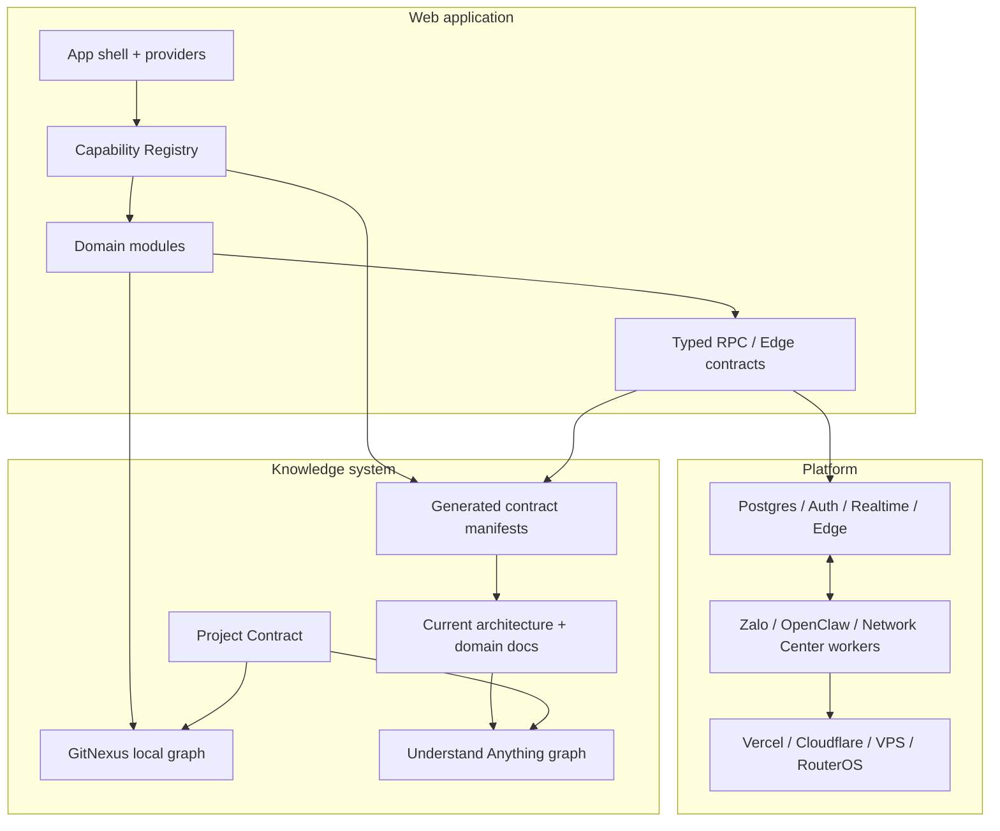

# Kế hoạch tối ưu kiến trúc, tài liệu và hệ thống agent cho whiteboard-ihomecrm

> **[LỊCH SỬ — snapshot 05/08/2026]** Plan kiến trúc gốc (đã đổi tên bỏ hậu tố " (1)" 02/09/2026). Kiến trúc hiện hành: `docs/CODEBASE_STRUCTURE.md` + `docs/engineering/PROJECT_CONTRACT.md` §1. Giữ làm bằng chứng, không cập nhật nữa.

> **Repository:** `zxGreenxz/whiteboard-ihomecrm`  
> **Nhánh/commit của bản đánh giá gốc:** `main` / `7849ca219d09ddd509294b2dbb157418a477082d`  
> **Ngày đánh giá:** 2026-08-05, Asia/Ho_Chi_Minh  
> **Refresh codebase + database:** 2026-08-05; filesystem local hiện tại và production catalog project `tryymsxyyckgbrmmvozx` được truy vấn read-only.  
> **Giới hạn bằng chứng:** checkout local không có thư mục `.git`, vì vậy refresh này không xác minh được HEAD, working-tree diff hoặc lịch sử commit tại máy; các kết luận current-state dùng filesystem + catalog thật, không suy từ commit hash.  
> **Mô hình phát triển đã xác nhận:** dự án độc lập; **không còn dùng Lovable**; Claude Code và Codex là hai coding agent chính.  
> **Phương pháp:** giữ bằng chứng của đánh giá gốc, sau đó đối chiếu lại toàn bộ plan với code local, CI, generated types, 625 migration files, graph Understand Anything và production PostgreSQL 17.6. Database chỉ được đọc qua Supabase Management API; không có lệnh ghi nào được chạy.

---

# PHẦN 0 — CHANGELOG RÀ SOÁT 05/08/2026 (đọc trước mọi phần khác)

> Bản rà soát này đối chiếu lại toàn bộ plan với filesystem thật (4 luồng kiểm chứng độc lập) và
> bổ sung 4 quyết định của chủ dự án. **Khi phần thân dưới đây mâu thuẫn với Phần 0, Phần 0 thắng.**

## 0.1. Bốn quyết định của chủ dự án (05/08/2026)

| # | Câu hỏi | Quyết định | Hệ quả cho plan |
|---|---|---|---|
| Q1 | GitHub plan | **Private + Free** | Branch protection/required-checks **không enforce được** trên private repo Free. Lớp chặn cứng duy nhất khả thi nằm ở **Vercel**, không phải GitHub. Viết lại §28/§46. |
| Q2 | Ai review/approve PR | **Agent tự động commit, push, approve và promotion — chủ dự án không làm chốt review** | Bỏ "human promotion bắt buộc" khỏi §28/§40/§55/§XV-12. Thay bằng **auto-promote-on-green**: máy gate + evidence + rollback tự động (§0.4). |
| Q3 | `.git` của checkout | **Đã mất, phải khôi phục tại chính thư mục này** | Thêm deliverable **#0 của Đợt 0**; trước khi có `.git`, mọi bước branch/PR/commit/GitNexus/`/understand-diff` đều không chạy được. |
| Q4 | Hình thức tài liệu | **Sửa thẳng file plan này** | Không tạo file amendment; changelog nằm ở Phần 0. |

**Tension phải ghi nhận rõ (Q2):** rủi ro P0.1 của plan là "agent phát hành production không có điểm dừng".
Quyết định Q2 giữ nguyên tính tự động đó. Vì vậy bản sửa này **không giả vờ** đã đóng P0.1 bằng con người;
nó chuyển điểm dừng từ *người* sang *máy*: production chỉ được promote khi **toàn bộ gate bắt buộc xanh**,
mọi promotion ghi evidence, và rollback là một lệnh (§0.4). Trade-off còn lại — không ai nhìn bằng mắt trước khi
logic tiền thật lên production — là rủi ro **được chấp nhận có chủ đích**, phải ghi vào `ADR-0003`.

## 0.2. Hiệu chỉnh số liệu (bằng chứng filesystem 05/08/2026)

| # | Plan viết | Thực tế đo được | Ảnh hưởng |
|---|---|---|---|
| C1 | 132 call site `.rpc(...)` | **244**: 132 `.rpc(` + **112** `(supabase.rpc as any)(` mà grep cũ bỏ sót (45 file). **174/244 = 71 %** đi qua `any` cast (62 `(supabase as any).rpc(` + 112 dạng trên) | §2A, §9, §46, Đợt 5: allowlist raw-call phải đo **cả hai pattern**, nếu không baseline sai 46 % và ratchet vô nghĩa |
| C2 | "baseline hiện tại 74 lỗi", "giữ 74 fingerprint" | `ts-baseline.txt` chỉ chứa chuỗi `74` và **không script/CI nào đọc** — artifact chết. Gate sống là `ts-baseline.json` với **30 fingerprint** (`scripts/check-ts-baseline.mjs`, comment: "không đếm số nữa") | Bỏ mọi acceptance "giữ 74"; đổi thành "không thêm fingerprint mới". Việc cần làm là **xoá `ts-baseline.txt`** + sửa `CLAUDE.md` đang trích số 74 |
| C3 | `types.ts` "thiếu 2 partition `..._20260905`" | `types.ts` = **32 406 dòng** và **đã commit sẵn 80 partition ngày** (`network_{device,interface}_samples_20260727`→`20260904`), tăng ~96 dòng/ngày | P0.7 đúng về nguyên nhân nhưng nhẹ về mức độ: canonical hoá lần đầu là **xoá 80 partition khỏi file**, một PR diff lớn — phải là deliverable tường minh của Đợt 1a |
| C4 | 416 file test, "2 Deno Edge suites" | **418** file test (+1 `.test.yaml`). `supabase/functions/` có **15** file `*.test.ts` nhưng **chỉ 2** (`*/index.test.ts`) chạy Deno; **13 file còn lại chạy Vitest** qua script root | `tooling/test-matrix.json` phải gán runner theo **glob/file**, không theo thư mục |
| C5 | `.ua/meta.json` field `analyzedAt` | Field thật là **`lastAnalyzedAt`**; kèm `gitCommitHash: d0ffb045…`, `analyzedFiles: 2120`; graph 4.34 MB + fingerprints 2.46 MB **được commit có chủ đích** (`.gitignore` chỉ loại sub-path) | Freshness checker phải đọc đúng tên field; `.ua/intermediate/` và `diff-overlay.json` "vắng mặt" là **đúng thiết kế**, không phải lỗi |
| C6 | 625 file migration là toàn bộ bề mặt SQL | Còn **`supabase/migrations-archive/`**: 1 file superseded + **`migrations-bundle/` 14 file `*_apply_*.sql` prefix 8 chữ số** — **naming scheme thứ ba**, README ghi "TUYỆT ĐỐI KHÔNG replay", `DATABASE_SCHEMA.md` không nhắc | Provenance phải phủ **640 file**, không phải 625 |
| C7 | 33 nhóm trùng version | 33 nhóm = **69 file** (max 3 file/version); **legacy còn collision nội bộ** (`016_` ×4, `017_` ×2) ⇒ bề mặt thứ tự mơ hồ ~75 file | Khoá provenance phải là **(version, name, sha256)**, không chỉ version |
| C8 | Runtime matrix 8 dòng | Thiếu **4 manifest**: `services/openclaw-egress-broker` (>=24.15 <25), `infra/openclaw-zalo-watchdog` (>=24.15 <25), `worker/` (**không khai engines**), `infra/cloudflare-worker` (**không khai engines**). Thực tế: 6 ràng buộc trên 8 manifest + 2 bỏ trống. `.e2e-fleet/` không có `package.json` riêng | §P1.5 giữ nguyên hướng, mở rộng phạm vi |
| C9 | Feature flag "bị khai lặp nhiều nơi" | **Đã tập trung tốt**: mỗi env đọc đúng **một** module (`src/lib/{network-center,openclaw-zalo}/runtime.ts`), consumer import boolean dẫn xuất | Không mô tả flag như bị phân tán; `CapabilityDefinition.release` phải **tham chiếu module runtime hiện có**, không đọc `import.meta.env` lần nữa |
| C10 | — (chưa nêu) | **86 file test dùng `readFileSync` đọc source**; 3 file assert trực tiếp `App.tsx`/`Sidebar.tsx`/`launcherTiles.ts` bằng regex chuỗi | Đợt 4 tách `App.tsx` sẽ làm vỡ các test này ⇒ inventory + chuyển sang data-driven test phải nằm **trong cùng PR** |
| C11 | — (chưa nêu) | Prior art đã tồn tại: facade thật `src/hooks/openclaw-zalo/openClawRpc.ts` ("one hole" pattern); boundary hoàn chỉnh nhất repo `src/lib/network-center/{contracts,dto,supabaseRepository,demoRepository,repositoryLifecycle}.ts`; 4 arg-builder thuần (`contractCreateRpc`, `customerCreditRpc`, `incomeExpenseCreateRpc`, `paymentRecordRpc`) — dạng arg-builder **vẫn để caller gọi `.rpc()` qua any-cast**, tức mới typed một nửa | §9/Đợt 5 phải cite prior art này thay vì thiết kế lại |
| C12 | Số đếm docs stale | Con số **`371` migration lặp ở 3 file** (`supabase/README.md`, `docs/DATABASE_SCHEMA.md`, `docs/CODEBASE_STRUCTURE.md`) — lệch 254 file, CI hiện **xanh** | Củng cố P1.9; `check-docs.mjs` hiện chỉ kiểm link/trùng/sidebar/`status: published`, **không** kiểm freshness/owner/số đếm |
| C13 | `docs/he-thong/` có `Reviewed:` | **Không file nào có YAML frontmatter**; chỉ **12/26** file có blockquote `> **Reviewed:** 2026-07-20`. Ngược lại `docs/huong-dan-su-dung/` **đã có frontmatter chuẩn** (title/routes/permissions/captured/status; 103/104 `published`) | §11 nên **tái sử dụng schema của `huong-dan-su-dung`**, và checker phải parse được cả hai dạng trong giai đoạn chuyển tiếp |

**Xác nhận đúng nguyên văn:** 625/593/32/33 file migration; max version `20260805120000`; line counts `App.tsx` 604 / `Sidebar.tsx` 669 / `permissionPages.ts` 742 / `useRealtimeDataSync.ts` 393; auth listener module-scope không cleanup (`src/App.tsx:230-237`); `.from(` 836; Copilot glob không lọc gì (`src/copilot/tools/registry.ts:53-64`); `AGENTS.md:28-31` vẫn dạy redirect `gen:types >`; `CLAUDE.md:99-112` vẫn bắt `git push origin HEAD:main`; README nguyên mẫu Lovable + `lovable-tagger`; 4 file governance chưa tồn tại; **mọi path plan đề xuất tạo đều chưa tồn tại (không đụng độ)**; 7 script gate hiện hữu đều có thật.

## 0.3. Bảy vùng rủi ro plan chưa phủ (bổ sung, xếp theo mức độ)

- **R1 — `.git` đã mất (P0, chặn Day-0).** Không có `.git` thì không branch/PR/commit/diff/blame; `.ua/meta.json` pin `d0ffb045…` và `DATABASE_SCHEMA.md` pin `1d2c9d9` đều không giải được. Thêm nữa `node_modules` thiếu `typescript` ⇒ `npm run typecheck:baseline` không chạy. **Khôi phục `.git` + `npm ci` là deliverable #0 của Đợt 0**, làm trước cả việc sửa file hướng dẫn.
- **R2 — Backup: ĐÃ ĐO 05/08 và kết quả là rủi ro thật (P0).** Truy vấn `GET /v1/projects/{ref}/database/backups`:

  | Chỉ số | Giá trị đo được |
  |---|---|
  | `pitr_enabled` | **`false`** — **KHÔNG có Point-in-Time Recovery** |
  | `walg_enabled` | `true` |
  | Backup vật lý | 7 bản, mỗi ngày một lần, gần nhất `2026-08-04T20:54Z` |
  | Region | `ap-southeast-1` |

  Hệ quả: **RPO tối đa ~24 giờ** — một lệnh sai lúc 20:00 có thể mất gần trọn ngày dữ liệu tiền, và không có cách tua về đúng thời điểm ngay trước lệnh đó. Trước khi bắt đầu Đợt 1b/3: hoặc **bật PITR** (tính năng trả phí), hoặc **bắt buộc kéo dump thủ công ngay trước mỗi thao tác schema**. `pg_dump` 17.10 đã có sẵn tại `C:\Program Files\PostgreSQL\17\bin` (server 17.6) nên đường dump/baseline khả thi; nơi lưu dump do chủ dự án chỉ định, **không để trong repo hay thư mục tạm**.
- **R3 — Chưa quét secret trong git history (P0 sau khi có `.git`).** `.gitignore` **không có `.env`**, mà root đang có file `.env` thật. *Đã kiểm: nội dung chỉ gồm `VITE_SUPABASE_PROJECT_ID`/`PUBLISHABLE_KEY`/`URL` + `VITE_R2_PUBLIC_BASE`/`VITE_STORAGE_GATEWAY` — publishable, vốn nhúng vào bundle client, nên **không phải rò rỉ nghiêm trọng**.* Việc cần làm vẫn còn hai phần: (a) thêm `.env` vào `.gitignore` (hoặc commit có chủ đích) để `git add -A` không nuốt nhầm; (b) chạy `gitleaks`/`trufflehog` trên **toàn history** sau khi khôi phục `.git` — GitHub secret-scanning cho private repo là tính năng trả phí nên không thay thế được bước này.
- **R4 — PAT Supabase trong vault = đường ghi production thường trực (P0/P1).** `CLAUDE.local.md` giữ PAT Management API **account-scoped, chạy được SQL tuỳ ý trên production**. Chừng nào PAT còn nằm sẵn, mọi lời văn "agent không tự apply production" chỉ là instruction-level. Bù bằng cơ chế: `apply-reviewed-migration.mjs` và mọi tool ghi production yêu cầu **promotion token nhập tại thời điểm chạy, không lưu trong `CLAUDE.local.md`** — xem §0.4 để biết cách phối hợp với quyết định Q2.
- **R5 — Đường deploy Edge Function không được quản trị (P1).** `supabase functions deploy` là **đường lên production thứ hai**, không qua Vercel, không qua forward lane. 14 function dir đang chạy. Bảng gate §27 thiếu hoàn toàn dòng này: ai deploy, từ SHA nào, evidence gì, `supabase secrets set` do ai quản.
- **R6 — Env var/feature flag phía Vercel dashboard (P1).** `vercel.json` commit sẵn `VITE_NETWORK_CENTER_MODE=production` (tốt — review được qua diff), nhưng `VITE_OPENCLAW_ZALO_MODE` và các key Supabase nằm trên dashboard, đổi out-of-band không để lại dấu vết. Thêm: `vercel.json` có **2 cron** `/api/salary-v5-cron` (đụng lương) chỉ chạy trên production deployment — phải rà khi đổi production branch.
- **R7 — Acceptance gắn số tuyệt đối sẽ tự mục (P1).** Ví dụ nặng nhất: Đợt 1 yêu cầu raw-diff "chỉ gồm `network_device_samples_20260905` + `network_interface_samples_20260905`" — sai **ngay ngày hôm sau** vì partition sinh mỗi ngày. Tương tự `372 ledger rows`, `398 tables`, `74 lỗi TS`, `postgresVersion: 17.6` exact (Supabase tự vá minor). **Quy tắc thay thế:** checker so với giá trị đọc live hoặc file baseline đã commit; số trong tài liệu chỉ là snapshot có ghi ngày, không bao giờ hard-code vào script.

## 0.4. Mô hình phát hành mới — thay thế §28 (theo Q1 + Q2)

Vì repo **private trên GitHub Free**, branch protection không enforce được; vì chủ dự án chọn **tự động hoàn toàn**,
human approval không phải là gate. Mô hình thay thế đặt toàn bộ trọng lượng lên **ranh giới deploy của Vercel**:

```text
agent commit → push main → Vercel PREVIEW deploy (không ảnh hưởng người dùng)
                              ↓
                    gate suite bắt buộc chạy
                              ↓
              xanh hết ──→ auto-promote: fast-forward branch `production`
                              ↓            (ghi evidence: SHA, gate results, catalog fingerprint)
              đỏ bất kỳ ──→ dừng, giữ production ở SHA cũ, báo rõ gate nào đỏ
```

Bốn thay đổi cấu hình là xương sống (tất cả **miễn phí**, không cần GitHub Pro):

1. **Vercel Production Branch đổi từ `main` sang `production`** (tạo `production` tại đúng SHA đang chạy trước khi đổi). Từ đây `push main` **không còn là deploy** — đó là kiểm soát cứng duy nhất khả thi ở tier Free và nó hoạt động bất kể agent làm gì với git.
2. **Promotion = fast-forward `production`**, do agent tự chạy sau khi gate xanh, không cần người bấm.
3. **Rollback = promote lại SHA trước** (một lệnh, Vercel giữ sẵn deployment cũ) — phải test một lần ở Đợt 0 và ghi vào runbook.
4. **Đường ghi database production vẫn tách riêng** khỏi đường deploy web: promotion token nhập tay (R4). Deploy web sai thì rollback được; migration sai thì không.

Ghi chú cho `ADR-0003`: đây là "human out of the loop, machine gate in the loop". Điều kiện để mô hình này
không phải là ảo tưởng: (a) gate suite phải thật sự phủ money/RLS/schema — nếu không, auto-promote chỉ là
push thẳng có thêm bước; (b) mọi gate `continue-on-error` không được tính là xanh; (c) rollback phải đã được
diễn tập, không phải giả định. Nếu sau này chủ dự án muốn siết, chỉ cần bỏ bước auto-promote — phần còn lại giữ nguyên.

## 0.5. Sửa trình tự các đợt

- **Đợt 0 tách 0a/0b.** *0a — chặn cứng, làm trong 1 ngày:* khôi phục `.git` + `npm ci` → tạo branch `production` → đổi Vercel Production Branch → test rollback → verify backup/PITR + kéo dump ngoài nền tảng → thêm `.env` vào `.gitignore` + gitleaks toàn history → phẫu thuật tối thiểu `CLAUDE.md`/`AGENTS.md` (bỏ "push `main` = xong", bỏ lệnh redirect typegen). *0b — hợp đồng:* `PROJECT_CONTRACT.md` đầy đủ → chạy thử vài session → **rồi mới** rút `CLAUDE.md`/`AGENTS.md`/`AI_RULES.md` thành adapter. **Không được có khoảng thời gian nào mà một invariant đang cứu hệ thống hằng ngày không nằm ở đâu cả.** Pin GitNexus/`agent-tools.json` **rời khỏi Đợt 0** (không phải containment) — chuyển sang lúc thật sự bắt đầu dùng tool.
- **Đợt 1 tách 1a/1b.** *1a (nhỏ, mở khoá CI ngay):* canonical typegen loại partition + xoá 80 partition đã commit + catalog fingerprint. *1b (chạy nền, không chặn ai):* provenance 640 file. Không có phụ thuộc kỹ thuật nào buộc 1a chờ 1b.
- **Provisional cutoff thay cho stop-gate "hết unknown".** Tách ba khái niệm đang dính nhau: (a) **cutoff cho lane mới** — tuyên bố được **ngay hôm nay**: "mọi migration version > mốc chốt là forward-only, có digest + provenance từ dòng đầu; mọi file cũ hơn mặc định `legacy-frozen`, khoá read-only" (không cần biết file cũ nào đã chạy); (b) **baseline** — capture từ **live catalog**, chỉ cần R2 (backup) chứ không cần forensics file; (c) **provenance đầy đủ cho legacy** — hoạt động audit chạy nền. Nhờ đó "provenance nửa chừng" không còn chặn mọi migration mới. Gate provenance chỉ **fail** cho file sau cutoff; độ phủ legacy là **metric báo cáo**.
- **Đợt 2 tách external controls khỏi bó required checks.** 6/8 gate không phụ thuộc Đợt 1, bật được sớm. Phần "protected main + CODEOWNERS enforced" đánh dấu **chỉ khả thi nếu nâng GitHub Pro (~4 USD/tháng) hoặc chuyển public** — ở tier Free thay bằng: job CI báo động khi có push thẳng `production`, cộng ranh giới Vercel ở §0.4.
- **Đợt 3 cho phép capture baseline song song với provenance triage**; chỉ bước "chốt cutoff chính thức + khoá bytes legacy" mới gate trên 1b.
- **Trạng thái trung gian an toàn (áp cho mọi đợt):** ① gate mới chỉ fail cho **file/PR mới**, độ phủ cũ là metric; ② required check chỉ bật sau khi xanh ổn định ≥1 tuần, kèm thủ tục break-glass tự tạo issue nhắc bật lại; ③ baseline sống ở trạng thái `draft` cho tới khi restore + toàn bộ gate xanh, runbook chỉ đổi con trỏ sau đó; ④ **manifest nào sinh ra phải kèm checker trong cùng PR** — manifest sai còn tệ hơn không có.

## 0.6. Cắt bớt (over-engineering cho repo một người)

| Artifact | Phán quyết | Lý do |
|---|---|---|
| `.github/CODEOWNERS` | **CẮT** → thay bằng `tooling/risk-map.json` | Một owner ⇒ không tạo được reviewer thứ hai; enforce cần Pro. Giá trị thật là *bản đồ rủi ro cho agent* — nên là JSON để risk-classifier + PR template dùng được |
| 5 surface manifest | **GIẢM còn 2** | Giữ `rpc-surface.json` (244 call site — nguồn incident thật) + `edge-function-surface.json` (3 invoke, checker ~20 dòng). `capability-surface` **chính là** Registry Đợt 4 (làm trước là trùng); `realtime-surface` để Đợt 5; `database-object-ownership` trùng vai catalog inventory |
| `SECURITY.md`, `CONTRIBUTING.md` | **CẮT khỏi critical path** | Repo private, không contributor ngoài. Stub 5 dòng khi rảnh |
| 8 CI gate riêng (§31) | **GỘP còn 3 job** | `contract-gates` (agent + capability + runtime pin + known-gap expiry — toàn static, một runner); `schema-gates` (provenance + canonical types + forward lane); `docs-freshness` (docs + Copilot manifest; UA staleness chỉ **warning**) |
| `known-gaps.yaml` schema đầy đủ | **GIẢM field** | Giữ `id/expires_at/why/exit_condition` + checker ~30 dòng; bỏ `owner` (luôn là một người), `evidence` optional |
| Bộ 9 file `docs/engineering/*` | **GIẢM còn 3 trước** | `PROJECT_CONTRACT` + `MIGRATION_STRATEGY` + `DATA_ENVIRONMENTS`; phần còn lại viết theo nhu cầu |
| Frontmatter có `owner` + stale-threshold **fail** | **SỬA** | Bỏ `owner`; stale-threshold là **warning** — nếu fail, một người sẽ bulk-bump ngày review theo nghi thức và phá luôn tín hiệu |
| UA freshness thành required check | **SỬA: không required** | UA refresh thủ công/hiếm theo chính §21 ⇒ gate CI sẽ đỏ thường trực hoặc bị bump hình thức. Giữ script chạy tay/warning |
| `tooling/packages.json` + `run-package-gates` | **HẠ xuống P2** | Refactor thứ đang chạy (dù xấu); làm khi một gate thật sự gãy |
| Screenshot evidence cho external control | **THAY bằng API** | `check-external-controls.mjs` gọi `gh api …/branches/main/protection`, `vercel env ls`, project settings → JSON redacted commit làm evidence, **chạy lại định kỳ** (control có thể bị tắt về sau — evidence một lần không đủ) |
| `reviewedBy` từng file trong 640 entry | **THAY bằng batch + sampling** | 2–3 phút/file ≈ 25–30 giờ ⇒ sẽ ký hình thức và mất luôn giá trị. Xem §0.7 |
| Two-agent adversarial review mọi high-risk (§40) | **GIẢM phạm vi** | Chỉ tier Money / Authorization-RLS / Migration |

## 0.7. Giảm tải provenance: batch + sampling (thay §24 phần review)

Đổi ngữ nghĩa `reviewedBy` từ *"người đã xem file này"* sang *"người đã duyệt **quy tắc phân loại** và **mẫu kiểm** của batch"*:

- `ledger-applied` — máy so `(version, name)` + digest với ledger ⇒ **auto**, không cần mắt người (bằng chứng là phép so sánh).
- `catalog-proven` — script đối chiếu object file tạo với catalog descriptor ⇒ **auto-tag**; người duyệt **quy tắc đối chiếu** một lần + random sample n≈30 trên bucket.
- **Review 100 %** chỉ dành cho: file còn `unknown` sau khi máy đã chạy, **và** mọi file đụng tiền / RLS / SECURITY DEFINER bất kể state (risk-directed).
- `reviewedBy` ghi `batch:<id>` trỏ tới một review record (rule + sample + kết quả).

Ước tính: ~30 giờ → ~3–4 giờ, giữ nguyên nguyên tắc "không suy đoán 'đã chạy' từ timestamp".

## 0.8. Việc mới thêm vào backlog (chưa có trong plan gốc)

1. Khôi phục `.git` + `npm ci` (Đợt 0a, chặn mọi thứ).
2. Verify backup/PITR + dump ngoài nền tảng (Đợt 0a, trước mọi việc baseline).
3. `.env` vào `.gitignore` + gitleaks toàn history + rotate thứ bị lộ (Đợt 0a).
4. Vercel production-branch flip + diễn tập rollback + rà scope 2 cron salary (Đợt 0a).
5. Promotion token ngoài vault cho mọi write production (Đợt 0a ở mức rule, Đợt 3 ở mức wrapper).
6. Edge Function deploy governance — thêm dòng vào bảng gate §27 (Đợt 2/3).
7. `check-external-controls.mjs` + snapshot `vercel env ls` định kỳ (Đợt 2).
8. Provenance phủ thêm `migrations-archive/` 15 file (Đợt 1b).
9. Xoá `ts-baseline.txt` chết + sửa số 74 trong `CLAUDE.md` (Đợt 0b).
10. Hợp nhất **2 guard `db push`** trùng lặp khác độ chặt (`supabase-migrate.yml:41` regex vs `network-center-validation.yml:264` bare-substring) (Đợt 2).
11. Inventory + chuyển **86 test đọc source bằng `readFileSync`** sang data-driven (cùng PR với Đợt 4).
12. Thêm npm alias cho 4 script gate chưa có (`check-view-invoker`, `check-stable-fn-locks`, `reconcile-money`, `clone-org/snapshot`) — hiện chỉ 3/7 script có alias nên agent dễ bỏ sót; làm rõ `reconcile-money.mjs` vs `reconcile-money-v2.mjs` cái nào canonical (Đợt 2, cùng test-matrix).
13. Dọn dangling ref `SUMMARY.md`: `Sidebar.tsx:112` + ~20 ref trong `.kiro/specs/resident-docs-alignment/` (Đợt 4 hoặc lúc rảnh).
14. Quyết định permission gate cho Copilot tool `huong_dan` — hiện **không có `requiredPermission`**, khác mọi tool anh em (Đợt 1a, cùng lúc chặn ingest docs stale).
15. **Nhịp tim chương trình**: `tooling/program-status.json` ngắn + rà 30 phút/tuần (đợt nào, blocker gì, việc kế tiếp). Chương trình một người chết trong im lặng.

## 0.9. Containment tối thiểu trong 1 ngày (nếu chỉ có 1 ngày rồi quay lại làm tính năng)

1. Khôi phục clone git sạch; diff cứu công việc dở dang; xác nhận `CLAUDE.local.md`/`.env` không bị track. `npm ci`. **[1–2 h]**
2. Tạo branch `production` tại SHA đang chạy → đổi Vercel Production Branch sang `production` → rà scope env + 2 cron → diễn tập rollback. **[~1 h]**
3. Verify PITR/backup + kéo một bản dump về nơi chủ dự án tự giữ; ghi lại các bước restore. **[~1 h]**
4. `gitleaks` toàn history; thêm `.env` vào `.gitignore`; rotate thứ bị lộ (nếu có). **[1–2 h]**
5. Phẫu thuật tối thiểu instruction: xoá "Push lên `origin/main` NGAY" (`CLAUDE.md:99-112`) và lệnh redirect typegen (`AGENTS.md:28-31`); thay bằng "push branch; production chỉ lên qua promotion khi gate xanh". **[~30 ph]**
6. Rule promotion token ngoài vault (R4). **[~30 ph]**
7. Chặn Copilot ingest docs quá hạn 20/07 bằng allowlist tạm. **[30–60 ph]**
8. Ghi `tooling/program-status.json` với 3 dòng: đang ở đâu, blocker gì, việc kế tiếp. **[10 ph]**

Sau ngày này: agent push nhầm chỉ ra preview; có backup đã kiểm; có đường quay lại bằng git; feature work tiếp tục được trong khi Đợt 0b/1a/1b chạy nền.

---

## 0. Contract của kế hoạch

**Objective:** đưa repository từ trạng thái nhiều nguồn sự thật và deployment evidence phân mảnh sang một critical path có thể triển khai, kiểm chứng và dừng đúng lúc.

**In scope:**

- agent/release safety;
- schema truth, migration provenance, baseline và forward-only workflow;
- deterministic generated types;
- capability/navigation/permission contract;
- risk-scoped RPC/Edge contracts;
- tài liệu current, Copilot ingest và knowledge-tool freshness;
- local credential contract để agent tự động test/seed/query đúng môi trường mà không làm lộ secret;
- runtime/test/CI governance cần thiết để kiểm các mục trên.

**Out of scope:**

- rewrite toàn bộ frontend theo `src/features` trong một đợt;
- bọc typed wrapper cho mọi RPC low-risk;
- thay toàn bộ CI bằng monorepo orchestrator mới;
- tự đổi production branch, apply database hoặc bật feature production trong cùng plan implementation;
- di chuyển, sao chép hoặc commit giá trị trong `CLAUDE.local.md` sang file khác;
- cleanup/refactor không trực tiếp phục vụ acceptance criteria của từng đợt.

**Definition of Done của toàn chương trình:**

1. Không còn đường agent mặc định đẩy thẳng production.
2. Mỗi thay đổi schema mới có file duy nhất, digest, provenance và catalog evidence.
3. Môi trường mới dựng được từ baseline + forward migrations mà không replay legacy history.
4. Generated types deterministic và không drift vì physical partition runtime.
5. Route/nav/launcher/release flag/permission không thể drift âm thầm.
6. High-risk writer có typed boundary và contract test; raw-call baseline chỉ giảm, không tăng.
7. Current docs, Copilot ingest và knowledge graph có freshness gate.
8. `CLAUDE.local.md` vẫn là local credential vault bắt buộc, được gitignore và agent có preflight redacted để tự động làm việc khi được cấp quyền.
9. Mọi gate bắt buộc của đợt cuối cùng xanh; external control chưa xác minh phải được báo rõ, không tuyên bố production-ready.

### Thứ tự ưu tiên nguồn sự thật

Khi các phần cũ của tài liệu mâu thuẫn với refresh này, dùng thứ tự:

```text
production catalog read-only evidence
  > current source/config/test in this checkout
  > generated manifests/types after normalization
  > current docs
  > historical audit/commit prose
```

Các số liệu và quyết định trong mục **2A** thay thế số liệu cũ ở những phần chưa được sửa hết bằng prose.

## 1. Kết luận điều hành

`whiteboard-ihomecrm` hiện không còn là một ứng dụng React/Supabase đơn giản. Nó đã trở thành một **platform đa runtime và đa biên triển khai**, gồm:

- React/Vite frontend triển khai trên Vercel.
- Supabase/PostgreSQL với số lượng lớn migration, RPC, RLS, trigger và Edge Function.
- Zalo CRM worker cũ.
- Hệ OpenClaw Zalo gồm bridge, maintenance, cell, session crypto, Edge Function, media gateway, watchdog và quy trình rollout riêng.
- Network Center gồm frontend, Supabase, worker Node, Docker, WireGuard, RouterOS và runbook vận hành phần cứng.
- VitePress user documentation.
- Tài liệu hệ thống được AI Copilot nạp trực tiếp.
- Nhiều harness kiểm chứng SQL, quyền, cross-tenant, generated types, mutation test và E2E.

Chất lượng kiểm chứng ở các subsystem mới khá cao. Điểm yếu lớn nhất hiện nay không phải là “thiếu test”, mà là:

1. **Quản trị phát hành chưa tương xứng với mức rủi ro:** agent được hướng dẫn đẩy thẳng vào `main`, trong khi `main` triển khai production.
2. **Nguồn sự thật bị phân tán:** route, sidebar, launcher, permission catalog, feature flag và tài liệu được khai báo ở nhiều nơi.
3. **Tài liệu kiến trúc current đã chậm hơn codebase:** nhiều file được review ngày 20/07, trước khi Network Center và OpenClaw phát triển mạnh.
4. **Hướng dẫn agent mâu thuẫn nhau:** đặc biệt quy trình generate Supabase types và các gate database.
5. **Migration provenance không còn phản ánh production:** legacy replay hỏng, ledger dừng trước schema đang chạy và nhiều đợt được apply out-of-band.
6. **Nhiều tri thức quan trọng chỉ nằm trong commit body và comment dài**, không nằm trong invariant/ADR/runbook có cấu trúc.
7. **Code graph không phải deployed-state evidence:** SQL file có thể được index, nhưng graph không chứng minh function body, ACL, RLS, ledger hay dữ liệu đang chạy trên production.
8. **Generated types từ live DB đang không deterministic:** partition runtime của Network Center làm `types.ts` drift dù logical API không đổi.
9. **Understand Anything graph đã stale:** graph ghi mốc 29/07, không có Network Center, OpenClaw hoặc migration mới; vấn đề hiện tại là freshness, không phải khả năng xuất tiếng Việt.

### Quyết định kiến trúc đề xuất

- Dùng **GitNexus** làm nguồn context và impact analysis chính cho TypeScript/JavaScript và dependency graph.
- Dùng **Understand Anything** cho onboarding, domain map và business documentation.
- Dùng **contract manifests + SQL harness riêng của repo** để bù phần SQL/RPC/string-boundary mà hai graph không thể coi là nguồn sự thật.
- Tạo **một Project Contract duy nhất** cho Claude Code và Codex.
- Chuyển quy trình agent sang **branch → PR → required checks → human promotion**.
- Tạo **Capability Registry theo lát mỏng** cho route, release mode, navigation và permission gate; không di chuyển toàn bộ feature/action catalog trong đợt đầu.
- Tách `src/App.tsx` theo thứ tự auth lifecycle → providers → route groups; không move page tree cùng lúc.
- Lập **migration provenance manifest** trước, rồi đóng băng legacy và tạo production schema baseline + forward-only lane.
- Giữ migration mới trong `supabase/migrations/` sau cutoff để không tạo thêm một đường apply song song; CI chọn file theo policy/manifest.
- Normalize physical partitions khỏi generated-type contract.
- Chuyển tài liệu current sang mô hình có metadata, freshness gate và machine-generated inventory.
- Giữ output Understand Anything bằng tiếng Việt với plugin đã pin; refresh graph sau khi nguồn current được sửa.
- Loại toàn bộ dấu vết Lovable không còn sử dụng.

---

## 2. Bằng chứng đã kiểm tra

Các file và khu vực chính đã được đọc ở commit mốc:

| Phạm vi | File/nguồn |
|---|---|
| README gốc | `README.md` |
| Agent rules | `CLAUDE.md`, `AGENTS.md`, `AI_RULES.md` |
| Frontend bootstrap | `src/App.tsx`, `vite.config.ts` |
| Navigation | `src/components/layout/Sidebar.tsx`, `src/pages/home/launcherTiles.ts` |
| Permission model | `src/lib/permissions.ts`, `src/lib/permissionPages.ts` |
| Realtime | `src/hooks/useRealtimeDataSync.ts` |
| TypeScript | `tsconfig.json`, `tsconfig.app.json`, `ts-baseline.json`, `ts-baseline.txt`, `scripts/check-ts-baseline.mjs` |
| Root tooling | `package.json`, `.gitignore`, `.gitattributes` |
| CI | `.github/workflows/ci-gates.yml`, `.github/workflows/network-center-validation.yml` |
| Deployment | `vercel.json` |
| Docs | `docs/README.md`, `docs/CODEBASE_STRUCTURE.md`, `docs/DATABASE_SCHEMA.md`, `docs/he-thong/README.md`, `docs/he-thong/00-tong-quan.md`, `docs/he-thong/99-quy-trinh-tong.md`, `docs/plans/README.md` |
| Docs tooling | `docs-site/package.json`, `docs-site/.vitepress/sidebar.mts`, `scripts/check-docs.mjs` |
| Copilot knowledge | `src/copilot/tools/registry.ts` |
| Supabase runbook | `supabase/README.md` |
| Understand Anything | `.ua/config.json`, `.gitignore` |
| Runtime packages | `worker/package.json`, `infra/network-center-worker/package.json`, `services/openclaw-zalo-bridge/package.json`, `services/openclaw-zalo-maintenance/package.json`, `infra/openclaw-media-gateway/package.json` |
| Lịch sử thay đổi | các commit Network Center, OpenClaw, migration, RLS, rollout và docs gần nhất đến 05/08/2026 |

### Bằng chứng refresh tại filesystem/catalog hiện tại

| Phạm vi | Bằng chứng đã đo |
|---|---|
| Frontend hotspots | `src/App.tsx` 604 dòng; `Sidebar.tsx` 669; `permissionPages.ts` 742; `useRealtimeDataSync.ts` 393 |
| String boundaries | **244** lệnh gọi RPC (132 `.rpc(` + 112 `(supabase.rpc as any)(` — xem §0.2/C1), 3 `functions.invoke(...)`, 836 `.from(...)` trong `src/` |
| Tests | **418** file test-like; `supabase/functions/` có 15 file `*.test.ts` nhưng **chỉ 2 chạy Deno**, 13 chạy Vitest; 43 Playwright specs (§0.2/C4) |
| TypeScript | `strict: false`; gate sống là `ts-baseline.json` **30 fingerprint** — `ts-baseline.txt` (chuỗi `74`) là artifact chết, không script nào đọc (§0.2/C2) |
| Migration files | 625 SQL trong `supabase/migrations/` (593 timestamp 14 chữ số; 32 tên legacy; 33 nhóm trùng version = 69 file) **+ 15 file trong `migrations-archive/`** ⇒ tổng bề mặt 640 (§0.2/C6–C7) |
| Production ledger | 372 dòng; `max(version)=20260727095000` |
| Ledger divergence | 270 file timestamp không khớp exact ledger; 141 file nằm sau max ledger |
| Production public schema | 398 tables, 12 views, 5 sequences; 1,067 `pg_proc` rows trong schema `public` |
| RLS/view gates | 398/398 public tables bật RLS; 83 forced RLS; 12/12 views có `security_invoker=true` |
| Definer/lock gates | 1,057 SECURITY DEFINER trong `public` + `app_private`, không hàm nào thiếu function-level `search_path`; stable-function lock gate xanh |
| Latest schema evidence | guard production có `ANNOTATE`, `CASHBOOK_MOVE`, `LINK_CONTRACT`, `SALE_BONUS_DEPOSIT`; alias `dsphongtrong` tồn tại |
| Generated types | `types.ts` 32 406 dòng, **đã commit sẵn 80 partition ngày** `network_{device,interface}_samples_20260727`→`20260904` (~96 dòng/ngày); so với live typegen thiếu 2 partition của ngày kế tiếp (§0.2/C3) |
| Understand Anything | plugin local `2.9.4`, output `vi` hoạt động; `meta.json` dùng field **`lastAnalyzedAt`** = 29/07, `gitCommitHash d0ffb045…`, `analyzedFiles 2120`; không chứa Network Center/OpenClaw/latest migrations (§0.2/C5) |
| Local agent credentials | `CLAUDE.local.md` tồn tại ở repo root và đã được `.gitignore`; audit chỉ xác minh existence/ignore, không đọc hoặc ghi credential values. **`.env` ở root KHÔNG được gitignore** — nội dung chỉ gồm biến `VITE_*` publishable nên không phải rò rỉ nặng, nhưng vẫn phải xử (§0.3/R3) |
| Git / toolchain local | **Không có `.git`** trong checkout; `node_modules` thiếu `typescript` ⇒ mọi bước git-based và `npm run typecheck:baseline` chưa chạy được (§0.3/R1) |

---

## 2A. Baseline current-state đã xác minh

### Blocker phải sửa trước các refactor lớn

0. **Không có `.git` + thiếu toolchain (mới, chặn Day-0):** checkout không phải git repo và `node_modules` thiếu `typescript`. Mọi bước branch/commit/PR/diff và `npm run typecheck:baseline` đều bất khả thi cho tới khi khôi phục (§0.3/R1).
0b. **Chưa xác minh backup/PITR production (mới):** không được đụng baseline/migration lane khi chưa biết backup có thật và restore được (§0.3/R2).

1. **Agent release policy:** `CLAUDE.md` và `AGENTS.md` vẫn yêu cầu push `HEAD:main`. **Cách xử đã đổi theo §0.4:** ở tier GitHub Free, lớp chặn là **Vercel production branch**, không phải branch protection; agent vẫn tự commit/push/promote nhưng promotion chỉ chạy khi gate xanh.
2. **Generated-types instruction:** `AGENTS.md` vẫn redirect vào `types.ts`, trái với generator atomic hiện tại.
3. **Migration provenance:** production schema đi trước `supabase_migrations.schema_migrations`; không thể dùng ledger hiện tại để suy file nào đã chạy.
4. **Partition-driven type drift:** live typegen nhìn thấy physical partitions do runtime tạo theo ngày, làm CI drift job đỏ mà logical schema không đổi.
5. **Copilot docs:** `docs/he-thong/*.md` vẫn được glob toàn bộ, trong khi current docs dừng ở 20/07.
6. **Knowledge graph:** `.ua` có file mới trên filesystem nhưng metadata vẫn ở commit/mốc 29/07; timestamp file không chứng minh graph fresh.

### Fix-now trong code path kế hoạch sẽ thay đổi

- Sửa agent rules và thêm contract gate trước mọi rollout khác.
- Tạo provenance inventory read-only trước khi freeze/move bất kỳ migration nào.
- Sửa type generation contract trước khi dùng live type drift làm required check.
- Pin cả `network-center-validation.yml` và `supabase-migrate.yml`; không chỉ workflow chính.
- Giữ các DB safety gate đang xanh làm regression gates, không mở một security rewrite mới.
- Dùng existing domain-local contracts làm nền; không tạo cây abstraction song song.
- Giữ `CLAUDE.local.md` làm shared local credential source cho Claude Code/Codex; chỉ thêm contract tên field và preflight redacted.

### Deferred có chủ ý

- full `src/features/**` migration;
- workspaces/Turborepo/Nx;
- wrapper cho mọi read-only RPC;
- UA auto-update;
- production branch riêng cho Vercel trước khi branch protection/PR flow cơ bản hoạt động;
- Git LFS cho graph khi chưa có bằng chứng kích thước hoặc policy yêu cầu.

Nguồn chính thức của công cụ được đối chiếu:

- GitNexus: <https://github.com/nxpatterns/gitnexus>
- Understand Anything: <https://github.com/Egonex-AI/Understand-Anything>

---

# PHẦN I — ĐÁNH GIÁ SÂU CODEBASE VÀ TÀI LIỆU HIỆN TẠI

## 3. Các phát hiện P0 — cần xử lý trước khi mở rộng agent

### P0.1. Agent đang được hướng dẫn tự động phát hành production

Cả `CLAUDE.md` và `AGENTS.md` đều hướng agent:

1. sửa code;
2. commit;
3. push thẳng `HEAD:main`;
4. coi việc chưa push là chưa hoàn tất.

Trong cùng tài liệu, repository được mô tả là deploy trực tiếp từ `main` qua Vercel.

Đây là một đường phát hành tự động không có điểm dừng review. Rủi ro tăng mạnh vì:

- agent có quyền đọc secret cục bộ;
- agent có thể apply hoặc kiểm tra live database;
- repository chứa logic tiền, RLS, Security Definer, phần cứng mạng và rollout OpenClaw;
- commit gần đây cho thấy nhiều lỗi chỉ lộ khi đo bằng role thật, HTTP thật hoặc production schema thật;
- một thay đổi đúng ở một harness có thể vẫn sai ở môi trường production.

**Đề xuất bắt buộc (đã viết lại 05/08 theo quyết định Q1 + Q2 — xem §0.4):**

- **Điều bắt buộc duy nhất không thương lượng: `push main` không được là `deploy production`.** Thực hiện bằng cách đổi Vercel Production Branch sang `production`; ở tier GitHub Free đây là kiểm soát cứng khả thi duy nhất.
- Agent **được phép** tự commit, push `main` và tự promote — chủ dự án không làm chốt review (Q2). Đổi lại, promotion chỉ chạy khi **toàn bộ gate bắt buộc xanh**, mỗi lần promote ghi evidence (SHA, kết quả gate, catalog fingerprint), và rollback là một lệnh đã được diễn tập.
- Gate `continue-on-error` **không được tính là xanh** khi quyết định promote.
- Tách “đã hoàn tất code” khỏi “đã phát hành production”: hoàn tất code = merge vào `main` + preview xanh; phát hành = fast-forward `production`.
- Đường ghi **database** production tách khỏi đường deploy **web**: web sai thì rollback được, migration sai thì không ⇒ mọi write production qua Management API yêu cầu promotion token nhập tại chỗ, không lưu trong vault (§0.3/R4).
- Phần "branch protection + required review trên `main`" chỉ khả thi nếu nâng GitHub Pro hoặc chuyển repo public; giữ lại như tuỳ chọn, không phải tiền đề.

Quyền đọc credential không bị loại bỏ. `CLAUDE.local.md` phải tiếp tục tồn tại ở repository root, được gitignore và là nguồn local bắt buộc cho tài khoản test, Supabase PAT/project ref, password `FLEET_PASS_*` và key dịch vụ cần cho automation. Giảm rủi ro bằng action boundary, environment preflight và redacted logging; không làm agent mất khả năng tự seed/test/query hệ thống trong phạm vi được giao.

---

### P0.2. `AGENTS.md` đang hướng dẫn generate types theo cách có thể phá file

`CLAUDE.md` nói đúng rằng:

```bash
npm run gen:types
```

script tự ghi nguyên tử vào:

```text
src/integrations/supabase/types.ts
```

và không được redirect stdout.

`AGENTS.md` lại hướng:

```bash
npm run gen:types > src/integrations/supabase/types.ts
```

sau đó thêm header thủ công.

Redirect shell sẽ mở và cắt trắng file trước khi generator chạy. Nếu generator lỗi, file types bị phá. Repo đã có test chống đúng lớp lỗi này.

**Đề xuất bắt buộc:**

- Sửa ngay `AGENTS.md`.
- Thêm CI rule cấm chuỗi `npm run gen:types >`.
- Không cho GitNexus tự sửa hai agent file khi chưa có Project Contract chuẩn.
- Mọi rule generated types phải nằm ở một nguồn canonical.

---

### P0.3. Có ba nguồn rule agent không đồng nhất

Hiện có:

- `CLAUDE.md`
- `AGENTS.md`
- `AI_RULES.md`

`AI_RULES.md` chứa nhiều quy tắc đã không còn đúng:

- yêu cầu giữ toàn bộ route trong `src/App.tsx`;
- tuyên bố TypeScript strict mode đã bật, trong khi `strict: false`;
- yêu cầu dùng Supabase Storage, trong khi hệ thống đã dùng R2 và Cloudflare;
- cấm CSS riêng, trong khi repo có các page CSS được cô lập có chủ ý;
- mang phong cách rule của dự án frontend đời đầu, không phản ánh platform hiện tại.

`Sidebar.tsx` còn comment “khớp 100% SUMMARY.md”, nhưng `SUMMARY.md` không tồn tại ở commit được kiểm tra.

**Đề xuất bắt buộc:**

- Retire `AI_RULES.md` hoặc biến nó thành file pointer ngắn.
- Tạo `docs/engineering/PROJECT_CONTRACT.md`.
- `CLAUDE.md` và `AGENTS.md` chỉ là adapter mỏng.
- Không để cùng một invariant được viết lại bằng prose ở ba nơi.

---

### P0.4. Lịch sử migration không replay được nhưng runbook vẫn mô tả như replay chuẩn

`supabase/README.md` yêu cầu:

- timestamp/tên duy nhất;
- migration chạy theo thứ tự tên;
- thêm migration mới, không sửa lịch sử.

Refresh local + production catalog xác nhận vấn đề nặng hơn đánh giá gốc:

- có 625 SQL file, trong đó 593 file dùng timestamp 14 chữ số, 32 file tên legacy và 33 nhóm trùng version;
- `supabase start` chết ở unique constraint của migration ledger;
- replay theo tên file tiếp tục hỏng vì migration cũ đọc một cột không migration nào tạo;
- OpenClaw từng được apply bằng chuỗi file ban đầu rồi có nhiều delta thủ công;
- production ledger chỉ có 372 dòng và dừng ở `20260727095000`;
- có 141 migration file sau mốc ledger, nhưng catalog production đã chứa thay đổi đến `20260805120000`;
- 270 file timestamp không khớp exact `(version, name)` với ledger;
- production schema hiện phải được kiểm bằng catalog fingerprint, rollout evidence và schema-drift harness, không bằng ledger đơn lẻ.

Đây không chỉ là nợ tài liệu. Nó ảnh hưởng:

- local onboarding;
- CI disposable database;
- generated types;
- impact analysis;
- khả năng tái dựng môi trường;
- disaster recovery.

**Không nên làm:**

- đổi tên lịch sử đã deploy;
- giả vờ Supabase CLI replay được;
- backfill ledger bằng bytes không thật sự đã chạy;
- coi `max(schema_migrations.version)` là trạng thái schema production;
- move 625 file trước khi mọi script/test reference đã được inventory;
- sửa tại chỗ migration cũ thêm lần nữa.

**Hướng đúng:**

- tạo `migration-provenance.json` trước, phân loại từng file: `ledger-applied`, `catalog-proven`, `out-of-band-reviewed`, `superseded`, `not-applied`, `unknown`;
- mỗi trạng thái ngoài `ledger-applied` phải có evidence reference và reviewer;
- đóng băng legacy migration history tại chỗ bằng cutoff policy; chưa move file ở bước đầu;
- tạo production schema baseline đã chuẩn hoá;
- tiếp tục đặt migration mới trong `supabase/migrations/`, nhưng chỉ file sau cutoff được forward runner đọc;
- CI dựng từ baseline rồi apply forward migrations;
- mọi migration mới có unique version và statement digest;
- production apply tool ghi đầy đủ statement bytes, digest, reviewed SHA, catalog fingerprint, actor và execution path vào evidence ledger riêng;
- không sửa/backfill `supabase_migrations.schema_migrations` cho đến khi provenance mapping được review hoàn tất.

Chi tiết ở Phần VI.

---

### P0.5. Tài liệu current bị AI Copilot nạp nhưng đã chậm hơn codebase

`src/copilot/tools/registry.ts` dùng:

```ts
import.meta.glob('/docs/he-thong/*.md', { query: '?raw' })
```

Nghĩa là mọi file Markdown trong `docs/he-thong/` được đưa vào công cụ hướng dẫn của Copilot.

Trong khi đó:

- index current chỉ có domain `00`–`21`;
- chưa có domain canonical cho Network Center;
- chưa có domain canonical cho OpenClaw Zalo;
- tổng quan vẫn mô tả Zalo worker cũ nhưng không phản ánh đầy đủ platform mới;
- nhiều file có `Reviewed: 2026-07-20`;
- codebase đã thay đổi mạnh đến 05/08/2026.

Nếu Copilot đọc tài liệu current bị stale, nó có thể đưa hướng dẫn nghiệp vụ hoặc kỹ thuật sai dù code và test đều đúng.

**Đề xuất bắt buộc:**

- Copilot không được glob mù mọi file.
- Tạo manifest tài liệu được phép ingest.
- Chỉ ingest file `status: current` và chưa quá hạn review.
- Tài liệu quá hạn phải bị CI cảnh báo hoặc Copilot bỏ qua.
- Thêm domain Network Center và OpenClaw vào current docs trước khi bật rộng Copilot.
- **Bổ sung 05/08:** trong 26 file bị glob có cả `README.md`, `perf-2026-06-30-*.md` và `realtime-sync.md` — không phải hướng dẫn nghiệp vụ. Ngoài ra tool `huong_dan` **không khai `requiredPermission`** (khác mọi tool anh em trong cùng registry) ⇒ phải quyết định permission gate cùng lúc với manifest (§0.8/#14).
- **Bổ sung 05/08 (§0.2/C13):** `docs/he-thong/` **không có YAML frontmatter nào**, chỉ 12/26 file mang blockquote `> **Reviewed:** 2026-07-20`; trong khi `docs/huong-dan-su-dung/` đã có frontmatter chuẩn (`title/routes/permissions/captured/status`, 103/104 `published`). Tái sử dụng schema đó thay vì phát minh mới, và checker phải đọc được cả hai dạng trong giai đoạn chuyển tiếp.

---

### P0.6. Understand Anything graph stale; kết luận “không hỗ trợ `vi`” đã lỗi thời

Repo đang có:

```json
{
  "outputLanguage": "vi"
}
```

Plugin local đã xác minh là `@understand-anything/skill` **2.9.4**, hỗ trợ mã ISO 639-1 hoặc friendly language name và graph hiện tại thực tế đã sinh summary/layer tiếng Việt. Vì vậy đổi cưỡng bức sang `en` sẽ làm giảm usability mà không giải quyết blocker.

Vấn đề thật:

- `.ua/meta.json` ghi **`lastAnalyzedAt`** (không phải `analyzedAt`) `= 2026-07-29T14:02:16.449Z`, kèm `gitCommitHash: d0ffb045…` và `analyzedFiles: 2120` — freshness checker phải đọc đúng tên field (§0.2/C5);
- graph không có node cho `src/pages/network-center`, `src/pages/openclaw-zalo` hoặc migration mới;
- checkout current không có `.git`, nên không thể dùng commit diff để chứng minh freshness;
- mtime 05/08 của graph/fingerprint không đồng nghĩa nội dung đã refresh.

**Đề xuất:**

- giữ `outputLanguage: "vi"`;
- pin skill version `2.9.4` và commit/tool provenance trong `tooling/agent-tools.json`;
- thêm freshness checker đọc `meta.json`, graph coverage và source inventory;
- refresh graph **sau** khi Project Contract/current docs/capability sources đã đúng;
- không bật auto-update trước khi git/release workflow ổn định;
- graph gate phải fail nếu capability production mới không có node sau refresh.

---

### P0.7. Live generated types drift vì physical partition runtime

`src/integrations/supabase/types.ts` hiện có 396 public tables. Live type generation cùng Supabase CLI pin `2.109.1` sinh 398 tables; hai object thêm là child partition runtime của ngày kế tiếp (`network_device_samples_20260905`, `network_interface_samples_20260905`).

**Hiệu chỉnh 05/08 (§0.2/C3) — mức độ nặng hơn mô tả gốc:** vấn đề không phải "thiếu 2 partition" mà là **80 partition ngày đã nằm sẵn trong file committed** (`network_{device,interface}_samples_20260727` → `20260904`, 40 mỗi bảng), khiến `types.ts` phình tới 32 406 dòng và tăng ~96 dòng/ngày. Logical parent đã có contract; child partition không phải API mà frontend cần import type. Vì vậy bước canonical hoá **lần đầu là một PR xoá 80 partition**, diff lớn nhưng chỉ chạm generated file — phải làm riêng, không gộp vào PR tính năng.

Nếu tiếp tục diff raw live output:

- mỗi lần maintenance tạo partition mới có thể làm CI đỏ;
- committed `types.ts` phình theo physical storage layout;
- baseline schema có thể vô tình capture partition horizon phụ thuộc ngày;
- agent bị hướng regen types cho một thay đổi không có logical API impact.

**Đề xuất bắt buộc:**

1. Tách `raw live typegen` khỏi `canonical generated types`.
2. Normalize/remove child partitions (`relispartition=true`) trước khi diff/commit, hoặc sinh type từ logical schema snapshot không chứa runtime partitions.
3. Thêm test chứng minh parent tables vẫn tồn tại và hai child partition khác ngày cho cùng canonical output.
4. Live drift job so canonical output; partition inventory được kiểm ở Network Center retention/partition gate riêng.
5. Chỉ sau khi gate này xanh mới nâng `generated-types-drift` thành required check.

---

## 4. Các phát hiện P1 — kiến trúc và maintainability

### P1.1. Route, navigation, launcher, permission và feature flag bị khai báo lặp

Một capability hiện có thể xuất hiện ở:

- `src/App.tsx`
- `src/components/layout/Sidebar.tsx`
- `src/pages/home/launcherTiles.ts`
- `src/lib/permissionPages.ts`
- `src/lib/permissions.ts`
- runtime feature flag
- user docs sidebar
- Copilot route whitelist
- test source regex

Lịch sử OpenClaw đã chứng minh drift thực tế:

1. route được gác;
2. tile bị bỏ sót;
3. sidebar bị bỏ sót;
4. permission picker tiếp tục chào mời feature chưa ship.

Test hiện tại bắt drift bằng cách đọc source và regex. Đây là biện pháp tốt để containment, nhưng không phải kiến trúc tối ưu.

**Hiệu chỉnh 05/08:**

- **Feature flag KHÔNG bị phân tán** (§0.2/C9): mỗi env đọc đúng **một** module — `src/lib/network-center/runtime.ts:33` và `src/lib/openclaw-zalo/runtime.ts:33` — consumer (`App.tsx`, `Sidebar.tsx`, `launcherTiles.ts`, `permissionPages.ts`) đều import boolean dẫn xuất. Registry phải **tham chiếu module runtime này**, tuyệt đối không đọc `import.meta.env` thêm lần nữa.
- **Quy mô nợ test lớn hơn mô tả** (§0.2/C10): repo có **86 file test dùng `readFileSync` đọc source**; riêng 3 file assert trực tiếp `App.tsx`/`Sidebar.tsx`/`launcherTiles.ts` bằng regex chuỗi (`openclawNavigation.test.ts`, `businessPerformanceNavigation.test.ts`, `openclaw-zalo/__tests__/runtime.test.ts`). Mọi PR tách `App.tsx` sẽ làm vỡ chúng ⇒ inventory + chuyển sang data-driven phải nằm **trong cùng PR**, không để lại "sẽ dọn sau".

**Đề xuất:** tạo Capability Registry dùng chung, mô tả ở Phần III.

---

### P1.2. `src/App.tsx` đang làm quá nhiều vai trò

`src/App.tsx` hiện chứa:

- lazy imports của khoảng lớn page;
- auth listener;
- QueryClient setup;
- app providers;
- realtime mount;
- public/protected route tree;
- redirect compatibility;
- permission gates;
- feature flag wiring;
- route comments và quyết định kiến trúc;
- deferred Copilot launcher.

Hệ quả:

- file trở thành điểm xung đột khi nhiều agent cùng làm việc;
- GitNexus trả blast radius lớn và nhiều noise;
- route thay đổi nhỏ chạm file critical path;
- test thường phải dùng source regex;
- kiến thức route bị trộn với app lifecycle;
- HMR/test có thể đăng ký lại auth listener cấp module.

**Đề xuất:**

```text
src/app/
  App.tsx
  providers/
    AppProviders.tsx
    QueryProvider.tsx
    AuthCacheSync.tsx
    RealtimeProviders.tsx
  routes/
    index.tsx
    public.tsx
    operations.tsx
    customers.tsx
    finance.tsx
    reports.tsx
    settings.tsx
  capabilities/
    registry.ts
    types.ts
    selectors.ts
```

`src/App.tsx` cuối cùng chỉ nên compose providers và route tree.

---

### P1.3. Auth listener được đăng ký ở module scope

Hiện có dạng:

```ts
supabase.auth.onAuthStateChange(...)
```

ở cấp module trong `src/App.tsx`, không giữ subscription để cleanup.

Trong production module thường chỉ load một lần, nhưng HMR, test isolation hoặc import lặp có thể tạo listener trùng.

**Đề xuất:**

- chuyển thành `<AuthCacheSync />`;
- đăng ký trong `useEffect`;
- unsubscribe trong cleanup;
- test StrictMode/HMR behavior;
- tách khỏi route module.

---

### P1.4. TypeScript “strict app” chưa strict và còn baseline lỗi

`tsconfig.app.json` đang có:

```json
"strict": false,
"noImplicitAny": false,
"noUnusedLocals": false,
"noUnusedParameters": false
```

CI lại đặt tên step là “Typecheck strict app”.

Repo có (hiệu chỉnh 05/08 — §0.2/C2):

- `ts-baseline.json` là **gate sống**: 30 fingerprint, `scripts/check-ts-baseline.mjs` fail khi xuất hiện fingerprint MỚI (comment đầu file: "không đếm số nữa");
- `ts-baseline.txt` chỉ chứa chuỗi `74` và **không script/CI/npm nào đọc** — artifact chết của cơ chế đếm cũ, phải xoá (và sửa `CLAUDE.md` đang trích số 74);
- nhiều lỗi liên quan generated types, unsafe cast và object shape.

Ratchet fingerprint là cơ chế tốt. Nhưng tên CI và tài liệu tạo cảm giác strict đã hoàn tất. Ngoài ra root `tsc --noEmit` **không check gì** (root `tsconfig.json` là `files: []` + `references`, mà non-build mode không đi theo references) — đúng như `CLAUDE.md` đã cảnh báo.

**Đề xuất:**

1. Đổi tên CI thành `Typecheck app + baseline ratchet` (hiện đang tên "Typecheck strict app" ở `ci-gates.yml:99` trong khi config có `strict: false`).
2. Không bật `strict: true` toàn repo trong một PR.
3. Tạo strict islands:

```text
tsconfig.strict-core.json
tsconfig.strict-finance.json
tsconfig.strict-openclaw.json
tsconfig.strict-network-center.json
```

4. Mọi module mới phải strict.
5. Mỗi đợt xoá một nhóm fingerprint rồi chạy `--write`.
6. Xoá `ts-baseline.txt` **ngay** (artifact chết); mục tiêu cuối là xoá luôn `ts-baseline.json` khi 30 fingerprint về 0, không giữ baseline vĩnh viễn.

---

### P1.5. Runtime versions phân mảnh và không có nguồn machine-readable chung

Hiện thấy:

| Khu vực | Runtime khai báo |
|---|---|
| Root package | Node `>=20` |
| CI gates chính | Node `24.18.0` chính xác |
| OpenClaw bridge | Node `>=24.18.0 <25` |
| OpenClaw maintenance/media | Node `>=24.15.0 <25` |
| Network Center worker | Node `>=20 <23`, CI dùng Node 22 |
| Edge | Deno 2.9.4 ở một workflow, `v2.x` ở workflow khác |
| Production/local DB evidence | PostgreSQL 17.6 |
| Docs site | Node `>=20` |

Refresh bổ sung:

- máy audit hiện chạy Node `22.20.0`, đủ root app nhưng không đủ OpenClaw service gate;
- `.github/workflows/supabase-migrate.yml` dùng Node 20 và action tag động;
- `services/openclaw-zalo-cell/session-crypto` cho phép Node `>=22.13.0`, khác các package OpenClaw còn lại;
- `generated-types-local-drift` pin Node 24.18.0 nhưng live type drift còn nhiễu partition như P0.7;
- **bổ sung 05/08 (§0.2/C8)** — bảng trên còn thiếu 4 manifest: `services/openclaw-egress-broker` (`>=24.15.0 <25`), `infra/openclaw-zalo-watchdog` (`>=24.15.0 <25`), `worker/` (**không khai `engines`**), `infra/cloudflare-worker` (**không khai `engines`**). Thực tế là **6 ràng buộc khác nhau trên 8 manifest + 2 bỏ trống**; `.e2e-fleet/` không có `package.json` riêng nên dùng deps của root;
- **bổ sung 05/08** — script root `test:openclaw:services` tự chặn runtime bằng `node -e` regex đòi Node `24.15.0`–`24.x`, tức `engines: ">=20"` ở root **không phải** sàn thật của script đó. Bốn nguồn version (root engines / guard trong script / `ci-gates` 24.18.0 / `supabase-migrate` 20 / `network-center-validation` 22) phải được `runtime-matrix.json` hoà giải, kèm cơ chế đổi Node cục bộ (volta/fnm/nvm-windows) để agent chạy được gate của từng package.

Agent đọc root `engines` có thể chọn Node 20, nhưng một phần hệ thống yêu cầu Node 24. Network Center lại cố ý chưa chạy Node 24.

**Đề xuất:**

Tạo:

```text
tooling/runtime-matrix.json
docs/engineering/RUNTIME_MATRIX.md
scripts/check-runtime-matrix.mjs
```

JSON là nguồn sự thật; Markdown được sinh từ JSON. CI kiểm:

- workflow setup-node có khớp package engine;
- Deno có pin đúng;
- Docker image version có khớp;
- agent docs không ghi version trôi.

Không ép Network Center lên Node 24 cho đến khi test compatibility.

---

### P1.6. Root `package.json` đã thành script orchestrator khó bảo trì

`test:openclaw:services` là một chuỗi shell rất dài, gọi nhiều package bằng `npm --prefix`, vendor verification, build, pack và Vitest.

Rủi ro:

- khó đọc dependency giữa gate;
- lỗi ở giữa khó phân loại;
- khó chạy subset;
- CI và package script có thể drift;
- agent dễ bỏ sót package mới.

Do runtime khác nhau, chưa nên bật npm workspaces theo kiểu big-bang.

**Đề xuất trước mắt:**

```text
tooling/packages.json
scripts/run-package-gates.mjs
scripts/list-package-gates.mjs
```

Mỗi package khai:

- path;
- runtime;
- build;
- test;
- typecheck;
- lint;
- dependencies;
- ownership;
- risk tier.

Sau khi runtime được chuẩn hoá mới cân nhắc workspaces/Turborepo/Nx.

---

### P1.7. SQL file có thể được index, nhưng deployed-state và string-boundary vẫn là điểm mù

Understand Anything hiện đã tạo node cho SQL migration và table names; điều này hữu ích cho discovery. Tuy nhiên graph stale đã bỏ sót toàn bộ Network Center/OpenClaw hiện tại, còn code graph nói chung không chứng minh object nào đang deploy. Business logic quan trọng nằm ở:

- migration SQL;
- RPC;
- trigger;
- RLS;
- view;
- Security Definer;
- string name trong `supabase.rpc(...)`;
- `supabase.functions.invoke(...)`;
- queue/event names;
- table/view names;
- deployment manifest.

Do đó graph impact vẫn có thể bỏ sót hoặc hiểu sai:

```text
TypeScript caller
  -> RPC name string
  -> PostgreSQL function
  -> trigger
  -> table
  -> realtime invalidation
  -> report
```

**Đề xuất bắt buộc:**

Tạo machine-generated bridge manifests:

```text
contracts/surfaces/
  rpc-surface.json
  edge-function-surface.json
  realtime-surface.json
  capability-surface.json
  database-object-ownership.json
```

Và scripts:

```text
scripts/generate-rpc-surface.mjs
scripts/check-rpc-surface.mjs
scripts/check-edge-surface.mjs
scripts/check-realtime-surface.mjs
```

Mục tiêu là biến string-boundary thành contract có thể diff và kiểm.

Manifest phải được tạo từ **hai nguồn** và fail nếu không giao nhau đúng:

1. source declarations/call sites;
2. live hoặc disposable catalog đã normalize.

Không generate contract chỉ từ migration text vì 270 file hiện không khớp exact ledger và nhiều object đã được apply out-of-band.

---

### P1.8. Realtime invalidation map đang tập trung và chép tay

`useRealtimeDataSync.ts` chứa một danh sách rất lớn:

- table;
- query key;
- prefetch domain;
- business performance subtype;
- comment về các lần bỏ sót trước.

Thiết kế này có nhiều tri thức tốt, nhưng mọi domain mới đều phải nhớ sửa một file trung tâm.

Đo lại 05/08: hub có `SYNC_TABLES` **13 entry** chép tay (kèm bản đồ thứ hai `BUSINESS_PERFORMANCE_INVALIDATION_RULES`), và repo có **5 implementation realtime độc lập**, tổng ~1 950 dòng, mỗi cái một chiến lược debounce/cleanup riêng:

| File | Channel |
|---|---|
| `src/hooks/useRealtimeDataSync.ts:341` | `crm-data-sync-${userId}` |
| `src/hooks/network-center/useNetworkCenter.ts:411` | `network-center-${actor.id}` |
| `src/hooks/openclaw-zalo/useOpenClawRealtime.ts:78` | `openclaw-zalo:${orgId}:${accountId}:${gen}` |
| `src/hooks/useNotifications.ts:346` | `notif-${uid}` |
| `src/hooks/useZaloChat.ts:399,416` | `zalo-convs`, `zalo-msg-${activeId}` |

Vì vậy không nên ép mọi channel vào một hub chung hoặc move toàn bộ sang `src/features`.

**Đề xuất:**

Chỉ tách phần business hub hiện tại thành descriptor nằm cạnh cấu trúc đang có:

```text
src/hooks/realtime/invoices.ts
src/hooks/realtime/contracts.ts
src/hooks/realtime/finance.ts
src/hooks/realtime/index.ts
```

Hub chỉ compose:

```ts
const descriptors = [
  invoicesRealtime,
  contractsRealtime,
  financeRealtime,
]
```

Mỗi query key nên được export từ chính domain, không chép string nhiều nơi.

---

### P1.9. Tài liệu “current” chứa số đếm thủ công dễ stale

`docs/DATABASE_SCHEMA.md` ghi số table/view/function/migration tại mốc 20/07. Từ đó repo đã thêm rất nhiều object và migration.

Số đếm thủ công không phải API ổn định, dù tài liệu đã ghi cảnh báo.

**Đề xuất:**

- sinh inventory bằng script;
- commit JSON machine-readable;
- Markdown đọc từ JSON;
- CI fail nếu generated inventory drift;
- không duy trì số bằng tay.

Inventory generator phải phân biệt:

- logical tables với physical child partitions;
- PostgREST-exposed RPC names với toàn bộ `pg_proc` rows/overloads;
- migration files với migration provenance states;
- catalog production với disposable/baseline catalog.

Không so trực tiếp con số `pg_proc` với số function name trong generated types.

Ví dụ (**sửa 05/08:** bỏ cây `architecture/` — mâu thuẫn với Phần XV #9 và với §51; mọi generated artifact nằm dưới `docs/generated/`):

```text
docs/generated/repository-inventory.json
docs/generated/database-inventory.json
docs/generated/REPOSITORY_MAP.md
docs/generated/DATABASE_INVENTORY.md
```

Bằng chứng cụ thể cho mục này (05/08): số **`371` migration** đang bị chép tay ở **ba** file — `supabase/README.md`, `docs/DATABASE_SCHEMA.md`, `docs/CODEBASE_STRUCTURE.md` — lệch 254 file so với thực tế 625, và `npm run docs:check` vẫn **xanh** vì `scripts/check-docs.mjs` chỉ kiểm link/trùng nội dung/sidebar/`status: published`.

---

### P1.10. Knowledge quan trọng nằm trong commit body nhiều hơn tài liệu bền vững

Commit gần đây chứa các bài học có giá trị cao:

- RLS có thể im lặng trả tập rỗng;
- superuser harness che lỗi role thật;
- PostgREST STABLE chạy read-only;
- line ending phá shebang/Vitest và digest;
- Docker DNAT bypass UFW;
- retry thao tác không idempotent gây reboot lần hai;
- migration replacement theo anchor có thể nuốt nhánh guard;
- test mutation có thể là no-op nếu không xác minh file thật sự đổi;
- source regex có thể tự match comment;
- config route/sidebar/tile drift.

Những kiến thức này không nên chỉ sống trong `git log`.

**Đề xuất:**

```text
docs/decisions/
docs/incidents/
docs/engineering/invariants/
```

- ADR ghi quyết định kiến trúc.
- Incident ghi sự cố, detection gap và preventive controls.
- Invariant ghi luật máy có thể kiểm.
- Commit body tóm tắt và link về tài liệu.

---

## 5. Các phát hiện P2 — tối ưu quy trình và tài liệu

### P2.1. Root README hoàn toàn sai với dự án hiện tại

`README.md` vẫn là mẫu “Welcome to your Lovable project”, nói:

- dùng Lovable để chỉnh code;
- publish bằng Lovable;
- stack chỉ gồm Vite/React/shadcn/Tailwind;
- không nhắc Supabase, CI, services, infra, test, docs, multi-tenant hoặc production safety.

Theo xác nhận của chủ dự án, Lovable đã bỏ hoàn toàn.

**Đề xuất:**

- thay toàn bộ README;
- bỏ URL Lovable;
- bỏ hướng dẫn publish Lovable;
- xoá `lovable-tagger` khỏi dependency và `vite.config.ts` sau khi xác minh không còn dùng;
- đổi package root name từ `vite_react_shadcn_ts` sang tên dự án;
- thêm kiến trúc, runtime, setup, test, docs, security và release flow.

---

### P2.2. User docs sidebar viết tay và có thể drift với capability thật

`docs-site/.vitepress/sidebar.mts` là danh sách viết tay. Nó không có Network Center và OpenClaw trong phần đã đọc, trong khi app đã có capability tương ứng.

Đề xuất:

- user docs vẫn có thể giữ label viết tay;
- nhưng danh sách page phải được kiểm với Capability Registry;
- feature chưa ship có `docsVisibility: hidden`;
- feature production có `docsPath` bắt buộc;
- CI báo capability có route nhưng không có user docs hoặc có lý do miễn trừ.

---

### P2.3. `scripts/check-docs.mjs` chưa kiểm freshness và source ownership

Script hiện kiểm tốt:

- link hỏng;
- Markdown trùng nội dung;
- sidebar page tồn tại;
- page published;
- docs README tồn tại.

Cần thêm:

- frontmatter schema;
- reviewed date;
- last verified commit;
- source paths;
- owner;
- stale threshold;
- current docs không được trỏ file đã xoá;
- current docs đổi cùng subsystem có code thay đổi;
- Copilot ingest manifest.

---

### P2.4. Thiếu các file governance chuẩn

Không thấy ở commit đã kiểm tra:

- `.github/pull_request_template.md`
- `.github/CODEOWNERS`
- `CONTRIBUTING.md`
- `SECURITY.md`

Với private single-owner repo, CODEOWNERS vẫn có giá trị để:

- yêu cầu review cho migration, infra, auth, finance;
- chỉ định subsystem owner;
- hỗ trợ agent biết ai cần review;
- không để một PR vừa đổi app, DB và deploy mà không có owner rõ ràng.

---

### P2.5. Hai workflow phụ có policy pinning/runtime khác CI chính

`ci-gates.yml` pin action bằng commit SHA và pin Node/Deno chính xác.

`network-center-validation.yml` dùng:

```yaml
actions/checkout@v4
actions/setup-node@v4
denoland/setup-deno@v2
deno-version: v2.x
```

Ngoài ra path filter migration là:

```text
supabase/migrations/20260729*
```

Một migration Network Center mới có timestamp khác có thể không kích workflow.

`supabase-migrate.yml` cũng dùng:

```yaml
actions/checkout@v4
actions/setup-node@v4
node-version: '20'
```

Workflow này đúng khi **không auto-apply**, nhưng comment ledger đã stale so với catalog hiện tại và runtime/action policy vẫn phân mảnh.

**Đề xuất:**

- pin action SHA nhất quán;
- pin Deno exact;
- không filter migration theo ngày lịch sử;
- chạy change classifier dựa trên object/manifest;
- hoặc chạy workflow khi bất kỳ migration nào đổi rồi script tự quyết phạm vi.
- pin và cập nhật comment/evidence của `supabase-migrate.yml` cùng đợt;
- guard `no db push` phải đọc workflow AST/YAML hoặc script rõ ràng, không phụ thuộc grep dễ miss multiline variant.

---

### P2.6. Known broken/non-gating checks cần có ngày hết hạn

Network Center workflow ghi rất trung thực các known gap và dùng `continue-on-error`/warning có chủ ý.

Điểm yếu là warning có thể trở thành vĩnh viễn.

**Đề xuất:**

```text
tooling/known-gaps.yaml
```

Mỗi gap có:

- id;
- owner;
- introduced_at;
- expires_at;
- issue;
- evidence;
- why_non_gating;
- exit_condition.

CI fail nếu gap quá hạn mà chưa được gia hạn có review.

---

# PHẦN II — KIẾN TRÚC MỤC TIÊU

## 6. Sơ đồ mục tiêu



---

## 7. Capability Registry — nguồn sự thật cho bề mặt sản phẩm

### Mục tiêu

Một capability phải khai một lần các metadata bền vững:

```ts
interface CapabilityDefinition {
  id: string
  primaryRoute: string
  aliases?: readonly string[]
  group: string
  label: string

  // Sửa 05/08: KHÔNG khai tên env ở đây. Flag đã được resolve đúng một chỗ
  // (src/lib/{network-center,openclaw-zalo}/runtime.ts); registry chỉ trỏ tới
  // runtime module đó để tránh tạo nguồn đọc env thứ hai (§0.2/C9).
  release?: {
    mode: 'always' | 'runtime-mode'
    runtimeModule?: 'network-center' | 'openclaw-zalo'
    allowed: readonly ('demo' | 'production')[]
  }
  permission?: {
    module: string
    action: ActionKey
  }

  surfaces: {
    desktopNav: boolean | 'contextual'
    mobileLauncher: boolean | 'contextual'
    permissionPage?: string
    copilotNavigation: boolean
  }

  docs?: {
    systemDoc: string
    userDoc?: string
    visibility: 'published' | 'hidden' | 'internal'
  }

  owner: string
  risk: 'normal' | 'financial' | 'security' | 'infrastructure'
  e2e?: string
  exemption?: string
}
```

### Không nên nhét React component trực tiếp vào JSON

Lazy route element vẫn nên nằm ở route module. Registry cung cấp metadata; route module map `capability.id` sang element.

### Boundary của đợt đầu

Registry đợt đầu chỉ sở hữu **page-level product surface**:

- primary route + alias/redirect;
- release mode;
- route permission;
- sidebar/launcher/Copilot visibility;
- docs/E2E/owner/risk metadata.

`permissionPages.ts` hiện có 742 dòng và được nhiều component dùng cho feature/action-level authorization. Không move toàn bộ danh sách này vào registry trong cùng đợt. Chỉ thêm `permissionPage` reference và contract test; feature catalog tiếp tục là module riêng cho đến khi registry page-level ổn định.

Hai vertical slice đầu tiên là OpenClaw và Network Center vì chúng đã có route + sidebar + launcher + permission + runtime mode và đã từng drift thực tế. Sau khi selectors/test ổn định mới mở rộng sang route thường.

### Các output phải được dẫn xuất hoặc kiểm từ registry

- Route existence.
- Permission gate.
- Desktop sidebar.
- Mobile launcher.
- Permission picker visibility.
- Feature flag consistency.
- Copilot route whitelist.
- User docs path.
- System docs path.
- E2E smoke path.
- CODEOWNER/risk tier.

### Acceptance criteria

- Một route production không thể thiếu nav/docs nếu không có explicit exemption.
- Một nav item không thể trỏ route không tồn tại.
- Route, sidebar và launcher không thể dùng permission khác nhau.
- Feature flag chỉ được định nghĩa một lần.
- Permission catalog có thể chứa quyền tồn tại nhưng UI visibility phải được dẫn xuất từ release state.
- Alias/redirect không được sinh thêm nav item hoặc permission page trùng.
- Capability contextual phải có selector/test riêng; không encode điều kiện business bằng boolean tĩnh.
- Test không còn phải dùng regex source cho các quan hệ có thể biểu diễn bằng data.

---

## 8. Cấu trúc domain module — deferred migration, immediate boundary rules

Không thực hiện big-bang move toàn repo. `src/pages`, `src/components`, `src/hooks` và `src/lib` đang là convention thật; tạo ngay một `src/features` song song sẽ làm tăng số đường import trước khi giảm complexity.

Trong các đợt thuộc critical path này:

- file mới đặt cạnh domain hiện hữu;
- public boundary dùng `index.ts` chỉ khi một cụm đã có ít nhất hai consumer hoặc cần cấm deep import;
- ESLint boundary được thêm theo domain cụ thể, không bật rule toàn repo trước khi có baseline;
- `src/features/**` chỉ bắt đầu khi một domain đang được thay đổi vì acceptance criteria và move có thể hoàn tất trong cùng đợt.

Target dài hạn vẫn có thể là:

```text
src/features/
  contracts/
    pages/
    components/
    hooks/
    api/
    contracts/
    realtime.ts
    index.ts
  finance/
  openclaw-zalo/
  network-center/
```

Trong giai đoạn chuyển tiếp:

- file cũ trong `src/pages`, `src/components`, `src/hooks`, `src/lib` vẫn tồn tại;
- module mới export public API qua `index.ts`;
- cấm import xuyên domain vào internal path bằng ESLint;
- GitNexus sẽ nhìn thấy community và boundary rõ hơn;
- Understand Anything tạo domain map ít noise hơn.

Chỉ ưu tiên chuyển khi domain đó đang có feature/fix in-scope:

1. Income Expenses/Cashbooks/Approvals.
2. Contracts/Deposits.
3. Reports.

OpenClaw và Network Center đã có boundary domain tương đối rõ; trước mắt chuẩn hoá public API/contract tại vị trí hiện tại thay vì move chỉ để đổi path.

---

## 9. Typed contract layer cho RPC và Edge Function

### Vấn đề hiện tại

Nhiều incident xuất phát từ:

- client body không khớp schema Edge;
- response envelope đọc sai tầng;
- RPC đổi signature;
- grant/RLS khác local harness;
- tên RPC nằm trong string;
- caller tự suy business gate không giống server.

### Baseline hiện tại (hiệu chỉnh 05/08 — §0.2/C1, C11)

- **244** call site RPC trong `src/`: 132 dạng `.rpc(` **+ 112 dạng `(supabase.rpc as any)(`** mà grep cũ bỏ sót; **174/244 (71 %) đi qua `any` cast** (62 `(supabase as any).rpc(` + 112 dạng trên), tập trung nặng nhất ở finance/money;
- 3 Edge `functions.invoke(...)`: `admin-create-user` (×2), `send-push`;
- `contracts/openclaw-zalo/` đã có 10 `*.schema.json` + `golden-vectors.json` (sinh bởi `npm run gen:openclaw:vectors`);
- **prior art phải kế thừa, không thiết kế lại:**
  - `src/hooks/openclaw-zalo/openClawRpc.ts` — facade thật (49 dòng), gom cast vào "exactly one hole", expose `openClawReadRpc` / `openClawWriteRpc`;
  - `src/lib/network-center/{contracts,dto,supabaseRepository,demoRepository,repositoryLifecycle}.ts` — boundary hoàn chỉnh nhất repo (interface + DTO parser + 2 impl + lifecycle), là khuôn mẫu cho các domain khác;
  - 4 arg-builder thuần: `contractCreateRpc.ts`, `customerCreditRpc.ts`, `incomeExpenseCreateRpc.ts`, `paymentRecordRpc.ts` — **lưu ý: dạng này mới typed một nửa**, caller vẫn tự gọi `.rpc()` qua any-cast; việc cần làm là đóng nốt nửa còn lại chứ không phải viết wrapper mới.

Vì vậy tạo một cây `src/contracts` mới cho cùng domain sẽ nhân đôi ownership.

### Cấu trúc đề xuất

```text
contracts/
  openclaw-zalo/                 # giữ schema hiện có
  surfaces/
    rpc-surface.json
    edge-function-surface.json
    realtime-surface.json

src/lib/contractCreateRpc.ts     # ví dụ wrapper hiện hữu, tiếp tục do domain sở hữu
src/hooks/income-expenses/       # ví dụ query/mutation facade theo domain hiện hữu
src/lib/contracts/
  errors.ts                      # chỉ shared taxonomy thật sự dùng chung
  envelopes.ts
```

Mỗi contract có:

- request schema;
- response schema;
- error code mapping;
- permission/risk metadata;
- server source path;
- client wrapper;
- contract test.

### Nguyên tắc

- Không gọi `supabase.rpc('string')` trực tiếp trong component.
- High-risk RPC phải qua wrapper; read-only low-risk call dùng baseline/ratchet, không bắt migrate big-bang.
- Request/response Edge dùng cùng schema package hoặc được test chéo bằng schema server thật.
- Error mapping phải phân biệt permission, validation, concurrency, conflict và internal invariant.
- Wrapper không được biến lỗi thành `[]`, `{}` hoặc toast chung.
- `rpc-surface.json` được đối chiếu source caller với normalized catalog; migration text không phải nguồn duy nhất.
- CI lưu allowlist raw-call hiện tại theo file/risk và fail nếu có raw high-risk call mới. **Bộ dò phải bắt cả ba pattern** — `.rpc(`, `(supabase as any).rpc(`, `(supabase.rpc as any)(` — nếu chỉ dùng pattern đầu, baseline sai 46 % và ratchet trở nên vô nghĩa (§0.2/C1).

---

# PHẦN III — THIẾT KẾ HỆ THỐNG TÀI LIỆU VÀ AGENT

## 10. Cấu trúc tài liệu mục tiêu

```text
README.md

docs/
  README.md

  engineering/
    PROJECT_CONTRACT.md
    ARCHITECTURE.md
    REPOSITORY_MAP.md
    RUNTIME_MATRIX.md
    TEST_MATRIX.md
    DEPLOYMENT.md
    MIGRATION_STRATEGY.md
    SECURITY_INVARIANTS.md
    DATA_ENVIRONMENTS.md
    AGENT_OPERATING_MODEL.md

  he-thong/
    00-tong-quan.md
    01-...
    21-ai-copilot.md
    22-network-center.md
    23-openclaw-zalo.md
    24-platform-delivery.md
    99-quy-trinh-tong.md
    manifest.json

  operations/
    supabase/
    vercel/
    network-center/
    openclaw-zalo/
    incident-response/

  decisions/
    ADR-0001-capability-registry.md
    ADR-0002-production-schema-baseline.md
    ADR-0003-agent-pr-only.md
    ADR-0004-code-graph-split.md

  incidents/
    YYYY-MM-DD-incident-slug.md

  generated/
    repository-map.md
    database-inventory.md
    rpc-surface.md
    capability-matrix.md

  plans/
  audits/
  archive/
```

---

## 11. Frontmatter chuẩn cho current docs

```yaml
---
status: current
owner: platform
reviewed: 2026-08-05
last_verified_commit: 7849ca2
source_paths:
  - src/App.tsx
  - src/lib/permissionPages.ts
  - supabase/migrations/
copilot_ingest: true
risk: high
---
```

Các trạng thái:

```text
current
runbook
active-plan
historical
audit-evidence
generated
redirect
```

### Luật Copilot ingest

Chỉ ingest khi:

```text
status == current
copilot_ingest == true
reviewed chưa quá hạn
source path còn tồn tại
```

Không ingest:

- active plan;
- incident lịch sử;
- audit snapshot;
- generated graph;
- docs có PII;
- docs chưa review.

---

## 12. Project Contract duy nhất

Tạo:

```text
docs/engineering/PROJECT_CONTRACT.md
```

Nội dung chỉ chứa invariant bền vững:

1. Mô hình môi trường THẬT/DEMO/TEST.
2. Production write policy.
3. Branch/PR/release policy.
4. Generated types policy.
5. Migration policy.
6. RLS/Security Definer/view/function gates.
7. Money reconciliation.
8. Test selection.
9. Secret policy.
10. Definition of Done.
11. Tài liệu nào phải cập nhật theo loại thay đổi.
12. Cách dùng GitNexus/Understand Anything.
13. Những gì agent không được tự làm.

### `CLAUDE.local.md` — local credential vault bắt buộc

Giữ nguyên file local tại:

```text
CLAUDE.local.md
```

File này là nguồn credential runtime cho automation, không phải tài liệu canonical được commit. Nó phải lưu hoặc trỏ rõ tới:

- tài khoản test theo role và environment;
- Supabase project ref/PAT cần cho Management API, typegen, catalog query, seed và cleanup;
- `FLEET_PASS_CHUNHA`, `FLEET_PASS_KETOAN`, `FLEET_PASS_QUANLY`;
- API key/token của subsystem được phép tự động kiểm thử hoặc vận hành;
- mapping THẬT/DEMO/TEST và giới hạn write của từng credential.

Contract bắt buộc:

1. `CLAUDE.local.md` luôn nằm trong `.gitignore`; không copy nội dung sang Project Contract, docs, graph, artifact, issue, PR hoặc chat.
2. Agent được đọc file tại runtime khi task cần external access; không cần hỏi lại user nếu hành động đã nằm trong scope và policy môi trường cho phép.
3. Secret chỉ tồn tại trong process memory/environment của command cần dùng; không echo toàn file, không log token, không đưa token vào command output hoặc commit message.
4. Tạo `tooling/local-credential-contract.json` chỉ chứa **tên credential/section bắt buộc**, tuyệt đối không chứa value.
5. `scripts/check-local-agent-credentials.mjs` là local-only preflight: chỉ báo tên field thiếu, project/org mismatch hoặc file chưa gitignore; không in value và không chạy trong CI cloud.
6. Mọi write dùng credential phải preflight project/org/environment, chỉ ghi DEMO/TEST theo policy; production write vẫn cần authority/promotion riêng.
7. Nếu credential thiếu/hết hạn, agent fail closed và báo đúng tên capability bị chặn; không tạo secret giả hoặc lưu tạm vào file tracked.

Luồng truy cập dùng chung:

```text
Claude Code session
  -> CLAUDE.md
  -> PROJECT_CONTRACT.md
  -> tooling/local-credential-contract.json (tên field, không có value)
  -> CLAUDE.local.md (value local)
  -> redacted preflight
  -> environment/process của command cần chạy

Codex session trong workspace
  -> AGENTS.md
  -> PROJECT_CONTRACT.md
  -> tooling/local-credential-contract.json (cùng contract)
  -> CLAUDE.local.md (cùng value source)
  -> redacted preflight
  -> environment/process của command cần chạy
```

Không tạo `CODEX.local.md`, `.env.agent`, bản copy cho Claude hoặc secret store thứ hai. Hai agent khác adapter về tool nhưng dùng cùng path, cùng credential aliases, cùng environment mapping và cùng policy redaction. Một ChatGPT session không chạy trong workspace/local Codex harness sẽ không có filesystem authority để đọc file này; đó là giới hạn môi trường, không được giải quyết bằng cách upload/commit secret.

### `CLAUDE.md`

Chỉ gồm:

- pointer tới Project Contract;
- cách Claude dùng skill/hook;
- cách gọi GitNexus;
- quy tắc tool riêng;
- trailer nếu thật sự cần.

### `AGENTS.md`

Chỉ gồm:

- pointer tới Project Contract;
- cách Codex dùng MCP;
- cách tạo draft PR;
- giới hạn tool.

### `AI_RULES.md`

Hai lựa chọn:

- xoá;
- hoặc còn khoảng 10 dòng và trỏ về Project Contract.

Không giữ rule độc lập.

---

# PHẦN IV — CẤU HÌNH GITNEXUS

## 13. Vai trò

GitNexus là nguồn chính cho:

- code exploration;
- symbol context;
- import/call relationships;
- process flow;
- impact analysis;
- diff impact;
- refactor planning;
- agent skill theo community.

Không dùng GitNexus như bằng chứng duy nhất cho:

- SQL migration;
- RLS;
- trigger;
- dynamic SQL;
- string RPC;
- queue/event;
- production data;
- runtime permission.

---

## 14. Cài đặt đề xuất

### Pin version

Tạo:

```text
tooling/agent-tools.json
```

Trạng thái khởi tạo bắt buộc:

```json
{
  "gitnexus": {
    "version": null,
    "status": "blocked-until-version-is-verified"
  },
  "understandAnything": {
    "version": "2.9.4",
    "commit": "25442837f1087d1d39e5bfcb6aeda3c315f3da5b",
    "outputLanguage": "vi"
  }
}
```

`null` là trạng thái fail-closed có chủ ý, không phải version mặc định. Trong Đợt 0, chọn một exact GitNexus version từ package/source đã review, chạy smoke test trên repo này rồi mới đổi `status` thành `verified`. Không dùng `@latest` trong workflow dự án và không ghi một version chưa test chỉ để lấp field.

### Setup một lần trên máy

Claude Code:

```bash
claude mcp add gitnexus -- node scripts/run-pinned-gitnexus.mjs mcp
```

Codex:

```bash
codex mcp add gitnexus -- node scripts/run-pinned-gitnexus.mjs mcp
```

Hoặc:

```bash
node scripts/run-pinned-gitnexus.mjs setup
```

sau khi review file global mà setup sẽ sửa.

### Analyze repository

Lần đầu:

```bash
node scripts/run-pinned-gitnexus.mjs analyze \
  --skills \
  --skip-agents-md \
  --skip-embeddings \
  --worker-timeout 60
```

Giải thích:

- `--skip-agents-md`: bảo vệ Project Contract và hai adapter.
- `--skip-embeddings`: index đầu nhanh, không cần model/network.
- `--skills`: tạo context theo community.
- `--worker-timeout 60`: repo lớn và nhiều file đặc biệt.

Sau khi ổn định có thể thử embeddings ở máy riêng.

### `.gitignore`

Thêm:

```gitignore
# GitNexus local code-intelligence index
.gitnexus/
```

Official CLI lưu index cục bộ trong `.gitnexus/`; không commit database graph.

---

## 15. Chính sách generated skills

GitNexus có thể tạo skill trong `.claude/skills/generated/`.

Giai đoạn đầu:

- generate local;
- review kích thước và chất lượng;
- không auto-commit;
- thêm generated folder vào `.gitignore` nếu thay đổi quá thường xuyên.

Khi đã ổn định:

- commit một tập curated nhỏ;
- hoặc tạo script regenerate deterministic;
- Codex và Claude đều đọc Project Contract trước generated skills.

Generated skill không được ghi đè invariant dự án.

---

## 16. Workflow GitNexus cho agent

### Trước khi sửa

1. `gitnexus status`.
2. Reindex nếu stale.
3. `context` cho symbol/entry point.
4. `impact` upstream cho symbol dự kiến đổi.
5. Tìm contract manifest nếu liên quan RPC/SQL.
6. Đọc domain current doc.
7. Lập change plan.

### Sau khi sửa

1. `detect_changes`.
2. So sánh affected processes với test đã chạy.
3. Kiểm contract manifests.
4. Chạy gate theo risk matrix.
5. Cập nhật docs nếu behavior đổi.
6. Mở draft PR.

### GitNexus prompt bắt buộc trong agent contract

```text
Không kết luận blast radius đã đầy đủ nếu thay đổi chạm:
- supabase/migrations
- RPC string
- Edge Function slug
- table/view/function name
- queue/event name
- feature flag
- permission module/action
```

---

# PHẦN V — CẤU HÌNH UNDERSTAND ANYTHING

## 17. Vai trò

Understand Anything dùng cho:

- onboarding;
- structural graph dễ đọc;
- business domain view;
- flow explanation;
- guided tour;
- documentation draft;
- kiến thức cho người không cần đọc implementation.

Không dùng nó làm gate duy nhất cho code change hoặc SQL safety.

---

## 18. Ngôn ngữ và config

Plugin local đã xác minh là `@understand-anything/skill` 2.9.4 và tài liệu skill chấp nhận ISO 639-1 (`vi`, `en`, `fr`...) cùng locale variant. Graph hiện tại đã sinh tiếng Việt thành công.

Giữ:

```json
{
  "outputLanguage": "vi"
}
```

Pin tool evidence:

```json
{
  "understandAnything": {
    "version": "2.9.4",
    "commit": "25442837f1087d1d39e5bfcb6aeda3c315f3da5b",
    "outputLanguage": "vi"
  }
}
```

Không regenerate graph chỉ để đổi ngôn ngữ. Refresh khi current docs/Project Contract đã đúng và freshness checker đã tồn tại.

---

## 19. Phạm vi phân tích

Repo lớn, đa runtime và có vendor tree.

Lần khởi tạo nên:

- dùng local model/provider nếu có yêu cầu privacy;
- phân tích root khi đủ token;
- hoặc scope theo subsystem để học từng khối:

```text
/understand src
/understand supabase
/understand services/openclaw-zalo-bridge
/understand infra/network-center-worker
```

Không đưa vào knowledge graph nghiệp vụ:

```text
node_modules
dist
coverage
test-results
playwright-report
crawl-resident
data excel
.scratch
.backups
.clone-org-snapshots
.tmp-*
vendor artifacts
generated runtime state
secret/env files
```

Nếu tool version không hỗ trợ exclude config, dùng scoped command và repository ignore.

---

## 20. Commit graph hay không

Upstream khuyến nghị có thể commit `.ua/knowledge-graph.json` để chia sẻ.

Đối với repo này:

### Nên commit khi

- graph đã được review không chứa secret/PII;
- graph giúp onboarding thực sự;
- kích thước hợp lý;
- quy trình refresh rõ;
- private repo policy cho phép.

### Nếu graph >10 MB

Dùng Git LFS:

```bash
git lfs track ".ua/*.json"
```

Current snapshot:

- `.ua/knowledge-graph.json`: khoảng 4.55 MB;
- `.ua/fingerprints.json`: khoảng 2.58 MB.

Chưa có lý do bật Git LFS. Trước khi quyết định commit, chạy secret/PII scan và xác định rõ file nào là shareable artifact (`knowledge-graph.json`, `meta.json`, `config.json`) và file nào chỉ là incremental runtime state.

### Không commit

- `.ua/intermediate/`
- `.ua/diff-overlay.json`
- dashboard logs;
- temp/scratch;
- local provider config;
- token.

`.gitignore` hiện đã loại phần lớn scratch đúng hướng.

---

## 21. Không bật auto-update ngay

Upstream có:

```text
/understand --auto-update
```

Nhưng repo hiện có:

- tần suất commit cao;
- nhiều commit nhỏ;
- direct-main workflow cần được sửa trước;
- graph lớn;
- nguy cơ mỗi commit kéo theo graph noise.

Đề xuất:

1. manual update khi thay đổi architecture/domain;
2. update trước release hoặc theo lịch;
3. chỉ bật post-commit sau khi graph diff ổn định;
4. graph update không được tự động stage/commit.

---

## 22. Workflow Understand Anything

### Khi onboarding

```text
/understand
/understand-onboard
/understand-domain
```

Sau đó người review:

- đối chiếu current docs;
- sửa thuật ngữ business;
- link tới source paths;
- đánh dấu uncertainty.

### Khi thay đổi lớn

```text
/understand-diff
```

Dùng để xác định:

- domain docs nào cần cập nhật;
- onboarding nào bị ảnh hưởng;
- business flow nào thay đổi.

Không dùng `/understand-diff` để thay GitNexus impact hoặc SQL harness.

---

# PHẦN VI — CHIẾN LƯỢC MIGRATION MỚI

## 23. Mục tiêu

- Không rewrite lịch sử đã deploy.
- Có thể dựng môi trường mới.
- Có thể test forward migration.
- Có ledger xác thực.
- Có generated types deterministic.
- Có rollback/forward-fix rõ.
- Không phụ thuộc trí nhớ về file nào đã chạy tay.

---

## 24. Giai đoạn A — provenance inventory rồi mới đóng băng legacy

Tạo:

```text
supabase/migration-policy.json
supabase/migration-provenance.json
scripts/generate-migration-provenance.mjs
scripts/check-migration-provenance.mjs
```

**Phạm vi đã mở rộng 05/08 (§0.2/C6–C7):** manifest phải phủ **640 file**, không phải 625 — thêm `supabase/migrations-archive/` (1 file superseded + `migrations-bundle/` **14 file `*_apply_*.sql` prefix 8 chữ số**, tức **naming scheme thứ ba** mà `DATABASE_SCHEMA.md` không hề nhắc; README của thư mục ghi "TUYỆT ĐỐI KHÔNG replay"). Ngoài ra khoá định danh phải là **`(version, name, sha256)`**: 33 nhóm trùng version phủ 69 file (tối đa 3 file/version) và bộ legacy còn collision nội bộ (`016_` ×4, `017_` ×2) ⇒ bề mặt thứ tự mơ hồ ~75 file.

`migration-provenance.json` có một entry cho mỗi SQL file:

| Field | Contract |
|---|---|
| `path` | Repo-relative SQL path; ví dụ `supabase/migrations/20260805120000_ie_guard_link_contract_scope.sql` |
| `version` | Đúng 14 chữ số lấy từ filename |
| `name` | Phần filename sau version và trước `.sql` |
| `sha256` | 64 ký tự hex thường của exact statement bytes |
| `state` | Một giá trị trong allowlist bên dưới |
| `evidence` | Mảng ledger/catalog/rollout evidence IDs; ví dụ `catalog:function:app_private.guard_income_expense_owned_payload` |
| `reviewedBy` | GitHub login hoặc service actor đã review classification |
| `reviewedAt` | RFC 3339 UTC timestamp được generator/triage tool ghi |

Allowed state:

```text
ledger-applied
catalog-proven
out-of-band-reviewed
superseded
not-applied
unknown
```

Policy ghi:

- cutoff commit;
- cutoff date;
- lý do legacy không replay;
- danh sách duplicate version được grandfather;
- project/schema baseline source;
- tool apply được phép;
- cấm sửa file legacy.

Quy trình:

1. Import toàn bộ ledger rows (đọc `COUNT(*)` tại thời điểm generate và ghi vào manifest kèm timestamp — **không hard-code 372**, §0.3/R7).
2. Map exact `(version, name)` và digest khi có statement bytes ⇒ auto-tag `ledger-applied`, không cần mắt người.
3. Đối chiếu catalog descriptors cho các file không khớp exact ledger ⇒ auto-tag `catalog-proven`; người duyệt **quy tắc đối chiếu** một lần + random sample n≈30.
4. Dùng existing Accounting/Finance/OpenClaw/Network Center rollout evidence làm nguồn bổ sung.
5. Mọi file còn `unknown` được triage thủ công; **cộng thêm** mọi file đụng tiền / RLS / SECURITY DEFINER phải review 100 % bất kể state (risk-directed). Không đoán "đã chạy" từ timestamp.
6. `reviewedBy` ghi `batch:<id>` trỏ tới review record (rule + sample + kết quả), **không** phải chữ ký từng file — xem §0.7. Ký từng file cho 640 entry ≈ 25–30 giờ và sẽ biến thành ký hình thức.

**Cutoff KHÔNG chờ provenance xong (sửa 05/08 — §0.5).** Tách ba việc: (a) **cutoff cho lane mới** tuyên bố được ngay hôm nay — "mọi migration version > mốc chốt là forward-only, có digest + provenance từ dòng đầu; file cũ hơn mặc định `legacy-frozen`, khoá read-only"; (b) **baseline** capture từ live catalog, chỉ cần backup đã verify; (c) **provenance đầy đủ cho legacy** là audit chạy nền. Gate provenance chỉ **fail** cho file sau cutoff; độ phủ legacy là **metric báo cáo**. Nếu để nguyên stop-gate "hết unknown mới chốt cutoff", forensics quá khứ sẽ giữ mọi migration mới làm con tin và chương trình chết ở đây.

**Không move file ở đợt đầu.** Giữ legacy tại `supabase/migrations/` và CI chặn edit file trước cutoff. Move 625 file chỉ là cleanup optional sau khi mọi script/test reference đã chuyển sang manifest.

---

## 25. Giai đoạn B — production schema baseline

Tạo schema-only baseline từ PostgreSQL 17.6:

```text
supabase/baseline/
  schema.sql
  manifest.json
  normalization.md
```

`manifest.json` gồm:

| Field | Contract |
|---|---|
| `postgresVersion` | Server version đọc live lúc capture (snapshot 05/08 là `17.6`). **Checker so major/minor theo predicate**, không hard-code patch — Supabase tự vá minor (§0.3/R7) |
| `sourceProject` | Exact project ref; baseline đầu dự kiến từ `tryymsxyyckgbrmmvozx` |
| `capturedAt` | RFC 3339 UTC timestamp do capture tool sinh |
| `sourceCommit` | Full reviewed Git SHA; current no-`.git` checkout không đủ điều kiện tạo release baseline |
| `catalogFingerprint` | SHA-256 của normalized application catalog |
| `migrationProvenanceSha256` | SHA-256 của exact provenance manifest đã review |
| `sha256` | SHA-256 của normalized `schema.sql` |
| `containsData` | Luôn là `false`; checker fail nếu dump chứa row data |

Baseline phải:

- không chứa row data;
- không chứa secret;
- tách Supabase-managed bootstrap khỏi application-owned schema;
- chuẩn hoá owner/search_path chỗ cần nhưng không rewrite function semantics;
- loại physical child partitions khỏi canonical baseline; tạo partition horizon deterministic bằng post-restore fixture riêng;
- có test restore;
- có catalog inventory;
- chạy 12/12 view invoker, definer ACL/search_path, stable-function lock, RLS và role-real smoke;
- sinh canonical types khớp committed `types.ts`;
- được review riêng.

Repo đã có `scripts/authz-prepared/prod-snapshot`, OpenClaw full-reset/PGlite harness và Network Center disposable cluster. Tận dụng parser/bootstrap/assertion của các đường này, nhưng baseline mới phải là full application schema chứ không đổi tên một partial snapshot thành baseline.

**Tiền đề bắt buộc (mới 05/08 — §0.3/R2):** không bắt đầu capture baseline khi chưa xác minh backup production — PITR có bật không, retention bao lâu, đã diễn tập restore chưa, và có một bản dump nằm **ngoài** Supabase do chủ dự án tự giữ không. Baseline là thao tác đọc, nhưng cả giai đoạn này diễn ra quanh production có dữ liệu tiền thật; mất dữ liệu ở đây là kịch bản thiệt hại lớn nhất của toàn chương trình.

**Trạng thái trung gian an toàn:** baseline sống ở dạng `draft` cho tới khi restore + toàn bộ gate xanh trong CI; runbook chỉ đổi con trỏ **sau đó**. Nếu commit baseline rồi trỏ runbook vào nó trước khi restore test xanh, hệ thống sẽ có **hai** đường dựng môi trường cùng hỏng.

---

## 26. Giai đoạn C — forward-only lane trong thư mục hiện hữu

Không tạo `supabase/forward-migrations/` ở bước đầu. Supabase CLI, test và hàng trăm source reference đang giả định `supabase/migrations/`; thêm thư mục thứ hai sẽ tạo hai apply path.

Tạo:

```text
supabase/migration-policy.json
scripts/list-forward-migrations.mjs
scripts/apply-reviewed-migration.mjs
scripts/check-forward-migrations.mjs
```

Forward runner chỉ đọc file trong `supabase/migrations/` có version lớn hơn cutoff và có provenance metadata hợp lệ.

Mọi migration mới:

- timestamp 14 chữ số duy nhất;
- immutable sau merge;
- có metadata header: owner, risk, objects, required gates, rollout mode;
- có risk classification;
- có required gates;
- có statement digest;
- có owner.

CI:

1. restore baseline;
2. apply toàn bộ forward migrations;
3. ghi test evidence ledger của disposable DB;
4. chạy schema/catalog contract;
5. generate **canonical** types đã normalize partition;
6. diff types;
7. chạy caller/role/reconciliation test theo risk;
8. chứng minh file cũ trước cutoff không đổi.

Production tool:

- preflight project/org;
- working tree clean;
- reviewed commit;
- manifest/digest;
- serial apply;
- ghi statement bytes, normalized digest, catalog before/after fingerprint và actor vào `app_private.schema_change_evidence` hoặc evidence store tương đương;
- fail closed khi provenance state, reviewed SHA hoặc catalog precondition lạ;
- không rollback tự động destructive;
- forward fix riêng.

Không backfill giả vào `supabase_migrations.schema_migrations`. Bảng đó tiếp tục là historical Supabase CLI ledger; source of truth mới là baseline manifest + forward migration evidence.

Accounting, Finance V2, OpenClaw và Network Center rollout tooling hiện có nhiều nguyên tắc đúng. Chuẩn hoá interface evidence/preflight chung, nhưng giữ domain-specific assertions; không thay chúng bằng một generic runner yếu hơn.

**Hai tool apply ĐANG tồn tại phải được hợp nhất, không tạo cái thứ ba (mới 05/08):**

- `scripts/apply-sql.mjs` — theo `supabase/migrations-archive/README.md`, đây là đường apply trực tiếp qua Management API mà repo đang dùng thay cho `supabase db push`;
- `scripts/apply-accounting-rollout.mjs` — theo header `supabase-migrate.yml`, là đường apply out-of-band bằng PAT operator.

`apply-reviewed-migration.mjs` ở §26 phải **kế thừa/gói** hai đường này (thêm digest, provenance, catalog fingerprint, evidence), không dựng song song đường thứ ba. Đồng thời reconcile **ba mốc ledger đang mâu thuẫn trong chính repo**: `migrations-archive/README.md` nói "schema_migrations đứng từ Feb 2026", header `supabase-migrate.yml` nói `20260716170000`, đo thực tế 05/08 là `20260727095000` — cả ba phải trỏ về provenance manifest sau khi manifest tồn tại.

**Promotion token (mới 05/08 — §0.3/R4):** vì `CLAUDE.local.md` chứa PAT Management API toàn quyền, mọi lệnh ghi production của tool này phải đòi một **promotion token nhập tại thời điểm chạy**, không nằm trong vault. Đây là cách duy nhất biến ranh giới "web deploy tự động được, database write thì không" thành cơ chế thật thay vì lời văn.

---

## 27. Gate migration toàn hệ thống

| Thay đổi | Gate bắt buộc |
|---|---|
| VIEW | `check-view-invoker` |
| FUNCTION/RPC | `check-stable-fn-locks`, ACL/owner/search_path |
| RLS/POLICY | role-real harness, cross-tenant |
| Money writer | reconciliation + idempotency + concurrency |
| Generated schema | canonical typegen đã loại runtime partitions + drift check |
| Partitioned table | parent contract + partition lifecycle/retention gate; không commit child type |
| Migration provenance | no unknown blocker; digest + reviewed source + before/after fingerprint |
| Realtime table | publication + realtime descriptor |
| New organization table | sandbox/TEST hide policy |
| Security Definer | explicit owner, search_path, grant matrix |
| OpenClaw | isolation + SQL harness + rollout manifest |
| Network Center | hardening + disposable DB + worker/Edge gates |
| **Edge Function deploy** (mới, §0.3/R5) | reviewed SHA + function version/digest ghi vào evidence store; `supabase secrets set` có preflight project/org; deploy không được chạy từ working tree bẩn — đây là **đường lên production thứ hai**, không qua Vercel và không qua forward lane |
| **Web promotion** (mới, §0.4) | toàn bộ gate bắt buộc xanh (không tính `continue-on-error`) → fast-forward `production` → ghi evidence SHA/gate/fingerprint; rollback đã diễn tập |

---

# PHẦN VII — CI, RELEASE VÀ GOVERNANCE

## 28. Branch và release model

### Khuyến nghị (viết lại 05/08 theo Q1 = GitHub Free + Q2 = agent tự động — xem §0.4)

```text
feature/* / fix/* / chore/*
  -> agent merge vào main (tự động, không cần approval)
  -> Vercel PREVIEW deploy          ← push main KHÔNG còn là production
  -> gate suite bắt buộc
       xanh hết -> agent fast-forward `production` (auto-promote) + ghi evidence
       đỏ bất kỳ -> dừng; production giữ nguyên SHA cũ; báo gate nào đỏ
  -> rollback = promote lại SHA trước (một lệnh, đã diễn tập)
```

**Production branch riêng KHÔNG còn là "đợt sau" — nó là việc đầu tiên.** Lý do đảo ngược so với bản gốc:

1. Ở private repo GitHub **Free**, branch protection/ruleset **không enforce được** ⇒ không có kiểm soát cứng nào phía GitHub. Ranh giới deploy của Vercel là thứ duy nhất còn lại.
2. Nó tốn ~15 phút, đảo ngược được, không cần CI mới, không phụ thuộc provenance hay canonical typegen.
3. Điều kiện cũ ("chỉ làm khi đã có staging parity + rollback proof") là logic ngược: với một SPA Vite + `api/` functions, parity gần như tự động (cùng build, khác biệt env đếm được trên một bàn tay), còn "rollback proof" **chính là** tính năng promote sẵn có của Vercel.

Checklist khi flip:

- tạo branch `production` tại đúng SHA đang chạy **trước khi** đổi setting;
- rà scope env var (production vs preview) — nhất là key Supabase và `VITE_*_MODE`;
- **2 cron `/api/salary-v5-cron`** trong `vercel.json` chỉ chạy trên production deployment ⇒ xác nhận preview không nhân đôi cron lương;
- diễn tập rollback một lần và ghi vào runbook.

Nếu sau này nâng GitHub Pro (~4 USD/tháng) hoặc chuyển repo public thì bổ sung: `main` protected + required checks; `production` restrict push về owner. Lưu ý cạm bẫy: **GitHub không cho tác giả tự approve PR của mình** — nếu agent commit bằng credential của chủ dự án thì "required approvals ≥ 1" sẽ tự khoá chính chủ dự án. Muốn có approval thật phải cấp machine account riêng cho agent; nếu không thì để approvals = 0 và chỉ dựa required checks.

Các setting Vercel/GitHub là external control, không thể hoàn tất chỉ bằng commit. Acceptance dùng **API evidence** (`gh api …/branches/main/protection`, `vercel env ls`, project settings) commit ở dạng JSON redacted và **chạy lại định kỳ** — control có thể bị tắt về sau, evidence một lần không đủ. Screenshot chỉ dùng cho thứ không có API.

---

## 29. Risk map (thay cho CODEOWNERS)

**Sửa 05/08 (§0.6):** bỏ `.github/CODEOWNERS`. Với một owner duy nhất, CODEOWNERS không tạo ra được reviewer thứ hai, và enforce cần GitHub Pro (repo đang Free) nên nó sẽ là file trang trí. Giá trị thật của nó — *bản đồ rủi ro để agent và risk-classifier biết file nào nhạy cảm* — được giữ lại dưới dạng `tooling/risk-map.json`, dùng chung cho PR template, classifier chọn gate, và quyết định "thay đổi này có cần two-agent review không" (§40).

Mapping risk (nội dung giữ nguyên, chỉ đổi vật mang):

```text
supabase/migrations/**              database/security owner
src/hooks/income-expenses/**         finance owner
src/components/income-expenses/**    finance owner
src/pages/finance/**                 finance owner
infra/network-center-worker/**      infrastructure owner
services/openclaw-*/**              openclaw owner
supabase/functions/**               backend/security owner
.github/workflows/**                platform owner
docs/he-thong/**                    domain + documentation owner
```

Với repo cá nhân, owner có thể vẫn là một username, nhưng rule giúp agent và GitHub biết file nhạy cảm.

---

## 30. Pull request template

Tạo `.github/pull_request_template.md`:

```markdown
## Mục tiêu

## Phạm vi

## Risk classification
- [ ] UI-only
- [ ] Business state
- [ ] Money
- [ ] Authorization/RLS
- [ ] Migration
- [ ] Infrastructure/production

## Impact
- GitNexus context:
- GitNexus impact:
- SQL/RPC/Edge contracts:
- Affected business flows:

## Verification
- [ ] Typecheck/baseline
- [ ] Unit/property tests
- [ ] SQL/role harness
- [ ] Browser E2E
- [ ] Generated types
- [ ] Reconciliation
- [ ] Docs updated

## Production
- Feature flag:
- Migration plan:
- Rollback/forward-fix:
- Data touched:
```

---

## 31. CI bổ sung

> **Sửa 05/08 (§0.6):** gộp 8 job dưới đây thành **3 job** để giảm bề mặt bảo trì và số nơi có thể kẹt merge:
> `contract-gates` = agent + capability + runtime pin + known-gap expiry (toàn static check, một runner);
> `schema-gates` = migration provenance + canonical types + forward lane;
> `docs-freshness` = docs + Copilot manifest, còn **UA staleness chỉ ở mức warning, không required**
> (UA refresh là thủ công/hiếm theo §21 ⇒ đưa vào required sẽ đỏ thường trực hoặc bị bump hình thức).
> Nội dung kiểm của từng nhóm giữ nguyên như mô tả bên dưới.

### `agent-contract-gates`

Kiểm:

- không có `npm run gen:types >`;
- CLAUDE/AGENTS cùng link Project Contract;
- không có instruction direct push main;
- AI_RULES không chứa rule độc lập;
- GitNexus section không tự sửa ngoài marker cho phép.

### `capability-contract-gates`

Kiểm:

- route/nav/launcher/permission/docs;
- flag nhất quán;
- no orphan route;
- no invisible permission mismatch.

### `docs-current-gates`

Kiểm:

- frontmatter;
- freshness;
- manifest;
- source paths;
- Copilot ingest eligibility;
- generated docs drift.

### `runtime-contract-gates`

Kiểm workflow/package version.

### `migration-forward-gates`

Dựng baseline + forward migrations; kiểm provenance/digest/cutoff và chứng minh legacy files không đổi.

### `generated-types-contract-gates`

Kiểm raw live typegen, partition normalization, canonical output và committed diff. Runtime child partitions được báo ở inventory riêng, không làm đổi frontend contract.

### `knowledge-freshness-gates`

Kiểm UA metadata/coverage, tool pin, graph secret scan và không cho graph tự ghi đè Project Contract.

### `known-gap-gates`

Fail khi exemption quá hạn.

---

## 32. Sửa các workflow phụ

- Pin SHA cho GitHub Actions.
- Pin Deno exact.
- Giữ Node 22 đến khi package engine thay đổi.
- Thay path filter `20260729*`.
- Mọi migration đổi đều chạy classifier.
- Chuyển comment known gap vào `tooling/known-gaps.yaml`.
- Worker test Windows-only phải được tách job Windows hoặc port sang cross-platform, không để Linux job “expected fail” kéo dài.
- Upload evidence có retention rõ.
- Pin SHA + runtime cho `supabase-migrate.yml`.
- Cập nhật comment ledger theo provenance manifest thay vì hardcode mốc cũ.
- Giữ guard cấm auto-apply; thêm test cho multiline/action variant thay vì chỉ grep một mẫu.
- **Hợp nhất 2 guard `db push` đang trùng lặp** (mới 05/08): `supabase-migrate.yml:41` dùng regex có ngữ cảnh `run:`, còn `network-center-validation.yml:264` dùng bare-substring `grep -rn "supabase db push"` nên sẽ nổ cả khi chuỗi nằm trong comment/tài liệu. Giữ **một** guard đọc YAML/AST, gọi từ cả hai workflow.
- **Thêm npm alias cho 4 script gate chưa có** (mới 05/08): hiện chỉ 3/7 script gate có alias (`gen:types`, `typecheck:baseline`, `docs:check:links`); `check-view-invoker.mjs`, `check-stable-fn-locks.mjs`, `reconcile-money.mjs`, `clone-org/snapshot.mjs` phải gọi bằng đường dẫn tay nên agent dễ bỏ sót. Đồng thời làm rõ `reconcile-money.mjs` vs `reconcile-money-v2.mjs` cái nào canonical.
- **`network-center-validation.yml` còn `actions/upload-artifact@v4`** chưa pin SHA (bản gốc liệt kê thiếu action này).

---

# PHẦN VIII — TỐI ƯU TYPESCRIPT, TEST VÀ PACKAGE

## 33. Lộ trình TypeScript strict

### Đợt 1

- đổi tên CI step;
- tạo strict-island config có `strictNullChecks: true` trước khi bật `exactOptionalPropertyTypes`;
- strict OpenClaw/Network Center packages đã riêng;
- không thêm fingerprint mới.

### Đợt 2

Sửa nhóm baseline theo domain:

1. generated type drift;
2. contracts/deposits;
3. invoice/finance;
4. customer/building;
5. test fixtures.

### Đợt 3

- `strictNullChecks: true`;
- `noImplicitAny: true`;
- `noUncheckedIndexedAccess` cho core contract;
- bỏ `allowJs` ở vùng TypeScript nếu không cần;
- xoá baseline.

---

## 34. Test manifest toàn repo

OpenClaw đã có bài kiểm rằng harness mới phải được nối vào command. Mở rộng thành platform manifest:

Baseline refresh (hiệu chỉnh 05/08 — §0.2/C4): **418** file test-like (+1 `.test.yaml`), 43 Playwright specs, và `supabase/functions/` có **15** file `*.test.ts` nhưng **chỉ 2** (`*/index.test.ts` của `network-center-worker` và `network-watchdog`) chạy Deno — **13 file còn lại chạy Vitest** qua script root. Vì vậy manifest phải gán runner theo **glob/file**, không theo thư mục, và phải sinh/kiểm inventory bằng script thay vì nhập số bằng tay. `worker/` hiện **không có test nào**.

```text
tooling/test-matrix.json
```

Mỗi test suite có:

- owner;
- runner;
- runtime;
- command;
- scope;
- risk;
- CI job;
- timeout;
- environment;
- blockedBy nếu có;
- expiry nếu blocked.

CI kiểm:

- file test mới không mồ côi;
- suite blocked phải có lý do và expiry;
- runner đúng (Vitest/Node/Deno/Playwright);
- package test không bị root Vitest quét nhầm;
- no skipped security suite.

---

## 35. Mutation testing policy

Repo đã dùng mutation thủ công hiệu quả. Chuẩn hoá:

- mutation phải chứng minh file thực sự đổi;
- phải chỉ rõ test nào đỏ;
- không chỉ tin exit code;
- phải hoàn nguyên digest gốc;
- comment mutation không được là target duy nhất;
- mutation không dùng cho mọi PR, chỉ high-risk invariant.

Tạo helper dùng chung thay vì mỗi subsystem tự viết shell mutation khác nhau.

---

# PHẦN IX — TỐI ƯU README VÀ TÀI LIỆU HIỆN CÓ

## 36. README mới cần có

```text
# iHomeCRM

- Mục tiêu sản phẩm
- Trạng thái private/internal
- Kiến trúc ngắn
- Runtime matrix
- Repository map
- Local setup
- Environment và secret
- Test commands
- Supabase/migration strategy
- Docs
- Agent workflow
- PR/release
- Security
```

Loại:

- toàn bộ Lovable;
- project URL Lovable;
- “Share → Publish”;
- placeholder clone path;
- mô tả stack thiếu backend/infra.

---

## 37. Loại Lovable khỏi code

Sau khi chạy kiểm chứng:

1. xoá `lovable-tagger` khỏi `devDependencies`;
2. xoá import `componentTagger`;
3. xoá plugin condition khỏi `vite.config.ts`;
4. `npm install` cập nhật lockfile;
5. build;
6. kiểm sourcemap/dev behavior;
7. tìm toàn repo chuỗi `lovable`.

Không xoá nếu phát hiện một workflow nội bộ còn phụ thuộc, nhưng theo xác nhận hiện tại mục tiêu là loại hoàn toàn.

---

## 38. Cập nhật tài liệu canonical hiện có

### `docs/CODEBASE_STRUCTURE.md`

Bổ sung:

- `services/**`
- `infra/**`
- `.e2e-fleet/**`
- `docs-site/**`
- OpenClaw local stack
- Network Center worker
- API/Vercel cron
- Capability Registry
- contract manifests
- baseline/forward migrations
- runtime matrix

### `docs/DATABASE_SCHEMA.md`

- bỏ số đếm viết tay hoặc chuyển sang generated include;
- ghi rõ legacy replay broken;
- link migration strategy;
- phân biệt baseline, forward migrations và live catalog;
- thêm OpenClaw/Network Center schema clusters.

### `docs/he-thong/README.md`

Thêm:

- `22-network-center.md`
- `23-openclaw-zalo.md`
- `24-platform-delivery.md`

### `docs/he-thong/00-tong-quan.md`

Cập nhật diagram:

- Vercel;
- Supabase;
- Cloudflare/R2;
- OpenClaw;
- Network Center;
- TEST/DEMO/THẬT;
- docs/Copilot.

### `docs/he-thong/99-quy-trinh-tong.md`

Thêm:

- Network Center lifecycle;
- OpenClaw consent/connection/draft/send/operations/rollout;
- deployment and feature flag;
- production evidence.

### `supabase/README.md`

Thay phần replay bằng migration strategy thật.

---

# PHẦN X — WORKFLOW PHỐI HỢP CLAUDE CODE, CODEX, GITNEXUS VÀ UA

## 39. Workflow chuẩn cho một thay đổi

### Bước 1 — xác định scope

- đọc Project Contract;
- xác định risk tier;
- chọn org môi trường;
- không mutation production.

### Bước 2 — code graph

- GitNexus status;
- reindex nếu stale;
- context;
- impact;
- đọc process.

### Bước 3 — contract boundaries

Tìm:

- RPC;
- Edge slug;
- table/view/function;
- permission;
- feature flag;
- realtime;
- docs.

### Bước 4 — domain understanding

Chỉ khi cần:

- UA chat/explain/domain;
- current docs;
- onboarding.

### Bước 5 — implementation

- branch riêng;
- file scope rõ;
- không stage file người khác;
- không push main.

### Bước 6 — verification

Theo risk matrix.

### Bước 7 — post-change impact

- GitNexus detect_changes;
- `/understand-diff` nếu thay domain/architecture;
- update manifests;
- update current docs.

### Bước 8 — review

- draft PR;
- evidence;
- human review;
- promotion riêng.

---

## 40. Phân vai hai agent

### Claude Code

Phù hợp:

- deep repository session;
- multi-file implementation;
- tool orchestration;
- GitNexus hooks;
- SQL/harness investigation;
- long-running architecture task.

### Codex

Phù hợp:

- focused patch;
- independent review;
- CI/test fix;
- PR-ready change;
- second-opinion impact.

### Quy tắc chống self-confirmation

**Phạm vi thu hẹp 05/08 (§0.6):** vì chủ dự án không làm chốt review (Q2), cross-review giữa hai agent là lớp phòng thủ *thay thế* — nhưng bắt buộc cho **mọi** high-risk change sẽ nhân đôi chi phí và làm chậm mọi thứ. Chỉ bắt buộc cho ba tier: **Money**, **Authorization/RLS**, **Migration**. UI-only và business-state thường chỉ cần gate + self-review theo PR template. Phân loại tier đọc từ `tooling/risk-map.json` (§29).

Với change thuộc ba tier trên:

- agent A implement;
- agent B review độc lập;
- reviewer không đọc kết luận implementer trước khi lập risk list ban đầu;
- evidence phải dựa test/catalog/runtime, không dựa prose.

---

# PHẦN XI — BACKLOG ƯU TIÊN

## 41. P0 backlog

> **Sửa 05/08:** năm việc dưới đây được chèn lên **đầu** danh sách vì chúng chặn hoặc bảo vệ mọi việc còn lại.

0a. **Khôi phục `.git`** vào chính checkout này + `npm ci` (thiếu `typescript`) — không có bước này thì không branch/commit/PR/diff và không chạy được `typecheck:baseline` (§0.3/R1).
0b. **Verify backup/PITR production** + kéo một bản dump ra nơi chủ dự án tự giữ, trước mọi việc đụng baseline/migration (§0.3/R2).
0c. **Đổi Vercel Production Branch `main` → `production`** + diễn tập rollback + rà scope env và 2 cron salary — đây là kiểm soát cứng duy nhất khả thi ở GitHub Free (§0.4).
0d. **Thêm `.env` vào `.gitignore`** + chạy `gitleaks` toàn history sau khi có `.git` + rotate thứ bị lộ (§0.3/R3).
0e. **Rule promotion token ngoài vault** cho mọi write production qua Management API (§0.3/R4).

1. Chuyển agent sang mô hình auto-promote-on-green (§0.4): agent vẫn tự commit/push/promote, nhưng `push main` không còn là deploy và promotion chỉ chạy khi gate xanh. Tạo Project Contract; `CLAUDE.md`, `AGENTS.md`, `AI_RULES.md` chỉ làm adapter **sau khi** contract đã đủ nội dung; giữ `CLAUDE.local.md` làm local credential vault bắt buộc.
2. Sửa quy trình Supabase typegen: generate vào file tạm, normalize child partition runtime, kiểm diff rồi mới atomic replace `types.ts`.
3. Lập `migration-provenance.json` cho **640** SQL file (625 + 15 trong `migrations-archive/`); phân loại 33 nhóm duplicate version, collision legacy `016_`/`017_` và các file không exact-match ledger bằng ledger/catalog/evidence, không suy đoán từ timestamp; review theo **batch + sampling + risk-directed** chứ không ký từng file (§0.7).
4. Chốt **provisional cutoff ngay** (mọi version > mốc chốt là forward-only); khóa sửa file legacy trước cutoff nhưng không di chuyển hàng loạt. **Không** treo cutoff chờ hết `unknown` — provenance legacy là audit chạy nền, không phải điều kiện chặn (§0.5).
5. Tạo production catalog snapshot/fingerprint và schema-only baseline PostgreSQL 17.6 không chứa row data, secret hoặc physical child partition runtime.
6. Thiết lập forward-only lane ngay trong `supabase/migrations/`, kèm digest và catalog before/after evidence; không backfill giả historical Supabase ledger.
7. Đưa agent, migration provenance, partition-safe typegen, view invoker, definer/search-path và release guard thành required checks.
8. Pin workflow/action/runtime, gồm Node 22 và Deno 2.9.4; sửa cả `ci-gates.yml`, `network-center-validation.yml` và `supabase-migrate.yml`.
9. Bật Vercel release control (production branch tách khỏi `main`) với **API evidence chạy lại định kỳ**; branch protection GitHub chỉ áp dụng nếu nâng Pro/chuyển public. Agent tự merge và tự promote khi gate xanh — điểm dừng là **máy**, không phải người (§0.4).
10. Chặn Copilot ingest tài liệu stale và bổ sung current docs tối thiểu cho Network Center/OpenClaw trước khi refresh knowledge graph.

---

## 42. P1 backlog

11. Capability Registry ở mức page/product surface, sinh hoặc kiểm route, sidebar, launcher, permission, feature flag và docs mapping.
12. Tách `App.tsx` theo từng lát nhỏ: providers/auth listener trước, route groups sau; không kèm migration toàn bộ `src/features`.
13. Chuẩn hoá wrapper typed cho RPC/Edge high-risk ngay tại domain sở hữu và sinh surface manifest chung; không tạo contract tree thứ hai.
14. Tách realtime descriptors/invalidation theo domain nhưng giữ một orchestrator mỏng và contract test publication/query ownership.
15. Tạo TypeScript strict islands theo thứ tự `strictNullChecks` trước; **cấm thêm fingerprint mới vào `ts-baseline.json` (hiện 30)** và xoá `ts-baseline.txt` chết (§0.2/C2).
16. Tạo runtime, package, test và known-gap manifests machine-readable; mọi exemption có expiry (bỏ field `owner` — chỉ một người).
17. Hoàn thiện frontmatter/freshness/Copilot manifest và generated inventory cho current docs; **tái dùng schema frontmatter của `docs/huong-dan-su-dung/`** (§0.2/C13), stale-threshold là **warning** không phải fail.
18. Tạo PR template và risk classifier + `tooling/risk-map.json`. **Bỏ `CODEOWNERS`**; `SECURITY.md`/`CONTRIBUTING.md` xuống mức stub, ngoài critical path (§0.6).
19. Thay README, gỡ Lovable sau khi các truth/safety blocker đã xanh và build chứng minh không còn phụ thuộc.
20. Trích ADR/invariant/incident quan trọng khỏi commit body sang tài liệu bền vững.

---

## 43. P2 backlog

21. Incremental `src/features` migration chỉ khi một capability đang được thay đổi có ownership đủ rõ.
22. Tối ưu query key ownership và chuẩn hoá error taxonomy theo domain.
23. Graph/docs release automation sau khi refresh deterministic và secret/PII scan đã ổn định.
24. Bundle inventory regression và dependency/license audit.
25. ~~Production branch riêng~~ — **đã chuyển lên P0 (mục 0c)**; phần còn lại ở P2 chỉ là staging parity nâng cao và preview-vs-production diff tự động.
26. Git LFS cho UA graph chỉ khi artifact shareable vượt ngưỡng thực tế.
27. Tự động hoá mutation helper cho các invariant high-risk, không áp dụng đại trà cho mọi PR.

---

# PHẦN XII — KẾ HOẠCH TRIỂN KHAI THEO ĐỢT

## 44. Đợt 0 — Chặn cứng + hợp đồng agent (tách 0a/0b theo §0.5)

### Đợt 0a — chặn cứng, gói gọn trong 1 ngày

**Kích thước:** S · **Phụ thuộc:** không · **Đặc điểm:** phần lớn là external control và thao tác môi trường, không phải code.

**Deliverables (theo đúng thứ tự này):**

1. **Khôi phục `.git`** vào chính checkout này: clone sạch từ origin ra thư mục tạm → ghép `.git` vào cây hiện tại → `git status` đối chiếu, cứu thay đổi dở dang → xác nhận `CLAUDE.local.md` và `.env` **không** bị track. Chạy `npm ci` (thiếu `typescript`).
2. **Thêm `.env` vào `.gitignore`** (nội dung chỉ là `VITE_*` publishable nên không phải sự cố, nhưng phải chặn `git add -A` nuốt nhầm); `.gitnexus/` cũng thêm vào ignore.
3. **`gitleaks`/`trufflehog` toàn history** ngay khi có `.git`; rotate mọi thứ bị lộ. GitHub secret-scanning cho private repo là tính năng trả phí nên không thay thế bước này.
4. **Verify backup/PITR Supabase** + kéo một bản dump ra nơi chủ dự án tự giữ; ghi lại các bước restore.
5. **Tạo branch `production` tại SHA đang chạy → đổi Vercel Production Branch sang `production`** → rà scope env var và 2 cron `/api/salary-v5-cron` → **diễn tập rollback một lần** và ghi runbook.
6. **Phẫu thuật tối thiểu instruction** (chưa cần Project Contract đầy đủ): xoá "Push lên `origin/main` NGAY" (`CLAUDE.md:99-112`), xoá lệnh redirect `npm run gen:types >` (`AGENTS.md:28-31`); thay bằng mô hình §0.4.
7. **Rule promotion token ngoài vault** cho mọi write production qua Management API (ở mức văn bản; wrapper làm ở Đợt 3).
8. `tooling/program-status.json` 3 dòng: đang ở đâu, blocker gì, việc kế tiếp.

**Verification:** `git status` chạy được và không thấy `CLAUDE.local.md`/`.env`; `npm ci` xong, `npm run typecheck:baseline` chạy được; push thử một commit vô hại lên `main` → **chỉ tạo preview**, production giữ nguyên; rollback thử thành công; gitleaks không còn finding chưa xử.

**Stop gate:** không sang 0b khi `push main` vẫn deploy production, hoặc chưa biết backup có restore được không.

### Đợt 0b — Project Contract và adapter

**Kích thước:** S–M · **Phụ thuộc:** 0a xanh.

**Deliverables:**

- tạo `docs/engineering/PROJECT_CONTRACT.md` với invariant production, migration, typegen, test và release — **viết đủ trước, chạy thử vài session, rồi mới rút adapter**;
- **checklist mapping bắt buộc:** mọi rule đang sống trong `CLAUDE.md` (deno portable cho Edge test, `gen:types` ghi thẳng, `check-view-invoker`, `check-stable-fn-locks`, `reconcile-money`, ba org THẬT/DEMO/TEST + policy `_hide_sandbox_admin`, `.e2e-fleet` headless mặc định, `typecheck:baseline`) phải được đánh dấu đã chuyển sang contract **trước khi** xoá khỏi file cũ. Không được có khoảng thời gian nào một invariant không nằm ở đâu cả;
- rút `CLAUDE.md`, `AGENTS.md`, `AI_RULES.md` thành adapter trỏ về Project Contract;
- giữ `CLAUDE.local.md` tại repo root, xác nhận `.gitignore`, thêm credential-name contract và local redacted preflight;
- thay lệnh redirect typegen bằng quy trình file tạm + normalize + diff + atomic replace;
- thêm `check-agent-contract.mjs` và job `contract-gates`;
- xoá `ts-baseline.txt` chết và sửa con số 74 trong `CLAUDE.md` (§0.2/C2);
- ghi exact UA 2.9.4/commit `25442837f1087d1d39e5bfcb6aeda3c315f3da5b`.

> **Chuyển khỏi Đợt 0:** pin GitNexus + `tooling/agent-tools.json` không phải containment — làm khi thật sự bắt đầu dùng tool (Đợt 6 hoặc on-demand). Giữ trạng thái fail-closed `version: null` khi nào tạo file.

**Verification:**

- chạy `node scripts/check-agent-contract.mjs`;
- chạy `node scripts/check-local-agent-credentials.mjs` tại máy agent; output chỉ được chứa trạng thái/tên field thiếu, không chứa value;
- `rg` không tìm thấy `npm run gen:types >`, instruction "push `main` = xong", hoặc rule production độc lập trong ba agent file;
- diff checklist mapping chứng minh không rule nào bị rơi khi rút adapter.

**Stop gate:** không sang Đợt 1 nếu agent contract còn mâu thuẫn, typegen vẫn có thể truncate `types.ts` khi command lỗi, hoặc còn invariant chưa có nhà mới.

**Acceptance:**

- không còn lệnh redirect types;
- không agent doc nào coi "push `main`" là phát hành;
- Claude/Codex cùng đọc một contract;
- agent vẫn lấy được credential runtime từ `CLAUDE.local.md` để tự động test/seed/query đúng environment;
- guard có test và fail khi tái xuất hiện instruction nguy hiểm.

---

## 45. Đợt 1 — Schema truth, provenance và canonical typegen (tách 1a/1b theo §0.5)

### Đợt 1a — canonical typegen + catalog fingerprint (mở khoá CI sớm)

**Kích thước:** M · **Phụ thuộc:** Đợt 0 xanh · **Không phụ thuộc provenance.**

**Deliverables:**

- partition policy/normalizer: raw live typegen có thể chứa partition, nhưng canonical `types.ts` chỉ chứa public API ổn định;
- **PR riêng xoá 80 partition ngày đang nằm trong `types.ts`** (`network_{device,interface}_samples_20260727`→`20260904`) — diff lớn nhưng chỉ chạm generated file, không gộp vào PR tính năng (§0.2/C3);
- production catalog inventory/fingerprint, tách logical application schema khỏi runtime child partitions;
- focused current docs (**3 trang là đủ**): migration truth, Network Center, OpenClaw;
- chặn Copilot ingest file stale + quyết định `requiredPermission` cho tool `huong_dan` (§0.8/#14);
- xoá `ts-baseline.txt`; ghi rõ gate sống là `ts-baseline.json` 30 fingerprint.

**Verification (dùng predicate, không hard-code số — §0.3/R7):**

- raw live typegen → normalize → diff committed file: **canonical diff rỗng**; mọi chênh lệch raw còn lại phải khớp pattern `^network_(device|interface)_samples_\d{8}$` **và** có `relispartition = true` trong catalog;
- catalog checks: **mọi** public table bật RLS, **mọi** view có `security_invoker = true`, definer ACL/search-path và stable-function locks xanh (số lượng đọc live, ghi kèm timestamp vào manifest — không so với hằng số 398/12 trong tài liệu);
- docs checker không cho current docs mô tả legacy migration là replayable.

### Đợt 1b — provenance (chạy nền, không chặn đợt sau)

**Kích thước:** L · **Phụ thuộc:** Đợt 0 xanh; chạy song song 1a và Đợt 3-capture.

**Deliverables:**

- `supabase/migration-policy.json` + `supabase/migration-provenance.json` phủ **640** file (625 + 15 trong `migrations-archive/`), khoá `(version, name, sha256)`;
- generator/checker đối chiếu ledger rows (đọc `COUNT(*)` live, ghi kèm timestamp), 33 nhóm duplicate + collision legacy `016_`/`017_`, catalog production và rollout evidence;
- **provisional cutoff công bố ngay** ở đầu đợt; file sau cutoff bắt buộc có provenance từ dòng đầu;
- review theo batch + sampling + risk-directed (§0.7), `reviewedBy` ghi `batch:<id>`.

**Verification:**

- provenance checker chứng minh số entry bằng số SQL file (640) và liệt kê rõ mọi state, duplicate, ledger/catalog mismatch;
- gate **fail** cho file sau cutoff thiếu provenance; độ phủ legacy chỉ là **metric báo cáo trong output**, không phải điều kiện fail.

**Stop gate:** không chốt **cutoff chính thức + khoá bytes legacy** khi còn `unknown` có thể ảnh hưởng production schema. (Provisional cutoff cho lane mới thì **không** bị chặn — đó là điểm khác so với bản gốc.)

**Acceptance:**

- mỗi SQL file có provenance state và evidence hoặc được đánh dấu blocker minh bạch;
- không sửa/move legacy migrations trong quá trình inventory;
- runtime partitions không làm drift frontend types;
- docs tối thiểu phản ánh đúng deployed state ngày 05/08/2026.

---

## 46. Đợt 2 — Required checks, workflow pinning và external controls

**Kích thước:** M

**Phụ thuộc:** chỉ 2/8 gate (provenance, canonical types) cần Đợt 1; **6 gate còn lại và toàn bộ external control bật được ngay sau Đợt 0** — không bó chung để chờ (§0.5).

**Deliverables:**

- thêm required jobs, **gộp thành 3 nhóm** `contract-gates` / `schema-gates` / `docs-freshness` (§31);
- sửa `ci-gates.yml`, `network-center-validation.yml`, `supabase-migrate.yml`: action pin SHA (gồm cả `upload-artifact@v4`), Node 22, Deno 2.9.4, path classifier thay cho filter `20260729*`, evidence retention;
- **hợp nhất 2 guard `db push`** trùng lặp thành một checker đọc YAML/AST, gọi từ cả hai workflow;
- thêm npm alias cho 4 script gate còn thiếu + làm rõ `reconcile-money` v1/v2;
- **`scripts/check-external-controls.mjs`**: gọi `gh api`, `vercel env ls`, project settings → JSON redacted làm evidence, **chạy lại định kỳ** (control có thể bị tắt về sau);
- **thêm dòng Edge Function deploy vào bảng gate §27** — đường lên production thứ hai hiện chưa được quản trị (§0.3/R5);
- tạo PR template + `tooling/risk-map.json` + risk classifier. **Bỏ `CODEOWNERS`**; `SECURITY.md`/`CONTRIBUTING.md` để mức stub ngoài critical path;
- job báo động khi có push thẳng vào `production` (thay cho branch protection không khả dụng ở tier Free).

**Verification:**

- chạy từng workflow checker và test path classifier trên thay đổi UI, migration, Edge Function, Network Center và OpenClaw;
- **API evidence** chứng minh Vercel production branch, scope env var và deployment SHA đang chạy; nếu đã nâng GitHub Pro thì thêm evidence branch protection/required checks;
- dry-run chứng minh promotion bị chặn khi có bất kỳ gate đỏ (kể cả gate `continue-on-error` bị nhận nhầm là xanh).

**Stop gate:** không coi release governance hoàn tất nếu chỉ có YAML trong repo mà thiếu evidence từ Vercel/GitHub thực tế; không bật required cho check nào chưa xanh ổn định ≥1 tuần, và mỗi lần break-glass phải tự tạo issue nhắc bật lại.

**Acceptance:**

- promotion không xảy ra khi gate đỏ;
- workflow dùng runtime/action pin đã phê duyệt;
- production deployment truy ngược được SHA và có rollback evidence đã diễn tập.

---

## 47. Đợt 3 — Production baseline và forward-only lane

**Kích thước:** L, high-risk

**Phụ thuộc (sửa 05/08 — §0.5):** capture baseline + restore test **chạy song song được** với provenance 1b, vì baseline lấy từ live catalog chứ không suy từ 640 file; chỉ cần Đợt 1a (canonical typegen) và **backup đã verify** (§0.3/R2). Riêng bước "chốt cutoff chính thức + khoá bytes legacy" mới gate trên 1b. Đợt 2 bật required gates.

**Deliverables:**

- schema-only baseline PostgreSQL 17.6 tại `supabase/baseline/`, không chứa data/secret/physical child partition;
- deterministic restore + partition fixture/lifecycle riêng;
- cutoff được ghi trong migration policy và CI khóa bytes legacy trước cutoff;
- forward-only selector/validator/apply tool vẫn đọc `supabase/migrations/`;
- evidence store ghi statement bytes, normalized digest, actor, reviewed SHA và catalog fingerprint trước/sau;
- migration CI restore baseline, apply toàn bộ forward lane, chạy security/schema/type/caller gates.

**Verification:**

- restore trên disposable PostgreSQL 17.6 rồi chạy 12/12 view invoker, RLS role-real, definer ACL/search-path, stable-function locks và domain harness;
- apply forward migrations hai lần theo policy để chứng minh deterministic/idempotency nơi được yêu cầu;
- generate canonical types từ restored schema và production snapshot, cả hai diff rỗng với committed `types.ts`;
- kiểm historical `supabase_migrations.schema_migrations` không bị backfill/rewrite.

**Stop gate:** Không cho migration mới dùng forward lane nếu restore baseline, catalog contract hoặc canonical typegen còn đỏ.

**Acceptance:**

- môi trường mới dựng được;
- forward migration apply deterministic và fail closed khi digest/precondition lệch;
- schema-change evidence ghi bytes/digest/catalog before-after mà không giả mạo historical ledger;
- không rewrite production history;
- schema/security/type drift gates xanh.

---

## 48. Đợt 4 — Capability Registry và staged `App.tsx` extraction

**Kích thước:** M–L

**Phụ thuộc:** Truth/release gates ở Đợt 0–3 xanh để refactor không che schema drift.

**Deliverables:**

- registry typed ở mức page/product surface với route, nav, launcher, permission, feature flag, owner, risk và docs metadata;
- selectors/contract tests thay cho các danh sách route/nav/permission chép tay;
- tách module-scope auth listener khỏi `App.tsx` vào provider có lifecycle test được;
- tách route groups theo capability theo từng PR nhỏ; giữ lazy loading và error boundary hiện tại;
- không đổi cấu trúc toàn bộ domain folder và không tạo mega migration `src/features`.

**Verification:**

- data-driven tests chứng minh route/sidebar/launcher/permission/docs không orphan hoặc mismatch;
- focused Vitest cho auth cache sync/provider lifecycle;
- `npm run typecheck:baseline`, build và Playwright headless cho navigation/permission theo role;
- bundle/lazy-route comparison không tạo eager import regression.

**Stop gate:** Dừng extraction nếu registry buộc chứa React component không serializable, làm đổi permission semantics hoặc tăng TS baseline.

**Acceptance:**

- một page surface được khai báo một lần và các consumer được sinh/kiểm từ registry;
- `App.tsx` chỉ còn composition/routing trách nhiệm chính;
- auth listener có mount/unmount rõ và không đăng ký ở module scope;
- route/nav/permission drift không thể merge.

---

## 49. Đợt 5 — Risk-scoped contracts, realtime descriptors và strict islands

**Kích thước:** L

**Phụ thuộc:** Capability ownership ở Đợt 4 đủ rõ; database baseline/forward lane xanh.

**Deliverables:**

- wrapper typed cho RPC/Edge high-risk tại domain hiện hữu; ưu tiên finance/accounting, OpenClaw và Network Center;
- generated `contracts/surfaces/*` cho RPC, Edge, realtime và capability, không tạo `src/contracts` song song với domain wrappers;
- realtime descriptor theo domain và orchestrator `useRealtimeDataSync` mỏng;
- strict-island configs bắt đầu với `strictNullChecks`, sau đó mới `noImplicitAny`/`noUncheckedIndexedAccess` theo contract core;
- test matrix/package manifest/known-gap registry có owner, command, runner, CI job và expiry.

**Verification:**

- contract tests so server catalog/Edge schema với wrapper/surface manifests;
- high-risk callers trong scope không gọi raw RPC slug hoặc Edge slug ngoài allowlist;
- realtime tests kiểm publication, invalidation/query ownership và cross-tenant behavior;
- strict-island typecheck xanh; toàn app giữ baseline 74 hoặc giảm, không thêm fingerprint;
- manifest checker chứng minh không có test suite mới bị mồ côi.

**Stop gate:** Không mở rộng wrapper/strictness toàn repo nếu domain đầu tiên chưa chứng minh giảm rủi ro và không tạo abstraction trùng.

**Acceptance:**

- caller high-risk đi qua wrapper typed do domain sở hữu;
- manifest phản ánh đúng RPC/Edge/realtime deployed surface;
- realtime ownership có thể trace tới query invalidation và test;
- TS baseline không tăng và strict islands có đường mở rộng tuần tự.

---

## 50. Đợt 6 — Docs, Copilot và knowledge tools productionization

**Kích thước:** M

**Phụ thuộc:** Project/schema/capability/contract truth đã ổn định ở Đợt 0–5.

**Deliverables:**

- thay README và gỡ Lovable sau build/dependency proof;
- hoàn thiện current docs, runtime/test/deployment/security/data-environment docs và generated inventories;
- frontmatter/freshness/Copilot manifest chỉ ingest tài liệu current đã review;
- GitNexus exact pin, analyze/impact/detect-change scripts và staleness check;
- refresh UA 2.9.4 bằng `outputLanguage: "vi"`, có coverage Network Center, OpenClaw và migrations sau 29/07/2026;
- graph secret/PII scan, artifact ownership và manual refresh policy; LFS chỉ khi kích thước yêu cầu.

**Verification:**

- `node scripts/check-docs.mjs` và `node scripts/check-doc-freshness.mjs` xanh;
- `rg -i "lovable"` chỉ còn historical/audit reference được allowlist, build không phụ thuộc `lovable-tagger`;
- GitNexus status/freshness và representative impact query cho App, RPC wrapper, migration surface;
- UA metadata chứng minh analyzed commit/snapshot hiện tại, graph chứa Network Center/OpenClaw/latest migration concepts và không chứa secret/PII;
- Copilot ingest test loại historical, active-plan, audit và stale docs.

**Stop gate:** Không bật UA auto-update hoặc auto-commit graph nếu refresh chưa deterministic, graph chưa qua secret scan hoặc vẫn có thể ghi đè Project Contract.

**Acceptance:**

- agent context có staleness check;
- graph không ghi đè Project Contract;
- UA graph không chứa secret;
- current docs/Copilot/UA cùng phản ánh Network Center, OpenClaw và migration truth hiện tại;
- SQL/deployed-state limitation của graph được bù bằng provenance, catalog và surface manifests.

---

# PHẦN XIII — FILE CHANGE MAP ĐỀ XUẤT

## 51. File tạo mới

```text
docs/engineering/PROJECT_CONTRACT.md
docs/engineering/ARCHITECTURE.md
docs/engineering/RUNTIME_MATRIX.md
docs/engineering/TEST_MATRIX.md
docs/engineering/DEPLOYMENT.md
docs/engineering/MIGRATION_STRATEGY.md
docs/engineering/SECURITY_INVARIANTS.md
docs/engineering/DATA_ENVIRONMENTS.md
docs/engineering/AGENT_OPERATING_MODEL.md

docs/he-thong/22-network-center.md
docs/he-thong/23-openclaw-zalo.md
docs/he-thong/24-platform-delivery.md
docs/he-thong/manifest.json

docs/decisions/ADR-0001-capability-registry.md
docs/decisions/ADR-0002-production-schema-baseline.md
docs/decisions/ADR-0003-agent-pr-only.md
docs/decisions/ADR-0004-code-graph-split.md

.github/pull_request_template.md
CONTRIBUTING.md                  # stub, ngoài critical path
SECURITY.md                      # stub, ngoài critical path

tooling/risk-map.json            # THAY cho .github/CODEOWNERS (§29)
tooling/program-status.json      # nhịp tim chương trình (§0.8/#15)
tooling/agent-tools.json         # tạo khi bắt đầu dùng GitNexus, KHÔNG ở Đợt 0
tooling/local-credential-contract.json
tooling/runtime-matrix.json
tooling/test-matrix.json
tooling/known-gaps.yaml          # rút gọn: id/expires_at/why/exit_condition
tooling/packages.json            # hạ xuống P2, làm khi một gate thật sự gãy

supabase/migration-policy.json
supabase/migration-provenance.json
supabase/generated-types-policy.json
supabase/baseline/schema.sql
supabase/baseline/manifest.json
supabase/baseline/normalization.md

src/app/capabilities/registry.ts
src/app/capabilities/types.ts
src/app/providers/AuthCacheSync.tsx
src/app/providers/AppProviders.tsx
src/app/routes/index.tsx

contracts/surfaces/rpc-surface.json           # GIỮ — 244 call site, nguồn incident thật
contracts/surfaces/edge-function-surface.json # GIỮ — 3 invoke, checker ~20 dòng
# CẮT khỏi giai đoạn đầu (§0.6):
#   realtime-surface.json        -> để Đợt 5, khi tách descriptor
#   capability-surface.json      -> CHÍNH LÀ Capability Registry của Đợt 4, làm trước là trùng
#   database-object-ownership.json -> trùng vai catalog inventory/provenance

scripts/check-agent-contract.mjs
scripts/check-local-agent-credentials.mjs
scripts/check-external-controls.mjs           # mới — API evidence, chạy lại định kỳ (§0.6)
scripts/run-pinned-gitnexus.mjs
scripts/check-capability-contract.mjs
scripts/check-runtime-matrix.mjs
scripts/check-doc-freshness.mjs
scripts/generate-repository-inventory.mjs
scripts/capture-production-catalog.mjs
scripts/generate-migration-provenance.mjs
scripts/check-migration-provenance.mjs
scripts/normalize-supabase-types.mjs
scripts/check-supabase-types.mjs
scripts/list-forward-migrations.mjs
scripts/apply-reviewed-migration.mjs
scripts/check-forward-migrations.mjs
scripts/generate-rpc-surface.mjs
scripts/check-rpc-surface.mjs
scripts/generate-edge-surface.mjs
scripts/check-edge-surface.mjs
scripts/generate-realtime-surface.mjs
scripts/check-realtime-surface.mjs
```

Các file `src/app/**` chỉ được tạo theo extraction staged của Đợt 4. Không tạo trước một skeleton `src/features/**` hoặc di chuyển domain không nằm trong capability đang xử lý.

`CLAUDE.local.md` là file **đã tồn tại và phải giữ local**, không nằm trong danh sách file tạo/sửa để commit. Chỉ contract tên field và checker redacted được commit; credential values không rời file này.

---

## 52. File sửa lớn

```text
README.md
CLAUDE.md
AGENTS.md
AI_RULES.md
package.json
package-lock.json
vite.config.ts
.gitignore                       # thêm .env và .gitnexus/ (Đợt 0a)
ts-baseline.txt                  # XOÁ — artifact chết, không script nào đọc (§0.2/C2)
vercel.json                      # neo governance deploy/cron/env khi flip production branch
supabase/migrations-archive/README.md   # cập nhật khi provenance phủ 15 file này

src/App.tsx
src/components/layout/Sidebar.tsx
src/pages/home/launcherTiles.ts
src/lib/permissionPages.ts
src/lib/permissions.ts
src/copilot/tools/registry.ts
src/hooks/useRealtimeDataSync.ts
src/integrations/supabase/types.ts

docs/README.md
docs/CODEBASE_STRUCTURE.md
docs/DATABASE_SCHEMA.md
docs/he-thong/README.md
docs/he-thong/00-tong-quan.md
docs/he-thong/99-quy-trinh-tong.md
supabase/README.md

.github/workflows/ci-gates.yml
.github/workflows/network-center-validation.yml
.github/workflows/supabase-migrate.yml
```

`supabase/migrations/**` không phải bulk-edit target. Chỉ migration mới sau cutoff được thêm; file legacy chỉ được đọc, fingerprint và khóa immutable.

---

# PHẦN XIV — DEFINITION OF DONE

## 53. Với thay đổi code thường

- Scope/risk/capability owner được xác định; GitNexus context + impact chỉ được dùng khi index còn fresh.
- Focused tests đúng runner xanh; test manifest không có suite mồ côi.
- `npm run typecheck:baseline` **không thêm fingerprint mới** vào `ts-baseline.json` (hiện 30) hoặc giảm; strict-island typecheck xanh nếu file thuộc island.
- Capability/surface/realtime manifests được regenerate hoặc checker chứng minh không đổi.
- Browser E2E headless chạy nếu có UX/flow; console/network errors được kiểm.
- Current docs/Copilot metadata được cập nhật khi behavior đổi, hoặc PR ghi evidence vì sao không đổi.
- Task cần Supabase/browser/external API đã chạy local credential preflight; log/artifact không chứa value từ `CLAUDE.local.md`.

## 54. Với thay đổi database

- Migration mới forward-only trong `supabase/migrations/`, version 14 chữ số duy nhất và lớn hơn cutoff.
- Provenance metadata, exact statement bytes/digest, owner, risk, objects, reviewed SHA và rollout mode hợp lệ.
- Baseline restore + toàn bộ forward lane apply được trên disposable PostgreSQL 17.6.
- Catalog fingerprint trước/sau và schema-change evidence được lưu; không backfill/rewrite historical Supabase ledger.
- RLS/role-real/cross-tenant, view invoker, definer ACL/owner/search-path và stable-function gates xanh theo object type.
- Raw typegen được lưu làm evidence; partition-safe normalizer tạo canonical `types.ts`; runtime child partition không trở thành frontend API.
- Caller/contract test xanh; reconciliation + idempotency + concurrency chạy nếu đụng tiền/writer.
- Rollout, forward-fix và production smoke có evidence; docs/schema inventory được cập nhật.

## 55. Với thay đổi infrastructure

- Không có production secret trong CI/log/artifact; exact image/action/runtime được pin.
- Credential runtime được đọc từ `CLAUDE.local.md` qua local preflight redacted; không chuyển secret sang tracked config hoặc CI variable ngoài policy đã review.
- Dry-run/preflight kiểm đúng project/org/environment và reviewed SHA.
- External controls có API/screenshot evidence, không chỉ cấu hình dự kiến trong repo.
- Evidence sau apply gắn artifact/digest/actor/reviewed SHA; rollback được test bằng reviewed artifact/SHA.
- Không wide bind và không hidden retry cho non-idempotent action.
- **Promotion tự động khi gate xanh** (§0.4) — không có human gate theo quyết định Q2. Đổi lại: gate `continue-on-error` không được tính là xanh; mọi promotion ghi evidence SHA/gate/fingerprint; rollback đã diễn tập. Riêng **write database production** vẫn cần promotion token nhập tại chỗ, không lấy từ vault (§0.3/R4).

## 56. Với thay đổi architecture/domain

- ADR và boundary/owner/risk được ghi rõ; không kèm refactor ngoài acceptance criteria.
- Capability Registry, domain-local wrappers và `contracts/surfaces/*` được cập nhật nhất quán.
- Current docs và Copilot ingest manifest được review theo source paths/freshness.
- GitNexus `detect_changes` chạy trên index fresh; SQL/deployed-state được đối chiếu thêm bằng catalog/provenance/harness.
- UA domain/diff được refresh hoặc review khi thay đổi business flow; metadata chứng minh snapshot/commit và coverage mới.
- Graph qua secret/PII scan và không ghi đè Project Contract; browser/runtime verification chạy khi behavior người dùng đổi.

---

# PHẦN XV — NHỮNG VIỆC KHÔNG NÊN LÀM

1. Không chạy `gitnexus analyze` mặc định nếu chưa dùng `--skip-agents-md`.
2. Không bật UA auto-update trước khi sửa release workflow.
3. Không coi GitNexus là graph đầy đủ của SQL.
4. Không coi UA domain map là authorization evidence.
5. Không rewrite migration legacy.
6. Không backfill mù hoặc giả statement vào `supabase_migrations.schema_migrations` để làm lịch sử trông sạch.
7. Không tạo `supabase/forward-migrations/` song song; baseline artifact không phải migration apply path thứ hai.
8. Không coi physical child partitions là frontend API hoặc commit chúng vào canonical `types.ts`.
9. Không tạo `architecture/contracts`, `src/contracts` hoặc wrapper tree thứ hai cạnh contract do domain sở hữu; surface manifests dùng `contracts/surfaces/`.
10. Không flip TypeScript strict toàn repo một lần.
11. Không di chuyển toàn bộ `src/` theo feature trong một mega PR.
12. **(Viết lại 05/08 theo Q2)** Agent **được** commit/push/merge và tự promote — nhưng **không bao giờ** promote khi còn gate đỏ, không tính gate `continue-on-error` là xanh, và không bao giờ để `push main` trực tiếp thành production deploy.
13. Không tự apply **database** production chỉ vì test local xanh hoặc YAML đã được merge; write production luôn cần promotion token nhập tại chỗ.
14. Không để current docs chứa số đếm viết tay mà không có generator.
15. Không ingest mọi Markdown vào Copilot.
16. Không dùng commit body làm nơi duy nhất giữ invariant.
17. Không refresh/auto-commit graph trước khi nguồn truth, freshness và secret scan ổn định.
18. Không xoá, di chuyển, commit, in toàn bộ hoặc nhân bản credential từ `CLAUDE.local.md`; automation thiếu credential phải fail closed với thông báo đã redacted.

---

# PHẦN XVI — THỨ TỰ THỰC HIỆN ĐỀ XUẤT

Thứ tự tối ưu theo giảm rủi ro (**cập nhật 05/08 — §0.5**):

1. **Đợt 0a — chặn cứng (1 ngày):** khôi phục `.git` + `npm ci`; `.env`/`.gitnexus` vào gitignore + gitleaks; verify backup/PITR; **flip Vercel production branch** + diễn tập rollback; phẫu thuật tối thiểu `CLAUDE.md`/`AGENTS.md`; rule promotion token.
2. **Đợt 0b — hợp đồng:** Project Contract đầy đủ (kèm checklist mapping) → chạy thử → rút adapter; local credential contract; safe typegen; agent guard.
3. **Đợt 1a — canonical typegen:** normalizer partition + PR xoá 80 partition đã commit + catalog fingerprint + 3 trang docs tối thiểu.
4. **Đợt 2 (phần không phụ thuộc) — enforce sớm:** gộp 3 nhóm gate, pin workflow/action/runtime, external-control evidence bằng API, Edge deploy governance.
5. **Đợt 1b — provenance chạy nền ‖ Đợt 3-capture:** provisional cutoff công bố ngay; baseline capture + restore test song song; chỉ "cutoff chính thức + khoá bytes legacy" mới chờ provenance.
6. **Đợt 3 — forward-only lane:** hợp nhất `apply-sql.mjs`/`apply-accounting-rollout.mjs` thành một đường có digest/evidence; promotion token wrapper.
7. **Đợt 4 — product surface:** Capability Registry + staged `App.tsx` extraction (kèm chuyển 86 test đọc source sang data-driven).
8. **Đợt 5 — typed boundaries:** wrapper RPC/Edge cho tier tiền/authz, 2 surface manifest, realtime descriptors, strict islands.
9. **Đợt 6 — knowledge:** README/docs/Copilot reset, GitNexus pin, UA refresh.

README/Lovable cleanup có giá trị nhưng không chặn mất dữ liệu hay production drift, nên đứng sau agent safety, migration truth và release enforcement. Không bắt đầu bằng Capability Registry hoặc graph generation toàn repo khi schema/history/current docs vẫn chưa có nguồn sự thật đáng tin.

---

## 57. Kết luận cuối

Cấu hình phối hợp phù hợp nhất không chỉ là “GitNexus cho code, Understand Anything cho docs”, mà là hệ sáu lớp truth và evidence:

```text
1. PROJECT CONTRACT + LOCAL CREDENTIAL CONTRACT + RELEASE CONTROLS
   -> luật, runtime credential availability, authority, review và production promotion

2. LIVE CATALOG + MIGRATION PROVENANCE + BASELINE
   -> deployed database truth, lịch sử có evidence và đường dựng mới

3. PARTITION-SAFE CANONICAL TYPEGEN
   -> frontend database API ổn định, không drift theo child partition runtime

4. CAPABILITY REGISTRY + CONTRACT SURFACES
   -> route/nav/permission/RPC/Edge/realtime ownership

5. GITNEXUS + UNDERSTAND ANYTHING + CURRENT DOCS
   -> code impact, onboarding và business/domain knowledge có freshness

6. CI/HARNESS/RELEASE EVIDENCE
   -> RLS/SQL/runtime/browser/deployment proof thay vì prose
```

`whiteboard-ihomecrm` đã có nhiều gate kỹ thuật sâu và văn hoá “đo thay vì đoán”, nhưng production catalog, migration files, Supabase ledger, generated types và knowledge graph chưa cùng một freshness model. Ưu tiên đúng là hợp nhất các lớp truth này bằng provenance, normalized typegen và evidence gates trước khi refactor kiến trúc ứng dụng.

Bước đầu có ROI và giảm rủi ro cao nhất là:

1. bỏ direct push/merge/deploy production khỏi agent authority nhưng giữ khả năng đọc `CLAUDE.local.md` để tự động test/seed/query;
2. thống nhất Project Contract, local credential contract và safe typegen;
3. lập migration provenance + catalog fingerprint + canonical typegen;
4. enforce required checks và external release controls;
5. dựng production baseline + forward-only lane;
6. sau đó mới làm Capability Registry, typed boundaries, strict islands và knowledge tools.
